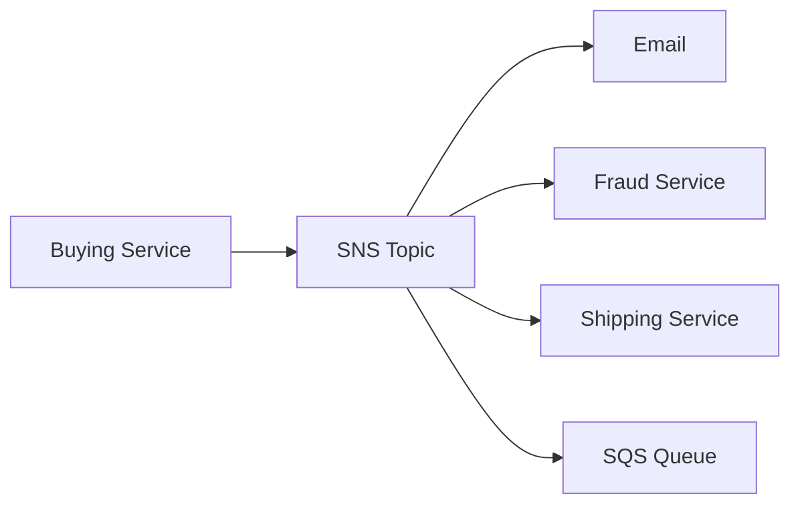

# 📢 Amazon SNS: Một message — vạn người nhận (Tổng quan)

> Nguồn: `149-SNS-Overview.txt` · [Udemy](https://ua.udemy.com/course/aws-certified-cloud-practitioner-new/learn/lecture/20056154)

Tiếp theo, chúng ta học cách decouple ứng dụng thứ hai: **Amazon SNS**. Nếu SQS giải bài toán "nhiều consumer chia nhau đọc message", thì SNS giải bài toán ngược lại: **gửi một message đến thật nhiều nơi nhận**.

---

### 🎯 Bài toán: gửi một message cho nhiều receiver

Giả sử buying service của bạn cần thông báo cho nhiều dịch vụ cùng lúc. Nếu dùng **direct integration (tích hợp trực tiếp)**, bạn sẽ phải viết tới **4 tích hợp riêng lẻ**:

1. Gửi **email notification (thông báo email)**.
2. Nói chuyện với **fraud service (dịch vụ chống gian lận)**.
3. Nói chuyện với **shipping service (dịch vụ vận chuyển)**.
4. Nói chuyện với **SQS queue**.

Cách này khá phức tạp và càng nhiều receiver càng khó bảo trì.

---

### 📡 Giải pháp: mô hình Pub/Sub với SNS Topic

Thay vì tích hợp trực tiếp, ta dùng kiểu tích hợp **Pub/Sub (publish/subscribe)**: buying service chỉ gửi message vào **một SNS Topic**, và topic **tự động** gửi thông báo tới tất cả subscriber — email, fraud service, shipping service và cả SQS queue.

**SNS** là viết tắt của **Simple Notification Service**. Cách hoạt động:

* **Event publishers** chỉ gửi message đến **một SNS topic** duy nhất.
* Bạn có thể có **bao nhiêu event subscriber cũng được**, tất cả cùng lắng nghe topic.
* **Mỗi subscriber nhận được TẤT CẢ message** gửi vào topic — khác với SQS, nơi các consumer **chia nhau** message.

---

### 📊 Những con số cần nhớ

* Mỗi SNS topic có thể có **hơn 12 triệu subscription (đăng ký nhận)**.
* Mỗi tài khoản có **soft limit 100.000 topic**.

---

### 📤 SNS gửi được đến những đâu?

Các **AWS target service** mà SNS có thể publish tới:

* **Amazon SQS**
* **Lambda**
* **Amazon Data Firehose**

Ngoài ra, SNS còn gửi được:

* **Email** trực tiếp.
* **SMS** và **mobile notification (thông báo di động)**.
* Dữ liệu trực tiếp tới **HTTP / HTTPS endpoint**.

👉 **Exam tip:** hễ thấy **notification, publish-subscribe, subscriber**... thì nghĩ ngay đến **Amazon SNS**.

---

### 🧪 Tự kiểm tra nhanh

**Câu 1:** SNS viết tắt của gì?

<b>Xem đáp án</b>

**Đáp án:** Simple Notification Service.

Giải thích: Đúng như tên gọi — dịch vụ gửi thông báo của AWS.

Tham chiếu: Mục Giải pháp Pub/Sub với SNS Topic.

**Câu 2:** Điểm khác biệt giữa SNS và SQS trong cách nhận message là gì?

<b>Xem đáp án</b>

**Đáp án:** Với SNS, mỗi subscriber nhận được tất cả message; với SQS, các consumer chia nhau message.

Giải thích: Đây là điểm phân biệt quan trọng giữa hai dịch vụ.

Tham chiếu: Mục Giải pháp Pub/Sub với SNS Topic.

**Câu 3:** Một SNS topic có thể có bao nhiêu subscription?

<b>Xem đáp án</b>

**Đáp án:** Hơn 12 triệu subscription mỗi topic.

Giải thích: Ngoài ra mỗi tài khoản có soft limit 100.000 topic.

Tham chiếu: Mục Những con số cần nhớ.

**Câu 4:** Kể tên các AWS target service mà SNS có thể publish tới?

<b>Xem đáp án</b>

**Đáp án:** Amazon SQS, Lambda và Amazon Data Firehose.

Giải thích: Ngoài ra SNS còn gửi được email, SMS, mobile notification và HTTP/HTTPS endpoint.

Tham chiếu: Mục SNS gửi được đến những đâu.

**Câu 5:** Trong đề thi, từ khóa nào khiến bạn nghĩ ngay đến SNS?

<b>Xem đáp án</b>

**Đáp án:** Notification, publish-subscribe, subscriber.

Giải thích: Đây là những "từ khóa nhận diện" SNS trong đề CLF-C02.

Tham chiếu: Mục SNS gửi được đến những đâu.

---

Vậy là các bạn đã hiểu vì sao SNS là "cánh tay phải" cho bài toán fan-out một message tới nhiều receiver. Ở bài tiếp theo, chúng ta sẽ vào console và **thực hành tạo SNS topic với subscription qua email**. Hẹn gặp các bạn ở đó! 🚀
