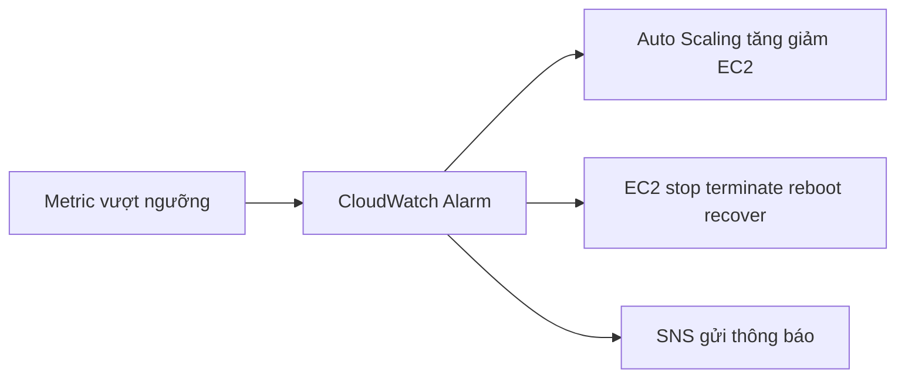

# 📊 CloudWatch Metrics & Alarms: Nắm trọn sức khỏe hệ thống AWS

> Nguồn: `153-CloudWatch-Metrics-CloudWatch-Alarms-Overview.txt` · [Udemy](https://ua.udemy.com/course/aws-certified-cloud-practitioner-new/learn/lecture/20056176)

Chào mừng các bạn đến với section **Cloud Monitoring** — nơi chúng ta học cách có được bức tranh rõ ràng về hiệu năng của mọi thứ mình triển khai trên cloud. Mở đầu, mình giới thiệu hai dịch vụ nền tảng nhất: **CloudWatch Metrics** và **CloudWatch Alarms**. *Đây là nhóm kiến thức rất hay được hỏi trong đề thi, nên các bạn đừng bỏ qua nhé.*

---

### 📈 CloudWatch Metrics — đo lường mọi thứ trên AWS

**CloudWatch** cung cấp metric cho **mọi dịch vụ trong AWS**, và **metric là một biến số để giám sát** — ví dụ **CPUUtilization** (mức sử dụng CPU) hay **NetworkIn** (lưu lượng mạng đi vào). Metric đi theo thời gian nên luôn có **timestamp (mốc thời gian)**, và các bạn có thể gom tất cả metric vào một **CloudWatch dashboard** để xem cùng lúc.

Một metric rất đáng chú ý là **Billing metric** — tổng số tiền các bạn đã chi trên AWS. Metric này **chỉ tồn tại ở region us-east-1**, và cuối mỗi tháng sẽ **reset về 0**. Trong ví dụ của mình, tháng đó mình đã tiêu **hơn 100 USD** vì thử nghiệm đủ loại dịch vụ AWS.

Các bạn có thể xem metric theo từng loại tài nguyên:

* **EC2 instances:** CPU Utilization (CPU làm việc nhiều quá nghĩa là instance đang quá tải — cần **scale up hoặc scale out**), **Status Check** (đảm bảo instance hoạt động đúng), **Network** in/out. Đặc biệt, **RAM không phải metric có sẵn của EC2**. Mặc định các metric này được thu thập **mỗi 5 phút**; bật **Detailed Monitoring** (tốn phí hơn) để có metric **mỗi 1 phút**.
* **EBS volumes:** lượng disk đọc và ghi đang diễn ra.
* **S3 buckets:** kích thước bucket theo bytes, số lượng object, số request vào bucket.
* **Billing:** tổng chi phí ước tính của **toàn bộ account**, chỉ ở us-east-1.
* **Service Limits:** mức bạn đang sử dụng một service API.
* **Custom metrics:** nếu không tìm thấy metric ưng ý, các bạn **tự push metric của riêng mình**.

---

### 🚨 CloudWatch Alarms — biến metric thành hành động

**Alarm** dùng để **kích hoạt thông báo cho bất kỳ metric nào**: khi metric vượt qua một **ngưỡng (threshold)**, CloudWatch Alarm sẽ thực hiện action.

| Action | Dùng để làm gì |
|---|---|
| **Auto Scaling group** | Tăng hoặc giảm **desired count** của EC2 — cho phép auto scaling group tự động scale |
| **EC2 actions** | **Stop, terminate, reboot hoặc recover** một EC2 instance |
| **SNS notifications** | Gửi thông báo vào một **SNS topic** — ví dụ CPU vượt 90% thì gửi email để kiểm tra |

Khi tạo alarm, các bạn có nhiều tùy chọn: **sampling, percentage, max, min**... và có thể chọn **period** để đánh giá — **5 phút, 10 phút hay 1 giờ**. Các bạn cũng có thể tạo **billing alarm** dựa trên Billing metric, ví dụ cảnh báo khi chi phí vượt **10 hoặc 20 USD**.

Trạng thái của alarm gồm 3 loại:

* **OK** — khi mọi thứ đều xanh.
* **INSUFFICIENT_DATA** — khi chưa đủ data point để biết nên xanh hay đỏ.
* **ALARM** — khi có vấn đề.

---

### 🎯 Tự kiểm tra nhanh

**Câu 1:** Metric nào **không** được cung cấp sẵn cho EC2 instance?

<b>Xem đáp án</b>

**Đáp án:** RAM.
Giải thích: EC2 có CPU, Status Check, Network... nhưng RAM không phải metric mặc định.
Tham chiếu: Mục CloudWatch Metrics.

**Câu 2:** Billing metric chỉ có ở region nào?

<b>Xem đáp án</b>

**Đáp án:** us-east-1 — và nó phản ánh chi phí của toàn bộ account.
Giải thích: Đây là chi tiết rất dễ gặp trong đề thi.
Tham chiếu: Mục CloudWatch Metrics.

**Câu 3:** Detailed Monitoring khác gì so với mặc định?

<b>Xem đáp án</b>

**Đáp án:** Metric mỗi 1 phút thay vì mỗi 5 phút, và tốn phí hơn.
Giải thích: Mặc định EC2 gửi metric 5 phút một lần.
Tham chiếu: Mục CloudWatch Metrics.

**Câu 4:** Alarm action nào giúp hệ thống tự động scale?

<b>Xem đáp án</b>

**Đáp án:** Action cho Auto Scaling group — tăng/giảm desired count của EC2.
Giải thích: Đây là cách CloudWatch Alarm kích hoạt auto scaling.
Tham chiếu: Mục CloudWatch Alarms.

**Câu 5:** Alarm ở trạng thái nào khi chưa đủ dữ liệu?

<b>Xem đáp án</b>

**Đáp án:** INSUFFICIENT_DATA.
Giải thích: Ba trạng thái là OK, INSUFFICIENT_DATA và ALARM.
Tham chiếu: Mục CloudWatch Alarms.

---

Vậy là các bạn đã nắm được bộ đôi **Metrics + Alarms** — trái tim của Cloud Monitoring trên AWS. *Cứ bình tĩnh, phần khái niệm này sẽ thấm dần khi các bạn tự tay làm.*

Ở bài tiếp theo, chúng ta sẽ vào console thực hành: xem metric, tạo alarm và cả billing alarm. Hẹn gặp các bạn ở đó! 🚀
