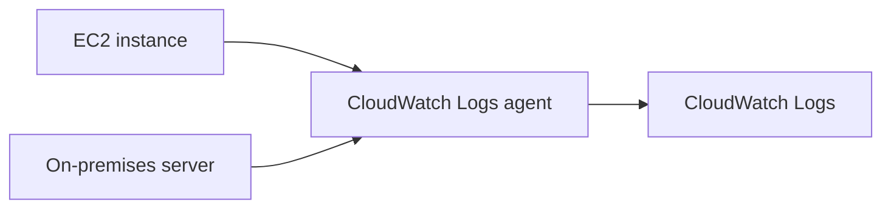

# 📜 CloudWatch Logs: Gom log về một mối để troubleshooting

> Nguồn: `155-CloudWatch-Logs-Overview.txt` · [Udemy](https://ua.udemy.com/course/aws-certified-cloud-practitioner-new/learn/lecture/20056188)

Metrics đã giúp các bạn nhìn thấy con số, còn **CloudWatch Logs** giúp các bạn đọc được câu chuyện đằng sau những con số đó. Trong bài này, mình sẽ giải thích **log file là gì, CloudWatch Logs thu log từ đâu, và cách nó hoạt động với EC2 lẫn server on-premises**. Đây là kiến thức nền rất quan trọng khi vận hành hệ thống.

---

### 🧾 Log file là gì?

Khi một ứng dụng chạy trên bất kỳ server nào, thông thường nó sẽ **ghi ra văn bản về những gì nó đang làm** — ví dụ khi thực hiện hành động cho người dùng, khi dọn dẹp dữ liệu... Tất cả những dòng đó là **log file (tệp nhật ký)**. Khi cần **troubleshoot (tìm lỗi)**, người dùng sẽ đọc log file để xem ứng dụng đã làm hoặc đã nói gì.

Vậy **Amazon CloudWatch Logs** — đúng như tên gọi — là dịch vụ **thu thập log file**. Các bạn có thể thu log từ rất nhiều nguồn:

* **Elastic Beanstalk**
* **ECS**
* **Lambda**
* **CloudTrail**
* **CloudWatch Logs agent** — cài agent trên máy EC2 hoặc server on-premises để đưa log trực tiếp lên AWS
* **Route 53** — log các truy vấn DNS

Khi tất cả log được gom về một nơi, CloudWatch Logs cho phép **giám sát log theo thời gian thực (real-time monitoring)** và **phản ứng với mọi thứ xảy ra trong log**.

Một điểm rất hay nữa: **log retention (thời gian lưu log) có thể điều chỉnh** — các bạn có thể giữ log **1 tuần, 30 ngày, 1 năm, hoặc vô hạn**.

---

### 🔌 CloudWatch Logs hoạt động với EC2 như thế nào?

Mặc định, **EC2 instance sẽ không tự gửi log file nào** lên CloudWatch Logs. Muốn có log, các bạn phải **cài CloudWatch Logs agent** trên instance; agent này sẽ đẩy những log file bạn muốn lên **CloudWatch Logs**.

Một điều kiện quan trọng: EC2 instance cần có **instance role với IAM permissions phù hợp** để được phép gửi dữ liệu log vào CloudWatch Logs.

Đặc biệt, log agent còn cài được trên **server on-premises** nữa — nó là **hybrid agent (agent lai)**, chạy được cả trên AWS lẫn ngoài AWS, gom log từ cả EC2 lẫn server on-premises trực tiếp vào CloudWatch Logs.

---

### 🎯 Tự kiểm tra nhanh

**Câu 1:** Amazon CloudWatch Logs dùng để làm gì?

<b>Xem đáp án</b>

**Đáp án:** Thu thập log file từ nhiều nguồn khác nhau.
Giải thích: Log giúp bạn đọc lại ứng dụng đã làm gì và troubleshooting khi có lỗi.
Tham chiếu: Mục Log file là gì.

**Câu 2:** Mặc định EC2 instance có gửi log lên CloudWatch Logs không?

<b>Xem đáp án</b>

**Đáp án:** Không. Bạn phải tự cài CloudWatch Logs agent.
Giải thích: Agent mới là thứ đẩy log file lên CloudWatch Logs.
Tham chiếu: Mục CloudWatch Logs hoạt động với EC2.

**Câu 3:** Để agent gửi được log, EC2 instance cần gì?

<b>Xem đáp án</b>

**Đáp án:** Một instance role với IAM permissions đúng để gửi dữ liệu log vào CloudWatch Logs.
Giải thích: Không có quyền phù hợp thì agent không thể đẩy log lên.
Tham chiếu: Mục CloudWatch Logs hoạt động với EC2.

**Câu 4:** Có thể điều chỉnh thời gian lưu log không? Các mốc nào được nhắc tới?

<b>Xem đáp án</b>

**Đáp án:** Có — 1 tuần, 30 ngày, 1 năm hoặc vô hạn.
Giải thích: Đây là log retention, giúp kiểm soát thời gian lưu dữ liệu.
Tham chiếu: Mục Log file là gì.

**Câu 5:** CloudWatch Logs agent có dùng được cho server on-premises không?

<b>Xem đáp án</b>

**Đáp án:** Có. Đây là hybrid agent, chạy được cả trên on-premises lẫn AWS.
Giải thích: Nhờ vậy bạn gom log từ cả môi trường lai về một nơi.
Tham chiếu: Mục CloudWatch Logs hoạt động với EC2.

---

Vậy là các bạn đã hiểu CloudWatch Logs gom log từ đâu và cần gì để bắt đầu. *Đừng lo nếu phần IAM role còn mơ hồ — chúng ta sẽ còn gặp lại khái niệm này nhiều lần.*

Ở bài tiếp theo, mình sẽ hands-on với log group và log stream để các bạn thấy log chạy thực tế. Hẹn gặp các bạn! 🚀
