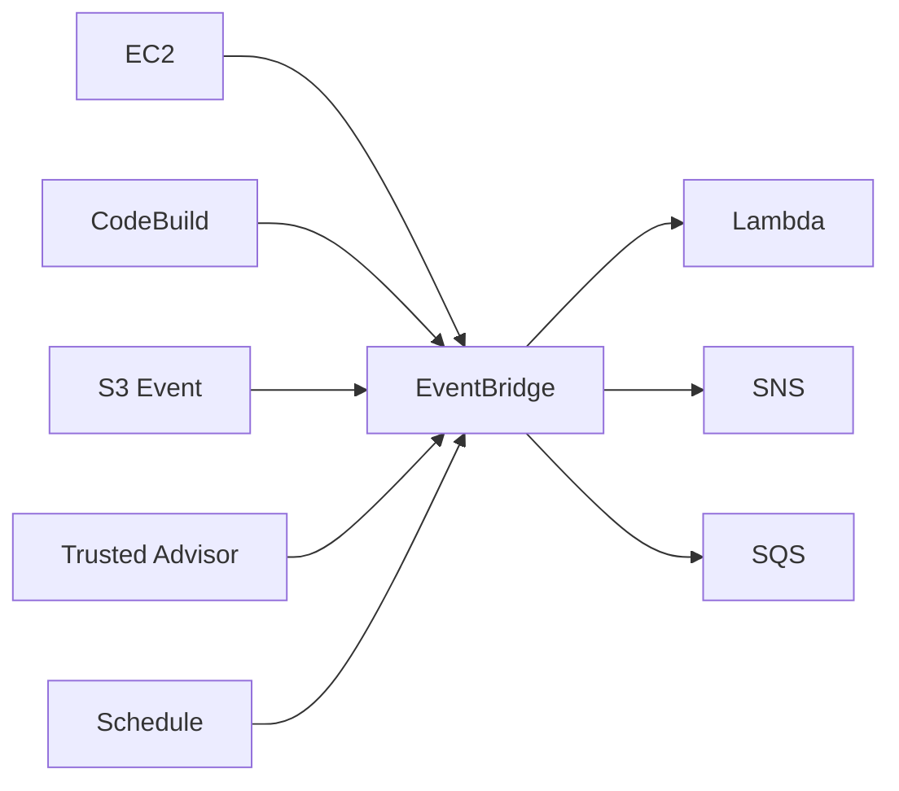

# 🔔 Amazon EventBridge: Phản ứng với mọi sự kiện trong tài khoản AWS

> Nguồn: `157-EventBridge-Overview-formerly-CloudWatch-Events.txt` · [Udemy](https://ua.udemy.com/course/aws-certified-cloud-practitioner-new/learn/lecture/20056214)

Tiếp theo chương trình, mình giới thiệu **Amazon EventBridge** — dịch vụ giúp hệ thống của các bạn **tự phản ứng với các sự kiện xảy ra trong tài khoản AWS**. Một lưu ý về tên gọi trước đây của dịch vụ này sẽ giúp ích cho các bạn trong phòng thi, cùng theo dõi nhé.

---

### 🎯 EventBridge là gì?

**Amazon EventBridge** trước đây có tên là **CloudWatch Events**. Nếu các bạn thấy tài liệu ghi CloudWatch Events thì hãy nghĩ ngay tới EventBridge và ngược lại — **EventBridge là tên mới**.

Với EventBridge, các bạn có thể **phản ứng với các event (sự kiện) đang diễn ra trong tài khoản AWS**. Có hai kiểu tình huống rất hay dùng:

* **Lên lịch cron job:** ví dụ tạo một **rule** nói rằng **mỗi 1 giờ** sẽ sinh ra một event, event này kích hoạt một script chạy trên **Lambda function**. Thế là các bạn có một **serverless cron job (cron job không cần server)**.
* **Phản ứng khi service làm gì đó:** ví dụ muốn cảnh báo đội security mỗi khi có người **đăng nhập bằng root user** — vì nguyên tắc là không nên dùng, hoặc rất hạn chế dùng root user. Các bạn có thể bắt event **IAM root user sign-in** rồi gửi vào một **SNS topic** có kèm email; mỗi lần ai đó đăng nhập, cả team sẽ nhận được email.

---

### 🔀 Nguồn, đích và luồng sự kiện

EventBridge nhận **event từ mọi nguồn**: **EC2 Instances, CodeBuild, S3 Event, Trusted Advisor**, và tất nhiên cả **schedule**. Từ EventBridge, các bạn có thể gửi tới rất nhiều **destination (đích)**: **Lambda functions, SNS, SQS**... cho compute, integration, orchestration, maintenance...

---

### 🚌 Ba loại event bus và các tính năng nâng cao

Các ví dụ trên đi qua **default event bus (event bus mặc định)** — nơi chứa event từ các **AWS service** hoặc từ **schedule** của bạn. Ngoài ra EventBridge còn có:

* **Partner event bus:** nhận event từ **đối tác của AWS** như **Zendesk, Datadog**... Họ gửi event vào tài khoản của bạn, nhờ đó bạn phản ứng được với cả **sự kiện xảy ra ngoài AWS**.
* **Custom event bus:** ứng dụng của chính bạn gửi event vào event bus riêng, để làm bất kỳ integration nào bạn muốn và tùy biến mọi thứ.

Ngoài ra còn có:

* **Schema Registry:** mô hình hóa **event schema** để xem event trông như thế nào, các **data type** ra sao.
* **Archive & Replay:** **lưu trữ event** gửi tới event bus vô thời hạn hoặc theo một khoảng thời gian, rồi **replay (phát lại)** các event đã lưu.

*Với đề thi Cloud Practitioner, các bạn chỉ cần nắm chắc khái niệm EventBridge là dùng để làm gì — phần nâng cao biết đến là quá đủ.*

---

### 🎯 Tự kiểm tra nhanh

**Câu 1:** EventBridge trước đây có tên là gì?

<b>Xem đáp án</b>

**Đáp án:** CloudWatch Events.
Giải thích: EventBridge là tên mới; thấy CloudWatch Events thì nghĩ tới EventBridge.
Tham chiếu: Mục EventBridge là gì.

**Câu 2:** Ứng dụng nào của EventBridge giúp chạy script định kỳ không cần server?

<b>Xem đáp án</b>

**Đáp án:** Tạo rule theo lịch — ví dụ mỗi giờ — để kích hoạt Lambda function, tạo thành serverless cron job.
Giải thích: Rule có thể dựa trên schedule hoặc event pattern.
Tham chiếu: Mục EventBridge là gì.

**Câu 3:** Làm cách nào nhận cảnh báo mỗi khi có người đăng nhập bằng root user?

<b>Xem đáp án</b>

**Đáp án:** Phản ứng với event IAM root user sign-in và gửi thông báo tới SNS topic kèm email.
Giải thích: Root user không nên dùng thường xuyên, nên cần cảnh báo để đội security kiểm tra.
Tham chiếu: Mục EventBridge là gì.

**Câu 4:** Partner event bus dùng để làm gì?

<b>Xem đáp án</b>

**Đáp án:** Nhận event do các đối tác liên kết với AWS gửi tới, ví dụ Zendesk hoặc Datadog.
Giải thích: Nhờ vậy bạn phản ứng được với sự kiện ngoài AWS.
Tham chiếu: Mục Ba loại event bus.

**Câu 5:** Tính năng nào cho phép lưu và phát lại event?

<b>Xem đáp án</b>

**Đáp án:** Archive các event gửi tới event bus rồi replay lại.
Giải thích: Có thể lưu vô thời hạn hoặc theo khoảng thời gian đặt trước.
Tham chiếu: Mục Ba loại event bus.

---

Vậy là các bạn đã nắm được vai trò của EventBridge trong hệ sinh thái AWS: **event từ bất kỳ nguồn nào, đưa tới bất kỳ đích nào bạn muốn**. *Cứ nhớ ý tưởng lớn này, các chi tiết nhỏ sẽ tự khớp lại khi làm hands-on.*

Ở bài tiếp theo, chúng ta sẽ tạo schedule và rule thật trên EventBridge. Hẹn gặp các bạn! 🚀
