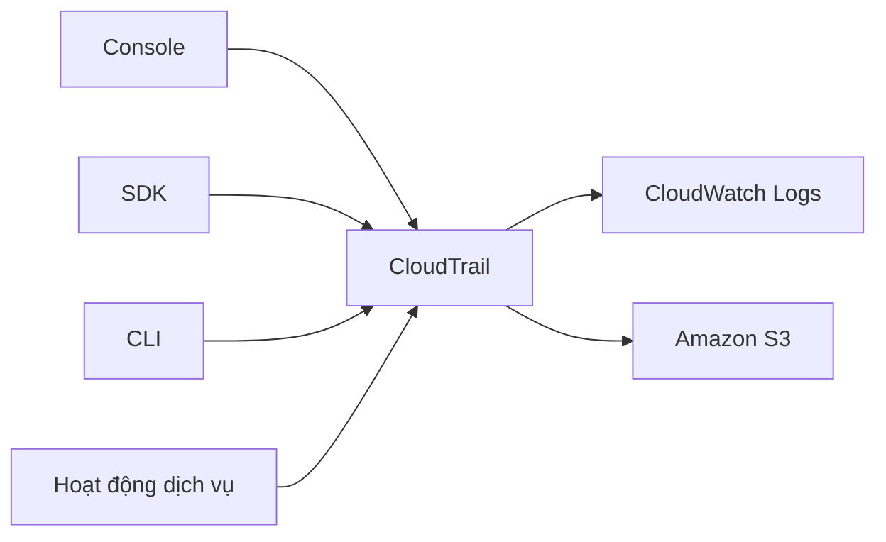

# 🔍 AWS CloudTrail: Ai đã làm gì trong tài khoản AWS của bạn?

> Nguồn: `159-CloudTrail-Overview.txt` · [Udemy](https://ua.udemy.com/course/aws-certified-cloud-practitioner-new/learn/lecture/20056220)

Chào các bạn! Bước sang nhóm dịch vụ **Monitoring (giám sát)**, có một cái tên mà các bạn sẽ gặp đi gặp lại cả trong công việc lẫn đề thi: **AWS CloudTrail**. Hiểu đơn giản, đây là "camera an ninh" ghi lại mọi hành động diễn ra trong tài khoản AWS của các bạn.

*Đừng bỏ qua bài này nhé — dạng câu hỏi "ai đã xóa tài nguyên của tôi?" gần như chắc chắn sẽ xuất hiện trong đề.*

---

### 🎯 CloudTrail là gì?

**AWS CloudTrail** là dịch vụ cung cấp khả năng **governance (quản trị), compliance (tuân thủ) và audit (kiểm toán)** cho tài khoản AWS của các bạn.

Điểm rất hay: khi bạn sử dụng một tài khoản AWS, **CloudTrail được bật mặc định** — nó tự động lưu **lịch sử toàn bộ các API call (lời gọi API) và event (sự kiện)** xảy ra bên trong tài khoản.

---

### 🧭 Mọi hành động đều được ghi lại

Dù hoạt động đến từ đâu, CloudTrail cũng "chộp" được hết:

* Ai đó đăng nhập vào **console** — mọi thứ họ làm đều được ghi lại.
* Ai đó dùng **SDK** — được ghi.
* Ai đó chạy lệnh bằng **CLI (Command Line Interface — giao diện dòng lệnh)** — cũng được ghi.
* Mọi **service activity (hoạt động của dịch vụ AWS)** — vẫn được ghi.

Nói cách khác: **bất cứ điều gì xảy ra trong tài khoản đều được đưa vào CloudTrail.**

---

### 📦 Logs đi đâu? Trail và region

Khi tạo một **trail (đường ghi log)** trong CloudTrail, các bạn có thể áp dụng nó cho **tất cả các region** để giám sát mọi thứ đang diễn ra, hoặc chỉ gắn với **một region duy nhất**.

Vì mục đích **audit và security (kiểm toán và bảo mật)**, bạn lấy lịch sử event và API call từ CloudTrail rồi gửi tới một trong hai nơi:

* **CloudWatch Logs**
* **Amazon S3**

Hai đích đến này phù hợp khi bạn cần **long-term retention (lưu trữ dài hạn)** dữ liệu. Đồng thời, ngay trong CloudTrail, các bạn vẫn có thể làm mọi loại **inspection (kiểm tra) và audit (kiểm toán)**.

---

### 🕵️ Câu hỏi tình huống "kinh điển" của đề thi

Ví dụ: một user đã xóa mất một tài nguyên. Làm sao biết **cái gì bị xóa, ai xóa và xóa lúc nào?**

→ Đáp án chính là **CloudTrail**.

Bất cứ khi nào cần tra cứu một **API call**, các bạn cứ nhớ ngay đến CloudTrail — đây là đáp án đúng cho dạng câu hỏi này.

Tóm lại, từ CloudTrail console bạn có:

* Thông tin sử dụng **SDK, CLI và console**
* Toàn bộ **IAM users, IAM roles** và các API call họ thực hiện
* Khả năng kiểm tra, kiểm toán tùy ý

---

### 🎯 Tự kiểm tra nhanh

**Câu 1:** CloudTrail cung cấp ba khả năng chính nào?

<b>Xem đáp án</b>

**Đáp án:** Governance (quản trị), compliance (tuân thủ) và audit (kiểm toán).

Giải thích: Đây là mục đích cốt lõi của CloudTrail với tài khoản AWS.

Tham chiếu: Mục CloudTrail là gì.

**Câu 2:** CloudTrail có cần bật thủ công không?

<b>Xem đáp án</b>

**Đáp án:** Không — CloudTrail được bật mặc định khi bạn dùng tài khoản AWS.

Giải thích: Lịch sử API call và event được ghi lại tự động.

Tham chiếu: Mục CloudTrail là gì.

**Câu 3:** Để lưu log dài hạn, bạn có thể gửi log CloudTrail tới đâu?

<b>Xem đáp án</b>

**Đáp án:** CloudWatch Logs hoặc Amazon S3.

Giải thích: Đây là hai đích đến giúp lưu trữ dài hạn dữ liệu CloudTrail.

Tham chiếu: Mục Logs đi đâu và Trail và region.

**Câu 4:** Một tài nguyên bị xóa, bạn cần biết ai xóa và khi nào. Dùng dịch vụ nào?

<b>Xem đáp án</b>

**Đáp án:** CloudTrail.

Giải thích: Mọi API call đều được CloudTrail ghi lại kèm thông tin người thực hiện.

Tham chiếu: Mục Câu hỏi tình huống kinh điển của đề thi.

**Câu 5:** Một trail trong CloudTrail có thể áp dụng cho phạm vi nào?

<b>Xem đáp án</b>

**Đáp án:** Có thể áp dụng cho tất cả các region, hoặc chỉ một region duy nhất.

Giải thích: Tùy nhu cầu giám sát toàn cầu hay cục bộ mà bạn chọn phạm vi trail.

Tham chiếu: Mục Logs đi đâu và Trail và region.

---

Vậy là các bạn đã nắm được "camera an ninh" của AWS. *Nhớ kỹ hai điều: cần tra cứu API call → CloudTrail; cần lưu log dài hạn → CloudWatch Logs hoặc S3.*

Ở bài tiếp theo, chúng ta sẽ vào console thực hành CloudTrail và tận mắt xem một API call hiện lên như thế nào. Hẹn gặp các bạn ở đó! 🚀
