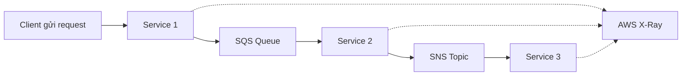

# 🧵 AWS X-Ray: Nhìn thấu luồng request trong hệ thống phân tán

> Nguồn: `161-X-Ray-Overview.txt` · [Udemy](https://ua.udemy.com/course/aws-certified-cloud-practitioner-new/learn/lecture/20056232)

Chào các bạn! Sau khi đã biết CloudTrail ghi lại mọi API call, chúng ta đến với một dịch vụ "thám tử" khác: **AWS X-Ray**. Nếu ứng dụng của bạn gồm nhiều service nói chuyện với nhau và bạn không biết request đang "kẹt" ở đâu, X-Ray chính là công cụ dành cho bạn.

---

### 😓 Nỗi đau: Debug trong production theo cách truyền thống

Khi ứng dụng đã được triển khai **(deployed)** lên production, cách debug "ngày xưa" thường diễn ra như sau:

1. Bạn **test ở môi trường local (cục bộ)**.
2. Bạn **thêm các câu lệnh log (log statements)** khắp nơi.
3. Có thể xem cách nó ghi log, rồi **triển khai lại (re-deploy)** lên production.
4. Cuối cùng mới xem có tìm ra được vấn đề hay không.

Vấn đề nằm ở chỗ: **log đến từ nhiều service và nhiều ứng dụng khác nhau**, nên **phân tích log rất khó** vì phải gom tất cả lại với nhau.

* Nếu bạn có một **monolith (ứng dụng nguyên khối)** — một ứng dụng khổng lồ duy nhất — thì debug tương đối dễ.
* Nhưng nếu bạn có các **distributed services (dịch vụ phân tán)** kết nối qua **SQS queues, SNS topics**, tách rời nhau (decoupled)... thì việc trace và hiểu chuyện gì đang xảy ra trong hệ thống **thực sự rất, rất khó**.

Kết quả là bạn **không có một góc nhìn chung (common view)** về toàn bộ kiến trúc của mình.

---

### ✨ X-Ray giải quyết bài toán đó như thế nào?

**AWS X-Ray** cho phép bạn **tracing (truy vết)** và **phân tích trực quan (visual analysis)** ứng dụng của mình.

Khi bật X-Ray trên các service:

* Bạn có **bức tranh đầy đủ** về những gì đang diễn ra ở từng service.
* Thấy được service nào **đang lỗi (failing)** và **hiệu năng (performance)** ra sao.
* Nếu một request gặp trục trặc, bạn **hình dung trực tiếp trong X-Ray console**.

---

### 🚀 Lợi ích của X-Ray

Theo giảng viên, X-Ray giúp các bạn:

* **Troubleshooting hiệu năng** thông qua việc tìm ra các **bottlenecks (điểm nghẽn)**.
* **Hiểu các dependency (phụ thuộc)** trong kiến trúc microservice, vì mọi thứ đều kết nối với nhau.
* **Xác định chính xác service gặp vấn đề** bằng tracing.
* **Xem lại hành vi của một request cụ thể**, tìm ra **errors (lỗi) và exceptions (ngoại lệ)** của request đó.
* Biết mình **có đang đáp ứng SLA (Service-Level Agreement — cam kết mức dịch vụ)** hay không, nghĩa là có đang trả lời đúng hạn cho mọi request không.
* Nếu đang bị **throttled (giới hạn tốc độ) hay bị chậm**, biết chuyện đó xảy ra **ở đâu, ở service nào**.
* Biết **những user nào sẽ bị ảnh hưởng** bởi các sự cố (outages).

Tóm lại, X-Ray cực kỳ phù hợp khi bạn cần **distributed tracing, troubleshooting và service graph**.

---

### 💡 Một lưu ý quan trọng cho kỳ thi

X-Ray là một dịch vụ **phức tạp hơn để sử dụng**, nên trong khóa học này giảng viên **sẽ không làm hands-on**. 

Tuy nhiên, phần **tổng quan ở mức cao** là **đủ cho kỳ thi** — các bạn chỉ cần nắm X-Ray dùng để trace request qua ứng dụng phân tán, tìm bottleneck, hiểu dependency và phân tích root cause.

---

### 🎯 Tự kiểm tra nhanh

**Câu 1:** AWS X-Ray cho phép bạn làm gì với ứng dụng?

<b>Xem đáp án</b>

**Đáp án:** Tracing (truy vết) và phân tích trực quan (visual analysis).

Giải thích: X-Ray cho bạn bức tranh đầy đủ về từng service, thấy lỗi và hiệu năng.

Tham chiếu: Mục X-Ray giải quyết bài toán đó như thế nào.

**Câu 2:** Vì sao debug hệ thống distributed lại khó?

<b>Xem đáp án</b>

**Đáp án:** Vì log đến từ nhiều service, nhiều ứng dụng khác nhau, phải gom lại để phân tích; các service tách rời qua SQS queues, SNS topics nên rất khó trace.

Giải thích: Bạn không có góc nhìn chung về toàn bộ kiến trúc.

Tham chiếu: Mục Nỗi đau Debug trong production theo cách truyền thống.

**Câu 3:** X-Ray giúp gì khi bạn cần kiểm tra SLA?

<b>Xem đáp án</b>

**Đáp án:** Biết mình có đang trả lời đúng hạn cho tất cả các request hay không.

Giải thích: SLA là cam kết mức dịch vụ; X-Ray giúp bạn xác nhận mình có đang tuân thủ hay không.

Tham chiếu: Mục Lợi ích của X-Ray.

**Câu 4:** X-Ray giúp xác định điều gì khi hệ thống bị chậm hoặc bị throttle?

<b>Xem đáp án</b>

**Đáp án:** Xác định việc đó đang xảy ra ở đâu, ở service nào.

Giải thích: Tracing giúp pinpoint service gặp vấn đề thay vì đoán mò.

Tham chiếu: Mục Lợi ích của X-Ray.

**Câu 5:** Vì sao khóa học không có bài hands-on cho X-Ray?

<b>Xem đáp án</b>

**Đáp án:** Vì X-Ray là dịch vụ phức tạp hơn để sử dụng; phần tổng quan ở mức cao là đủ cho kỳ thi.

Giải thích: Ở cấp Practitioner, bạn chỉ cần hiểu mục đích và lợi ích của X-Ray.

Tham chiếu: Mục Một lưu ý quan trọng cho kỳ thi.

---

Vậy là các bạn đã nắm được "kính hiển vi" dành cho hệ thống phân tán. *Nhớ nhanh: X-Ray = trace request, tìm bottleneck, hiểu dependency, phân tích root cause.*

Ở bài tiếp theo, chúng ta sẽ chuyển sang **AWS Health Dashboard** — dịch vụ giúp bạn biết AWS đang "khỏe" hay "ốm" và sự cố nào ảnh hưởng trực tiếp đến mình. Hẹn gặp các bạn ở đó! 🚀
