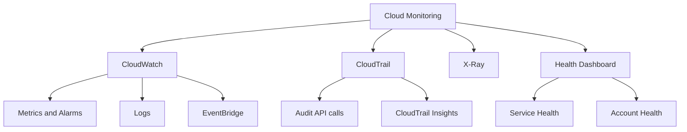

# 🗺️ Tổng kết Cloud Monitoring: Bức tranh toàn cảnh trước khi thi

> Nguồn: `164-Cloud-Monitoring-Summary.txt` · [Udemy](https://ua.udemy.com/course/aws-certified-cloud-practitioner-new/learn/lecture/20237304)

Chào các bạn! Chúng ta đã đi hết section **Monitoring** rồi, giờ là lúc gom tất cả lại thành một bức tranh hoàn chỉnh. Bài tổng kết này rất đáng đọc kỹ — đề thi rất thích hỏi kiểu "dịch vụ nào dùng cho việc gì", và đây chính là bảng "cứu điểm" của các bạn.

---

### 📊 CloudWatch và các "phiên bản" của nó

**CloudWatch** là dịch vụ trung tâm của Monitoring, với nhiều "phiên bản" (flavors) khác nhau:

* **CloudWatch Metrics** — giám sát **hiệu năng (performance)** của các dịch vụ AWS và cả **billing metrics (chỉ số thanh toán)**.
* **CloudWatch Alarms** — tự động hóa **notifications** khi một metric **vượt ra ngoài một ngưỡng (range)** cho trước. Từ alarm, bạn có thể tự động thực hiện các **EC2 actions** như **reboot**, v.v.
* **CloudWatch Logs** — thu thập **log files** từ **EC2 instances, servers và Lambda functions**, tất cả được **tập trung (centralized)** trong một dịch vụ.
* **CloudWatch Events**, còn gọi là **EventBridge** — cách để **phản ứng với các event trong AWS** hoặc **kích hoạt một rule theo lịch (schedule)** cụ thể.

Ngoài ra, bạn có thể gửi notifications trực tiếp vào **SNS (Simple Notification Service)** dựa trên việc một metric **vượt ngưỡng** nào đó.

---

### 🕵️ CloudTrail và CloudTrail Insights

Khi cần **audit (kiểm toán) các API call** được thực hiện trong tài khoản, hãy dùng **CloudTrail**.

Trên nền tảng đó còn có **CloudTrail Insights** — cho bạn **phân tích tự động (automated analysis)** các event của CloudTrail.

---

### 🧵 X-Ray — thám tử của hệ thống phân tán

**AWS X-Ray** dùng để **trace (truy vết) các request** đi qua **ứng dụng phân tán (distributed applications)**.

Công cụ này cực hữu ích khi bạn cần:

* **Phân tích hiệu năng (performance analysis)**.
* **Phân tích nguyên nhân gốc rễ (root cause analysis)** — đặc biệt khi có **lỗi (errors)** và các ứng dụng đang **"nói chuyện" với nhau**.

---

### 🏥 Health Dashboard — Service và Account

* **AWS Health Dashboard** cho bạn **tình trạng của tất cả các dịch vụ AWS trên mọi region**.
* **AWS Account Health Dashboard** nói về các **event AWS chỉ ảnh hưởng đến hạ tầng cụ thể của bạn**.

---

### 📋 Bảng tra nhanh: dịch vụ nào dùng cho việc gì?

| Dịch vụ | Vai trò chính | Nhớ nhanh |
|---|---|---|
| CloudWatch | Metrics, Alarms, Logs, Events/EventBridge | Giám sát hiệu năng và log |
| CloudTrail | Audit API call trong tài khoản | Ai làm gì, khi nào |
| CloudTrail Insights | Phân tích tự động CloudTrail events | Soi event tự động |
| X-Ray | Trace request qua ứng dụng phân tán | Performance và root cause |
| Health Dashboard | Tình trạng mọi dịch vụ AWS, mọi region | Sức khỏe toàn cầu |
| Account Health Dashboard | Event ảnh hưởng hạ tầng của bạn | Ảnh hưởng riêng bạn |

---

### 🎯 Tự kiểm tra nhanh

**Câu 1:** Dịch vụ nào dùng để audit các API call trong tài khoản của bạn?

<b>Xem đáp án</b>

**Đáp án:** CloudTrail.

Giải thích: CloudTrail ghi lại toàn bộ lịch sử API call và event trong tài khoản.

Tham chiếu: Mục CloudTrail và CloudTrail Insights.

**Câu 2:** CloudTrail Insights dùng để làm gì?

<b>Xem đáp án</b>

**Đáp án:** Phân tích tự động các event của CloudTrail.

Giải thích: Insights giúp bạn có thêm góc nhìn tự động trên dữ liệu CloudTrail.

Tham chiếu: Mục CloudTrail và CloudTrail Insights.

**Câu 3:** X-Ray phù hợp nhất với trường hợp nào?

<b>Xem đáp án</b>

**Đáp án:** Trace request qua ứng dụng phân tán, phân tích hiệu năng và root cause, đặc biệt khi có lỗi giữa các ứng dụng liên kết với nhau.

Giải thích: X-Ray cho bạn service graph và phân tích trực quan.

Tham chiếu: Mục X-Ray — thám tử của hệ thống phân tán.

**Câu 4:** CloudWatch Alarms có thể tự động làm những gì?

<b>Xem đáp án</b>

**Đáp án:** Tự động gửi notification khi metric vượt ngưỡng; thực hiện EC2 actions như reboot; gửi notification vào SNS.

Giải thích: Alarms biến metric thành hành động tự động.

Tham chiếu: Mục CloudWatch và các phiên bản của nó.

**Câu 5:** Phân biệt AWS Health Dashboard và AWS Account Health Dashboard?

<b>Xem đáp án</b>

**Đáp án:** Health Dashboard hiển thị tình trạng của tất cả dịch vụ AWS trên mọi region; Account Health Dashboard chỉ nói về các event ảnh hưởng đến hạ tầng cụ thể của bạn.

Giải thích: Một bên là toàn cảnh, một bên là ảnh hưởng cá nhân.

Tham chiếu: Mục Health Dashboard — Service và Account.

---

Vậy là các bạn đã nắm trọn section Cloud Monitoring: **CloudWatch** giám sát, **CloudTrail** kiểm toán, **X-Ray** truy vết, **Health Dashboard** theo dõi sức khỏe — bốn mảnh ghép hoàn chỉnh. *Hãy đọc lại bảng tra nhanh vài lần trước khi thi, vì đây là dạng câu hỏi chắc chắn có mặt trong đề.*

Các bạn đã làm rất tốt khi đi hết chặng này. Ở bài giảng tiếp theo, chúng ta sẽ tiếp tục hành trình chinh phục CLF-C02 — hẹn gặp các bạn ở đó! 🚀
