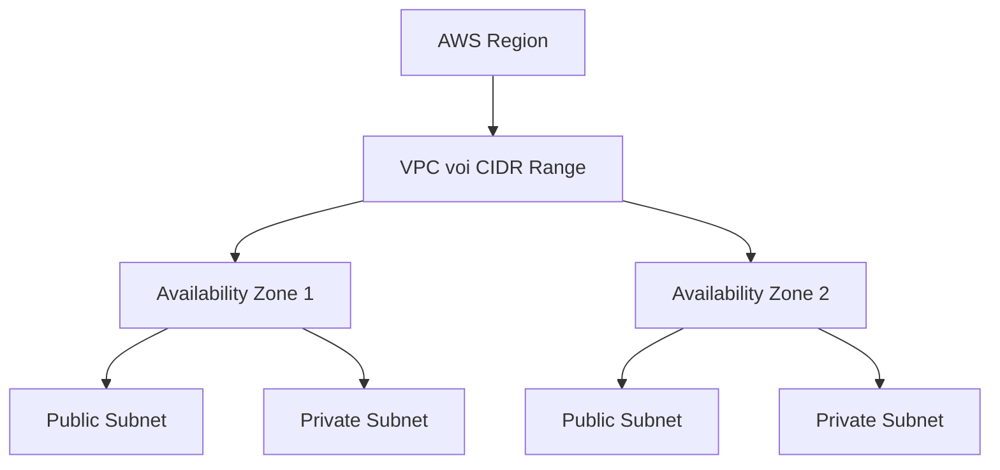
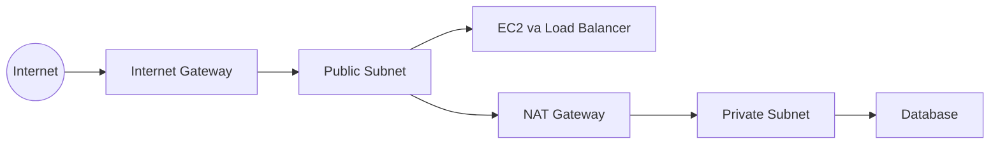

# 🧱 VPC, Subnet, Internet Gateway và NAT Gateway: Bộ khung mạng của AWS

> Nguồn: `167-VPC-Subnet-Internet-Gateway-NAT-Gateways.txt` · [Udemy](https://ua.udemy.com/course/aws-certified-cloud-practitioner-new/learn/lecture/20237290)

Sau khi đã nắm về địa chỉ IP, đây là lúc ghép các mảnh lại thành một kiến trúc mạng hoàn chỉnh. Bài này giải thích **VPC, Subnet, Route Table, Internet Gateway và NAT Gateway** — bộ khung để tài nguyên AWS "nói chuyện" với nhau và với internet. Đây là những khái niệm nền tảng, các bạn đọc chậm mà chắc nhé!

---

### 🧱 VPC và Subnet — mạng riêng và các phân vùng

**VPC (Virtual Private Cloud)** là một **mạng riêng** để bạn triển khai tài nguyên — ví dụ các **EC2 instance** của mình. Một điểm cần nhớ: **VPC gắn với một region cụ thể**, nên nếu bạn có nhiều region trên AWS thì bạn có nhiều VPC.

Bên trong VPC là các **Subnet (mạng con)**. Subnet là **một phần (partition) của VPC**, và được gắn với một **Availability Zone (AZ — vùng sẵn sàng)**. Có hai loại subnet:

* **Public Subnet** — subnet **truy cập được từ internet**, kết nối trực tiếp hai chiều: subnet ra internet, và internet vào được subnet.
* **Private Subnet** — subnet **không truy cập được từ internet**.

Bạn nên đặt gì vào đâu?

* Public subnet: **EC2 instance** (chúng ta đã tạo instance ở đây xuyên suốt khóa học), **load balancer**.
* Private subnet: **database** — vì database không cần ra internet, nhờ vậy sẽ **an toàn hơn**.

Để định nghĩa truy cập internet và liên lạc giữa các subnet (để tài nguyên nói chuyện được với nhau), chúng ta dùng **Route Table (bảng định tuyến)**.

Nếu nhìn một VPC đầy đủ hơn: trong **Region** có một **VPC với CIDR Range** — tức dải địa chỉ IP được phép trong VPC. VPC có thể trải qua **2 hoặc 3 Availability Zone**.

Ví dụ trên có **2 AZ, 1 VPC, 4 subnet** — 2 public và 2 private — và bạn có thể launch EC2 instance trong từng subnet.

| Tiêu chí | Public Subnet | Private Subnet |
|---|---|---|
| Truy cập từ internet | Có, kết nối trực tiếp | Không |
| Tài nguyên thường đặt | EC2, Load Balancer | Database |
| Route Table | Có route tới Internet Gateway | Không có route tới Internet Gateway |

---

### 🌐 Internet Gateway — điều kiện để subnet thành public

Giả sử có một EC2 instance trong public subnet và bạn muốn nó ra internet. Lúc này bạn cần tạo **Internet Gateway (IGW)** — thứ giúp các instance trong VPC **kết nối trực tiếp ra internet**.

Cách hoạt động rất đơn giản:

1. VPC có một **internet gateway** gắn vào.
2. Subnet có một **route trỏ tới internet gateway**.

Chỉ cần có **IGW + route tới IGW** là subnet đó trở thành **public subnet**. Dễ vậy thôi!

---

### 🔄 NAT Gateway — internet cho private subnet

Ngược lại, instance trong **private subnet** sẽ **không thể bị truy cập từ internet**. Nhưng bạn có thể vẫn muốn nó **ra được internet** — ví dụ để lấy bản cập nhật hệ điều hành hay tải file về.

Lúc này, chúng ta tạo **NAT Gateway** (do AWS quản lý) hoặc **NAT Instance** (tự quản lý). Cả hai cho phép instance trong private subnet **ra internet trong khi vẫn giữ tính riêng tư**.

Cách triển khai cụ thể:

1. Tạo **NAT Gateway/NAT Instance trong public subnet**.
2. Tạo route từ **private subnet → NAT Gateway**.
3. Từ **NAT Gateway → internet gateway** ra internet.

Vậy là private subnet của bạn có kết nối internet mà không bị lộ ra ngoài.

---

### 🎯 Tự kiểm tra nhanh

**Câu 1:** Một VPC gắn với phạm vi nào?

<b>Xem đáp án</b>

**Đáp án:** Một region cụ thể — nhiều region nghĩa là nhiều VPC.

Giải thích: Đây là quy tắc cơ bản về phạm vi của VPC.

Tham chiếu: Mục VPC và Subnet.

**Câu 2:** Subnet là gì và gắn với cái gì?

<b>Xem đáp án</b>

**Đáp án:** Là một phần (partition) của VPC, gắn với một Availability Zone.

Giải thích: Mỗi subnet thuộc một AZ trong region.

Tham chiếu: Mục VPC và Subnet.

**Câu 3:** Điều gì khiến một subnet trở thành public subnet?

<b>Xem đáp án</b>

**Đáp án:** Có Internet Gateway gắn vào VPC và có route từ subnet tới Internet Gateway.

Giải thích: Chỉ cần IGW + route tới IGW là subnet thành public.

Tham chiếu: Mục Internet Gateway.

**Câu 4:** NAT Gateway dùng để làm gì?

<b>Xem đáp án</b>

**Đáp án:** Cho instance trong private subnet ra internet (ví dụ lấy update) mà vẫn giữ tính riêng tư.

Giải thích: NAT Gateway do AWS quản lý, NAT Instance thì tự quản lý.

Tham chiếu: Mục NAT Gateway.

**Câu 5:** NAT Gateway được đặt ở đâu và route đi thế nào?

<b>Xem đáp án</b>

**Đáp án:** Đặt trong public subnet; route từ private subnet tới NAT, rồi từ NAT tới internet gateway.

Giải thích: Nhờ vậy private subnet có internet mà không bị truy cập ngược lại.

Tham chiếu: Mục NAT Gateway.

---

Vậy là bạn đã nắm được bộ khung: **VPC → Subnet → Route Table → Internet Gateway/NAT Gateway**. *Cứ nhớ đơn giản: có IGW và route là public, còn private subnet muốn ra ngoài thì cần NAT.*

Bài tiếp theo, chúng ta sẽ mở AWS console và **khám phá default VPC** cùng các subnet có sẵn. Hẹn gặp các bạn! 🚀
