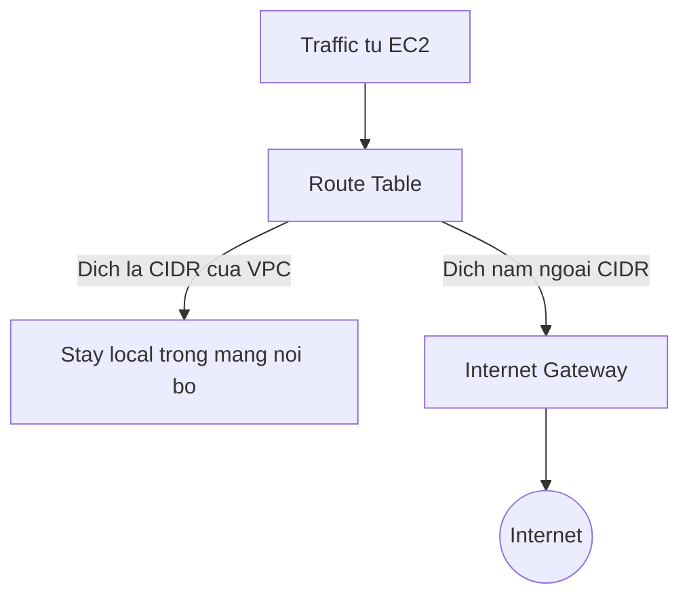

# 🧪 Hands-On: Khám phá VPC mặc định và các subnet trên AWS

> Nguồn: `168-VPC-Subnet-Internet-Gateway-NAT-Gateways---Hands-On.txt` · [Udemy](https://ua.udemy.com/course/aws-certified-cloud-practitioner-new/learn/lecture/49673365)

Lý thuyết đã xong, giờ là lúc mở AWS console và "sờ tận tay" vào VPC. Trong bài này, chúng ta sẽ khám phá **default VPC** mà AWS tạo sẵn: xem dải CIDR, ba subnet mặc định, tự tay launch một EC2 instance vào subnet, và hiểu vì sao nó là **public subnet**. *Cuối bài nhớ dọn dẹp tài nguyên nhé!*

---

### 🔍 Default VPC và dải CIDR 172.31.0.0/16

Mở **VPC console**, các bạn sẽ thấy có **1 VPC** và **3 subnet** cùng nhiều tài nguyên khác được tạo sẵn — đó là **default VPC (VPC mặc định)**.

Bấm vào VPC đó, điểm đầu tiên cần để ý là **IPv4 CIDR**: **172.31.0.0/16**. Để hiểu dải này, mình dùng trang [CIDR.XYZ](https://cidr.xyz) và nhập thông số vào:

* Trang hiển thị rõ **first usable IP** và **last usable IP**.
* Tổng cộng có **65,536 địa chỉ IP** khả dụng trong dải private này — rất tiện để biết bạn có thể tạo được bao nhiêu network interface.

Phần CIDR còn có thể **edit**: bạn có thể thêm IPv4 CIDR mới nếu sau này cần nhiều địa chỉ IP hơn, và thêm cả **IPv6 CIDR**.

---

### 🧩 Ba subnet mặc định — mỗi subnet một Availability Zone

AWS tự động tạo sẵn **3 subnet**, mỗi subnet có một **IPv4 CIDR /20** khác nhau (lần lượt các dải 0, 16, 32...). Nhìn vào đây ta thấy:

* **/20** tương ứng **4,096 địa chỉ IP**.
* AWS hiển thị **4,091 địa chỉ khả dụng** cho mỗi subnet (một số IP được AWS giữ lại).
* Mỗi subnet là **một tập con nhỏ hơn — một partition** của VPC.
* Mỗi subnet nằm ở một **Availability Zone khác nhau**: eu-west-1c, 1b và 1a.

Nhờ vậy, ta luôn biết được dải IP của từng subnet.

---

### 🖥️ Launch EC2 vào subnet tự chọn

Sang **EC2 console**, vào **Instances** → **Launch instance**. Mình chọn **no key pair** cho nhanh. Ở phần **Network settings**:

1. **Network**: vẫn là default VPC.
2. Bấm **Edit** ngay mục **Subnet** để chọn subnet cụ thể — ví dụ subnet nằm ở **eu-west-1a**.

Sau khi launch, instance nhận **private IPv4 là 172.31.28.181** — thuộc đúng dải CIDR của subnet đã chọn (số 28 khớp với dải). Quay lại trang subnet và refresh, các bạn thấy số IPv4 khả dụng **giảm đi 1**.

Vậy là đã rõ: **private IP của instance đến từ subnet mà bạn chọn khi launch** — chính là hành vi chúng ta thấy xuyên suốt khóa học. Instance này cũng có **public IPv4**, đơn giản vì nó nằm trong một **public subnet**.

---

### 🌐 Vì sao subnet này là public?

Câu trả lời nằm ở **Internet Gateway**. Trong console, một **internet gateway đã được tạo sẵn** và **gắn ở cấp VPC**. Nhưng IGW không tự làm subnet thành public — phải xem **Route Table**:

* Subnet đang dùng một **route table chung cho cả 3 subnet**.
* Route có nội dung: traffic đi tới **CIDR của VPC** → **stay local**, tức traffic nội bộ được giữ trong mạng riêng.
* Mọi địa chỉ IP **nằm ngoài CIDR** đó → đi tới **internet gateway**. Ví dụ khi truy cập google.com, địa chỉ được phân giải ra và nằm ngoài CIDR → traffic đi qua IGW ra internet.

Vì vậy, instance launch trong subnet có route tới internet gateway sẽ là **public instance** — và đó là lý do nó được cấp public IPv4.

---

### 🧹 Private subnet, NAT Gateway và dọn dẹp

Hiện tại chúng ta **chưa có private subnet nào**. Nếu muốn tạo một cái, bạn sẽ cần tạo **route table tương tự như trên nhưng không có internet gateway** — đây là việc thuộc các khóa nâng cao, không làm trong khóa này.

Và để private subnet ra được internet (ví dụ lấy update hệ điều hành), bạn cần một **NAT Gateway** gắn với các subnet cụ thể. Hiện chưa có NAT Gateway vì chưa có private subnet; ở góc độ kỳ thi, bạn chỉ cần hiểu **công dụng của nó ở mức high-level**.

Bước cuối cùng không thể quên: vào EC2, **terminate instance** vừa tạo để dọn dẹp. *Thói quen dọn dẹp sau mỗi bài hands-on sẽ giữ túi tiền của bạn an toàn.*

---

Vậy là bạn đã tự tay khám phá xong default VPC, các subnet và route table. Những gì vừa thấy trên console chính là "bản thật" của toàn bộ lý thuyết ở bài trước.

Bài tiếp theo, chúng ta sẽ nói về hai lớp bảo vệ mạng: **Security Groups và NACL**. Hẹn gặp các bạn! 🚀

## Nguồn tham khảo

* [CIDR.XYZ — công cụ tính và trực quan hóa dải CIDR](https://cidr.xyz)
