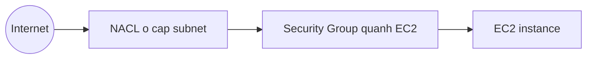

# 🛡️ Security Group và NACL: Hai lớp tường lửa trong VPC

> Nguồn: `169-Security-Groups-Network-Access-Control-List-NACL.txt` · [Udemy](https://ua.udemy.com/course/aws-certified-cloud-practitioner-new/learn/lecture/20056244)

Mạng đã dựng xong, giờ đến phần bảo vệ nó. Trong VPC có **hai lớp phòng thủ** bạn bắt buộc phải phân biệt: **NACL (Network Access Control List)** ở cấp subnet và **Security Group** ở cấp EC2 instance. Đây là chủ đề **rất hay xuất hiện trong đề thi**, nên các bạn đọc kỹ phần so sánh ở giữa bài nhé!

---

### 🛡️ NACL — lớp phòng thủ đầu tiên, ở cấp subnet

**NACL (Network ACL)** là một **firewall kiểm soát traffic ra/vào subnet**. Cần nhớ 3 đặc điểm:

* Hoạt động ở **subnet level (cấp subnet)**.
* Có thể định nghĩa cả rule **ALLOW** lẫn **DENY**.
* Rule **chỉ có thể chứa địa chỉ IP**.

Nhìn vào sơ đồ luồng traffic: NACL lọc traffic đi vào và đi ra khỏi subnet **trước khi nó chạm tới EC2 instance** — vì thế mình gọi nó là lớp phòng thủ đầu tiên.

---

### 🔐 Security Group — lớp phòng thủ quanh EC2 instance

**Security Group** là firewall kiểm soát traffic **tới và từ một EC2 instance**. Chúng ta đã dùng nó suốt khóa học, và đây là lớp phòng thủ thứ hai.

* Security Group **chỉ có ALLOW rules** (không có DENY).
* Có thể tham chiếu tới **địa chỉ IP** và **các security group khác**.

Trong sơ đồ, security group bao quanh EC2 instance và kiểm soát traffic đi vào/ra instance đó.

---

### 📊 So sánh NACL và Security Group

Điểm khác biệt cốt lõi: **NACL ở cấp subnet**, còn **Security Group ở cấp EC2 instance**. Từ góc độ thi cử, chỉ cần nắm chắc vài khác biệt đầu tiên là đủ.

| Tiêu chí | Security Group | NACL |
|---|---|---|
| Phạm vi hoạt động | Cấp EC2 instance | Cấp subnet |
| Loại rule | Chỉ ALLOW | ALLOW và DENY |
| Traffic quay về | Tự động được cho phép (stateful) | Phải được cho phép rõ ràng (stateless) |
| Đối tượng tham chiếu | Địa chỉ IP và security group khác | Chỉ địa chỉ IP |

Hai khái niệm quan trọng đi kèm:

* Security Group là **stateful**: traffic phản hồi **tự động được cho phép, bất kể rule** — bạn không cần mở rule chiều về.
* NACL là **stateless**: traffic phản hồi **phải được cho phép tường minh bằng rule**, nếu không sẽ bị chặn.

---

### 🖥️ Xem trên console: Security Group và NACL mặc định

Trong VPC console, mục **Security** → **Security groups** sẽ hiển thị **toàn bộ security group** đã tạo trong khóa học (bạn có thể thấy danh sách khác mình một chút, không sao cả). Bạn có thể xem security group từ **VPC console hoặc EC2 console**:

1. Bấm vào một security group, ví dụ **launch-wizard-7**.
2. Xem **inbound rules** để biết traffic nào được phép vào.

Đây là cách **tập trung hóa** mọi security group của VPC về một chỗ.

Còn **Network ACLs** nằm ở menu bên trái. Ở đây bạn thấy NACL **mặc định (default)**:

* Một VPC mặc định sẽ có **một NACL default** đi kèm, gắn ở **cấp subnet** — hiện đang liên kết với **3 subnet**.
* **Inbound rules**: **rule 100** cho phép **mọi traffic, mọi cổng, từ mọi nơi**; rule cuối cùng là **DENY** (dấu `*` nghĩa là rule cuối). Vì rule 100 đã match trước, mọi traffic đều được cho phép.
* **Outbound rules** tương tự: cho phép mọi traffic đi ra.
* Muốn siết chặt, bạn có thể **edit inbound rules** và thêm rule mới — ví dụ **rule 200 chỉ cho phép HTTPS từ mọi nơi**; nếu xóa rule 100, chỉ traffic HTTPS cổng 443 được vào, còn lại đều bị deny. Hiện tại chúng ta chưa muốn điều đó, nhưng đây chính là cách áp một firewall ở **cấp subnet**.

---

### 🎯 Tự kiểm tra nhanh

**Câu 1:** NACL hoạt động ở cấp nào và hỗ trợ loại rule nào?

<b>Xem đáp án</b>

**Đáp án:** Cấp subnet; hỗ trợ cả ALLOW và DENY.

Giải thích: Rule của NACL chỉ có thể chứa địa chỉ IP.

Tham chiếu: Mục NACL — lớp phòng thủ đầu tiên.

**Câu 2:** Security Group hoạt động ở cấp nào và hỗ trợ loại rule nào?

<b>Xem đáp án</b>

**Đáp án:** Cấp EC2 instance; chỉ có ALLOW rules.

Giải thích: Security group có thể tham chiếu IP và các security group khác.

Tham chiếu: Mục Security Group — lớp phòng thủ quanh EC2.

**Câu 3:** Vì sao Security Group được gọi là stateful?

<b>Xem đáp án</b>

**Đáp án:** Vì traffic phản hồi tự động được cho phép, bất kể rule.

Giải thích: Ngược lại, NACL là stateless — traffic quay về phải được cho phép tường minh.

Tham chiếu: Mục So sánh NACL và Security Group.

**Câu 4:** Trong NACL mặc định của VPC, rule 100 và rule cuối cùng quy định điều gì?

<b>Xem đáp án</b>

**Đáp án:** Rule 100 cho phép mọi traffic, mọi cổng, từ mọi nơi; rule cuối cùng (dấu `*`) là DENY.

Giải thích: Vì rule 100 match trước nên mọi traffic đều được cho phép.

Tham chiếu: Mục Xem trên console.

**Câu 5:** Muốn chỉ cho phép HTTPS từ mọi nơi ở cấp subnet, bạn làm thế nào?

<b>Xem đáp án</b>

**Đáp án:** Thêm rule cho phép HTTPS cổng 443 từ mọi nơi, rồi xóa rule 100 cho phép tất cả; phần còn lại sẽ bị deny.

Giải thích: Đây là ví dụ áp firewall ở cấp subnet bằng NACL.

Tham chiếu: Mục Xem trên console.

---

Vậy là bạn đã phân biệt được hai lớp tường lửa: **NACL gác ở cửa subnet, Security Group gác quanh từng EC2 instance**. Nhớ nhanh: *NACL có DENY và stateless, Security Group chỉ ALLOW và stateful.*

Bài tiếp theo, chúng ta sẽ học cách **nhìn thấy toàn bộ traffic trong VPC bằng Flow Logs** và cách nối các VPC với nhau bằng **VPC Peering**. Hẹn gặp các bạn! 🚀
