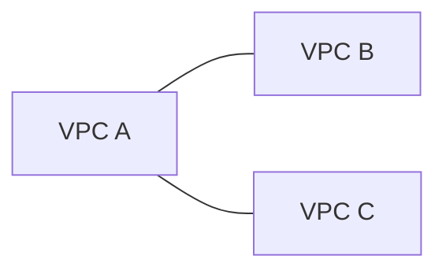

# 📜 VPC Flow Logs và VPC Peering: Nhìn thấy và kết nối mạng AWS

> Nguồn: `170-VPC-Flow-Logs-VPC-Peering.txt` · [Udemy](https://ua.udemy.com/course/aws-certified-cloud-practitioner-new/learn/lecture/20056258)

Làm sao để biết traffic trong VPC của bạn đang đi đâu, về đâu? Và làm sao nối hai VPC riêng biệt thành một mạng thống nhất? Bài này trả lời cả hai câu hỏi với **VPC Flow Logs** và **VPC Peering** — hai chủ đề gọn gàng nhưng rất thực dụng, kèm phần thao tác trên console.

---

### 📜 VPC Flow Logs là gì?

**VPC Flow Logs** là **log của toàn bộ traffic IP đi qua các network interface** của bạn. Bạn có thể bật flow log ở nhiều cấp độ:

* **VPC flow log**
* **Subnet flow log**
* **Elastic Network Interface flow log**

Mục đích chính là để xem **traffic đi vào và đi ra** — ví dụ từ các EC2 instance. Điều này cực kỳ quan trọng vì ngoài thông tin từ EC2, bạn còn thu được dữ liệu traffic cho cả **Elastic Load Balancers, ElastiCache, RDS, Aurora**, v.v.

---

### 🔍 Dùng Flow Logs để làm gì?

Khi bật flow log, bạn có thể **monitor và troubleshoot** các vấn đề kết nối. Ví dụ:

* Một subnet **không kết nối được ra internet**.
* Một subnet **không nói chuyện được với subnet khác**.
* **Internet không truy cập được vào một subnet**.

Tất cả những tình huống này đều **được ghi lại trong flow log**, và bạn xem log để tìm ra **nguyên nhân gốc (root cause)** của vấn đề.

---

### 💾 Flow Logs đi đâu và ghi những gì?

Flow logs có thể được gửi tới:

* **Amazon S3**
* **CloudWatch Logs**
* **Amazon Data Firehose** (trong console hiển thị là Kinesis Firehose)

Khi tạo một flow log trên console, bạn sẽ gặp các tùy chọn:

1. **Đặt tên** cho flow log.
2. **Filter**: **all traffic (toàn bộ)**, **accepted (được chấp nhận)** hoặc **rejected (bị từ chối)**.
3. **Maximum aggregation interval**: **10 phút** hoặc **1 phút**.
4. **Destination**: CloudWatch Logs, S3 bucket hoặc Kinesis Firehose — có thể cùng hoặc **khác account**.
5. Tùy đích đến mà khai báo tham số riêng, ví dụ với CloudWatch Logs là **log group** và **IAM role**.

**Log record format** sẽ ghi các thông tin như: version, account ID, interface ID, source address, destination address, source port, destination port, protocol, packets, bytes, start, end, action và log status.

---

### 🔗 VPC Peering — nối hai VPC như cùng một mạng

**VPC Peering** cho phép bạn **kết nối hai VPC riêng tư** với nhau bằng chính **mạng nội bộ của AWS**, để chúng hành xử **như thể cùng thuộc một mạng**. Ví dụ, VPC A và VPC B được peer với nhau thì tài nguyên hai bên nói chuyện được như trong cùng một network.

Hai quy tắc bắt buộc phải nhớ:

* **Dải địa chỉ IP không được chồng lấn (overlap)**. Nếu chồng lấn, bạn **không thể** thiết lập kết nối peering.
* VPC peering **không có tính bắc cầu (not transitive)**. Nếu bạn peer VPC A với B, rồi peer A với C, thì **B và C vẫn chưa nói chuyện được với nhau** — muốn vậy phải tạo thêm một peering connection giữa B và C.

---

### 🖥️ Tạo Flow Log và Peering Connection trên console

**Với flow log:** vào VPC → **Flow logs** → **Create flow log**, rồi cấu hình đúng các tùy chọn phía trên (tên, filter, khoảng tổng hợp, đích đến, IAM role...).

**Với peering:**

1. Vào mục **Peering connections** ở menu bên trái → **Create peering connection**.
2. **Đặt tên**, chọn **local VPC** (đóng vai trò **requester VPC**).
3. Chọn VPC còn lại để peer — có thể **trong account của bạn hoặc account khác**, và có thể **cùng region hoặc khác region** (ví dụ chọn Cape Town, Africa).
4. Nhập **VPC ID** của VPC đối tác.
5. Nhấn tạo peering connection; nếu phía bên kia **chấp nhận (accepted)**, hai mạng sẽ hành xử như một — đúng mục đích của VPC peering.

Trong bài giảng không có sẵn VPC thứ hai để demo, nhưng quy trình là như trên.

---

### 🎯 Tự kiểm tra nhanh

**Câu 1:** VPC Flow Logs có thể được bật ở những cấp nào?

<b>Xem đáp án</b>

**Đáp án:** VPC, subnet hoặc Elastic Network Interface.

Giải thích: Flow log ghi lại traffic IP đi qua các interface.

Tham chiếu: Mục VPC Flow Logs là gì.

**Câu 2:** Flow Logs có thể gửi dữ liệu tới những đâu?

<b>Xem đáp án</b>

**Đáp án:** Amazon S3, CloudWatch Logs và Amazon Data Firehose.

Giải thích: Trong console, Amazon Data Firehose hiển thị là Kinesis Firehose.

Tham chiếu: Mục Flow Logs đi đâu và ghi những gì.

**Câu 3:** Điều kiện tiên quyết để tạo VPC Peering giữa hai VPC là gì?

<b>Xem đáp án</b>

**Đáp án:** Dải địa chỉ IP của hai VPC không được chồng lấn.

Giải thích: Nếu CIDR trùng nhau, peering không thể được thiết lập.

Tham chiếu: Mục VPC Peering.

**Câu 4:** VPC Peering có tính bắc cầu không?

<b>Xem đáp án</b>

**Đáp án:** Không. A peer với B và A peer với C thì B và C vẫn chưa kết nối được.

Giải thích: Muốn B nói chuyện với C phải tạo thêm peering B–C.

Tham chiếu: Mục VPC Peering.

**Câu 5:** Sau khi một peering connection được chấp nhận, điều gì xảy ra?

<b>Xem đáp án</b>

**Đáp án:** Hai VPC hành xử như cùng một mạng.

Giải thích: Peering dùng mạng nội bộ AWS, kết nối riêng tư giữa hai VPC.

Tham chiếu: Mục VPC Peering.

---

Vậy là bạn đã biết cách **nhìn thấy traffic** bằng Flow Logs và cách **nối các VPC** bằng Peering. *Hai công cụ nhỏ nhưng cực hữu ích khi hệ thống lớn dần.*

Bài tiếp theo, chúng ta sẽ tìm hiểu **VPC Endpoints** — cách truy cập dịch vụ AWS mà không cần đi qua internet. Hẹn gặp các bạn! 🚀
