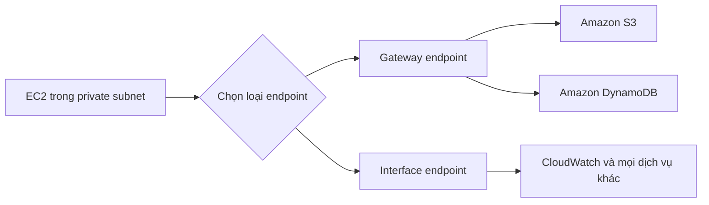

# 🔒 VPC Endpoints: Kết nối dịch vụ AWS qua mạng riêng, không đi internet

> Nguồn: `171-VPC-Endpoints---Interface-Gateway-S3-DynamoDB.txt` · [Udemy](https://ua.udemy.com/course/aws-certified-cloud-practitioner-new/learn/lecture/20056264)

Từ đầu khóa đến giờ, mọi dịch vụ AWS chúng ta dùng đều là **public** — nghĩa là khi kết nối tới chúng, các bạn đang đi qua internet công khai. Hôm nay mình giới thiệu **VPC Endpoint**: cách kết nối tới dịch vụ AWS bằng **mạng riêng của AWS** thay vì public internet.

*Nghe thì nhỏ, nhưng đây là chủ đề rất hay gặp trong đề thi — nhớ kỹ phần chốt cuối bài nhé!*

---

### 🔐 Vì sao nên dùng VPC Endpoint?

Khi dùng VPC Endpoint, các bạn kết nối tới dịch vụ AWS qua **private AWS network (mạng riêng của AWS)** thay vì public internet. Lợi ích rất rõ ràng:

* **Bảo mật tốt hơn** — traffic không đi qua internet công khai.
* **Latency thấp hơn** — không phải đi vòng qua các network hub.

Đúng kiểu "một mũi tên trúng hai đích": vừa an toàn hơn, vừa nhanh hơn.

---

### 🚪 Hai loại VPC Endpoint: Gateway và Interface

Hãy tưởng tượng bạn có một **VPC**, bên trong là **private subnet** chạy **EC2 instance**, và instance này cần kết nối tới **Amazon S3** hoặc **DynamoDB**. Lúc này bạn tạo **VPC endpoint loại gateway**.

* **Gateway endpoint** — chỉ dành cho **Amazon S3 và DynamoDB**, không có dịch vụ nào khác.
* **Interface endpoint** — dùng để kết nối tới **mọi dịch vụ AWS khác**, ví dụ **CloudWatch** khi bạn muốn đẩy custom metric từ EC2 instance vào CloudWatch.

| Tiêu chí | Gateway endpoint | Interface endpoint |
|---|---|---|
| Dịch vụ hỗ trợ | Chỉ S3 và DynamoDB | Mọi dịch vụ AWS khác |
| Ví dụ | EC2 private subnet kết nối S3, DynamoDB | EC2 đẩy custom metric vào CloudWatch |
| Ghi nhớ thi | "Gateway = S3 + DynamoDB" | Gần như dịch vụ nào cũng có |

---

### 🖥️ Thực hành tạo endpoint trên console

Trên AWS console, bạn vào mục **Endpoints** (nằm dưới **PrivateLink and Lattice**) — chú ý bấm **Endpoint** chứ không phải **Endpoint services** — rồi chọn **Create endpoint**:

1. Chọn loại mặc định là **AWS services**.
2. Kéo xuống danh sách dịch vụ — danh sách này rất dài, gồm nhiều trang, gần như **mọi dịch vụ AWS** đều có thể tạo endpoint.
3. Ví dụ với **EC2**: bạn tạo được **interface endpoint**, sau đó cần chỉ định **VPC** và **subnet** — đây là cấu hình cổ điển của interface endpoint.
4. Ví dụ với **Amazon S3**: có **hai lựa chọn** — vừa có interface endpoint, vừa có gateway.
5. **DynamoDB** cũng tương tự: có cả interface endpoint lẫn gateway endpoint.

---

### 💡 Chốt lại để nhớ lâu cho đề thi

Chỉ cần nhớ hai câu thần chú:

* **Gần như mọi dịch vụ AWS đều có interface endpoint.**
* **Chỉ DynamoDB và Amazon S3 mới có thêm gateway endpoint.**

Đây là dạng câu hỏi "gài" rất dễ xuất hiện, nên đừng học vẹt "gateway chỉ dành cho S3" mà quên mất DynamoDB nhé.

---

### 🎯 Tự kiểm tra nhanh

**Câu 1:** VPC Endpoint giúp kết nối tới dịch vụ AWS bằng đường nào?

<b>Xem đáp án</b>

**Đáp án:** Qua mạng riêng của AWS (private AWS network) thay vì public internet.

Giải thích: Nhờ đó bảo mật tốt hơn và latency thấp hơn.

Tham chiếu: Mục Vì sao nên dùng VPC Endpoint.

**Câu 2:** Gateway endpoint dùng được cho những dịch vụ nào?

<b>Xem đáp án</b>

**Đáp án:** Chỉ Amazon S3 và DynamoDB.

Giải thích: Đây là hai dịch vụ duy nhất có gateway endpoint.

Tham chiếu: Mục Hai loại VPC Endpoint.

**Câu 3:** Interface endpoint dùng để làm gì?

<b>Xem đáp án</b>

**Đáp án:** Kết nối tới mọi dịch vụ AWS khác, ví dụ CloudWatch.

Giải thích: Gần như mọi dịch vụ AWS đều có interface endpoint.

Tham chiếu: Mục Hai loại VPC Endpoint.

**Câu 4:** Khi tạo endpoint trên console, bạn chọn mục nào?

<b>Xem đáp án</b>

**Đáp án:** Endpoints (không phải Endpoint services) → Create endpoint.

Giải thích: Loại mặc định là AWS services, sau đó bạn tìm dịch vụ trong danh sách rất dài.

Tham chiếu: Mục Thực hành tạo endpoint trên console.

**Câu 5:** Phát biểu nào đúng cho đề thi?

<b>Xem đáp án</b>

**Đáp án:** Mọi dịch vụ có interface endpoint, nhưng chỉ S3 và DynamoDB có thêm gateway endpoint.

Giải thích: Đây là điểm phân biệt hai loại endpoint mà đề rất thích hỏi.

Tham chiếu: Mục Chốt lại để nhớ lâu cho đề thi.

---

Vậy là các bạn đã nắm gọn hai loại VPC Endpoint và biết cách tạo chúng trên console. *Chỉ cần nhớ "interface cho mọi dịch vụ, gateway cho S3 và DynamoDB" là các bạn đã ăn điểm phần này rồi.*

Ở bài tiếp theo, chúng ta sẽ tìm hiểu **PrivateLink** — cách kết nối riêng tư tới dịch vụ của bên thứ ba. Hẹn gặp các bạn! 🚀
