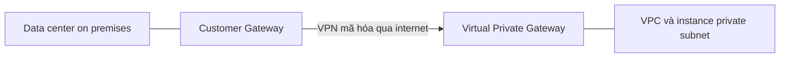

# 🏢 Direct Connect & Site-to-Site VPN: Nối data center lên AWS đúng cách

> Nguồn: `173-Direct-Connect-Site-to-Site-VPN.txt` · [Udemy](https://ua.udemy.com/course/aws-certified-cloud-practitioner-new/learn/lecture/20056254)

Giờ chúng ta bước vào thế giới **hybrid cloud**: bạn có một **data center on-premises (tại chỗ)** và muốn kết nối nó lên cloud — cụ thể là lên VPC của mình. AWS cho bạn **hai lựa chọn**: **Site-to-Site VPN** và **Direct Connect**.

*Đây là cặp đôi "kinh điển" trong đề thi — mình sẽ chỉ rõ khi nào chọn cái nào ở cuối bài.*

---

### 🔐 Site-to-Site VPN: nhanh, gọn, có mã hóa

**Site-to-Site VPN** dùng để kết nối **VPN on-premises của bạn lên AWS**. Cụ thể, đây là kết nối giữa data center và VPC, được **mã hóa (encrypted)** và đi **qua public internet**.

* Ưu điểm: thiết lập **cực nhanh — khoảng 5 phút** là bạn đã có kết nối giữa data center và AWS.
* Nhược điểm: vì đi qua public internet nên có thể bị **giới hạn băng thông (limited bandwidth)** và vẫn còn **lo ngại về bảo mật**, dù traffic đã được mã hóa.

Để dựng Site-to-Site VPN, các bạn cần nhớ đúng hai thiết bị:

1. **Customer Gateway (CGW)** — đặt ở phía on-premises.
2. **Virtual Private Gateway (VGW)** — đặt ở phía AWS.

Khi cả hai đã được tạo, bạn nối chúng với nhau bằng một **Site-to-Site VPN** chạy trên public internet.

---

### ⚡ Direct Connect: riêng tư, nhanh, ổn định

**Direct Connect (DX)** thiết lập một **kết nối vật lý riêng** giữa data center on-premises và AWS. Kết nối này **private, secure và fast** vì đi qua mạng riêng.

Đổi lại, DX **đắt hơn nhiều** vì bạn phải làm **kết nối vật lý** giữa mình và một **Direct Connect partner** để vào AWS. Thời gian thiết lập cũng lâu: **ít nhất một tháng**.

Bù lại, nó **riêng tư hơn, nhanh hơn và đáng tin cậy hơn** hẳn.

---

### 📊 So sánh nhanh & mẹo chọn đáp án

| Tiêu chí | Site-to-Site VPN | Direct Connect |
|---|---|---|
| Đường truyền | Public internet, có mã hóa | Mạng riêng, kết nối vật lý |
| Thời gian thiết lập | Khoảng 5 phút | Ít nhất 1 tháng |
| Chi phí | Thấp hơn | Cao hơn nhiều |
| Độ ổn định | Bị giới hạn băng thông | Nhanh, ổn định, đáng tin cậy |
| Thành phần cần | CGW + VGW | Direct Connect partner |

Trong đề thi, khi được hỏi chọn **Site-to-Site VPN** hay **Direct Connect** để nối on-premises với AWS, các bạn chỉ cần tự hỏi **hai câu**:

1. Kết nối có cần **private** không?
2. Kết nối có cần **thiết lập nhanh** không?

Trả lời xong hai câu này là bạn chọn được đáp án đúng.

---

### 🎯 Tự kiểm tra nhanh

**Câu 1:** Site-to-Site VPN mã hóa kết nối và đi qua đâu?

<b>Xem đáp án</b>

**Đáp án:** Đi qua public internet, có mã hóa.

Giải thích: Nhờ mã hóa nên người khác không đọc được liên lạc, nhưng vẫn có lo ngại bảo mật và giới hạn băng thông.

Tham chiếu: Mục Site-to-Site VPN.

**Câu 2:** Site-to-Site VPN thiết lập mất khoảng bao lâu?

<b>Xem đáp án</b>

**Đáp án:** Khoảng 5 phút.

Giải thích: Đây là ưu điểm lớn nhất của Site-to-Site VPN so với Direct Connect.

Tham chiếu: Mục Site-to-Site VPN.

**Câu 3:** Direct Connect là loại kết nối gì?

<b>Xem đáp án</b>

**Đáp án:** Kết nối vật lý riêng giữa data center on-premises và AWS.

Giải thích: Private, secure, fast; đắt hơn và thiết lập ít nhất một tháng qua Direct Connect partner.

Tham chiếu: Mục Direct Connect.

**Câu 4:** Hai thành phần bắt buộc để dựng Site-to-Site VPN là gì?

<b>Xem đáp án</b>

**Đáp án:** Customer Gateway (CGW) ở on-premises và Virtual Private Gateway (VGW) ở phía AWS.

Giải thích: Sau khi tạo hai gateway, bạn nối chúng bằng Site-to-Site VPN.

Tham chiếu: Mục Site-to-Site VPN.

**Câu 5:** Hai yếu tố quyết định chọn VPN hay Direct Connect?

<b>Xem đáp án</b>

**Đáp án:** Có cần private không, và có cần thiết lập nhanh không.

Giải thích: Dựa vào hai câu hỏi này là bạn chọn được đáp án trong đề.

Tham chiếu: Mục So sánh nhanh và mẹo chọn đáp án.

---

Vậy là các bạn đã nắm chắc khi nào dùng **Site-to-Site VPN** (nhanh, rẻ, qua internet) và khi nào dùng **Direct Connect** (riêng tư, nhanh, ổn định nhưng lâu và đắt). *Nhớ bộ đôi CGW + VGW là các bạn tự tin xử lý mọi câu hỏi về VPN nhé.*

Ở bài tiếp theo, chúng ta sẽ nói về **Client VPN** — đưa chính chiếc máy tính của bạn vào VPC. Hẹn gặp các bạn! 🚀
