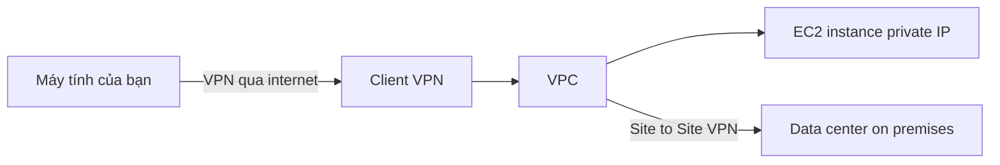

# 💻 Client VPN: Đưa máy tính cá nhân của bạn vào thẳng VPC

> Nguồn: `174-Client-VPN.txt` · [Udemy](https://ua.udemy.com/course/aws-certified-cloud-practitioner-new/learn/lecture/33532726)

Bài trước chúng ta nối **data center** lên AWS. Bài này mình nói về **AWS Client VPN** — giải pháp dành cho **chiếc máy tính cá nhân của bạn**: làm sao để kết nối riêng tư vào VPC trong AWS.

*Nghe thì "phép thuật", nhưng cách hoạt động lại rất dễ hiểu — mình đi từ tình huống thực tế nhé.*

---

### 🎯 Vấn đề: truy cập EC2 bằng private IP

Giả sử bạn deploy các **EC2 instance trong một private VPC** và muốn truy cập chúng bằng **private IP**. Nếu **không có VPN**, việc này rất khó. Nhưng nếu có VPN thì **siêu dễ**.

---

### 🔍 Client VPN hoạt động thế nào?

Bạn dùng **Client VPN** để thiết lập kết nối bằng **OpenVPN** tới mạng riêng trong AWS hoặc on-premises:

1. **Client VPN** được cài trên máy tính của bạn.
2. Bạn thiết lập **VPN connection qua internet** — kết nối này đi qua public internet.
3. Sau đó, bạn như thể đang **kết nối riêng tư vào VPC**.

Một khi VPN đã kết nối, bạn truy cập **EC2 instance bằng private IP** — *cứ như thể bạn đang ở ngay trong mạng VPC vậy.*

---

### 🔗 Kết hợp với Site-to-Site VPN

Điều thú vị: nếu VPC của bạn đã có **Site-to-Site VPN** nối tới data center on-premises, thì máy tính của bạn **cũng truy cập được riêng tư tới các server on-premises** đó.

*Nghe đúng kiểu "phép thuật", nhưng nó hoạt động thật đấy!*

---

### 🧠 Ghi nhớ nhanh cho đề thi

* **Client VPN** = đưa **máy tính cá nhân** vào VPC riêng tư.
* Dùng giao thức **OpenVPN**.
* Truy cập EC2 instance qua **private IP** như đang ở trong VPC.
* Kết nối khởi tạo **qua internet**, sau đó là kết nối riêng tư.
* Có thể với tới cả **server on-premises** nếu VPC đã có Site-to-Site VPN.

---

### 🎯 Tự kiểm tra nhanh

**Câu 1:** Client VPN dùng giao thức nào để kết nối?

<b>Xem đáp án</b>

**Đáp án:** OpenVPN.

Giải thích: Client VPN thiết lập kết nối OpenVPN tới mạng riêng trong AWS hoặc on-premises.

Tham chiếu: Mục Client VPN hoạt động thế nào.

**Câu 2:** Client VPN dùng cho đối tượng nào?

<b>Xem đáp án</b>

**Đáp án:** Máy tính cá nhân của người dùng, muốn kết nối riêng tư vào VPC.

Giải thích: Đây là điểm khác biệt so với Site-to-Site VPN (nối cả data center).

Tham chiếu: Mục Vấn đề truy cập EC2 bằng private IP.

**Câu 3:** Sau khi kết nối Client VPN, bạn truy cập EC2 instance bằng gì?

<b>Xem đáp án</b>

**Đáp án:** Bằng private IP, như thể bạn đang ở trong mạng VPC.

Giải thích: Không cần public IP cho instance nữa.

Tham chiếu: Mục Client VPN hoạt động thế nào.

**Câu 4:** Kết nối Client VPN có đi qua public internet không?

<b>Xem đáp án</b>

**Đáp án:** Có — VPN connection được thiết lập qua internet, sau đó bạn như đang kết nối riêng tư vào VPC.

Giải thích: Đây là cách Client VPN hoạt động theo transcript mô tả.

Tham chiếu: Mục Client VPN hoạt động thế nào.

**Câu 5:** Nhờ đâu máy tính của bạn truy cập được server on-premises?

<b>Xem đáp án</b>

**Đáp án:** Nhờ VPC đã có Site-to-Site VPN nối tới data center on-premises.

Giải thích: Khi đó Client VPN "nối tiếp" qua VPC để với tới mạng on-premises.

Tham chiếu: Mục Kết hợp với Site-to-Site VPN.

---

Vậy là các bạn đã biết Client VPN giúp kết nối máy tính cá nhân vào VPC qua OpenVPN và truy cập EC2 bằng private IP. *Hãy nhớ: Site-to-Site VPN là cho cả data center, còn Client VPN là cho từng người dùng — đề thi rất hay so sánh hai dịch vụ này.*

Ở bài tiếp theo, chúng ta tìm hiểu **Transit Gateway** — chiếc hub nối mọi thứ lại với nhau. Hẹn gặp các bạn! 🚀
