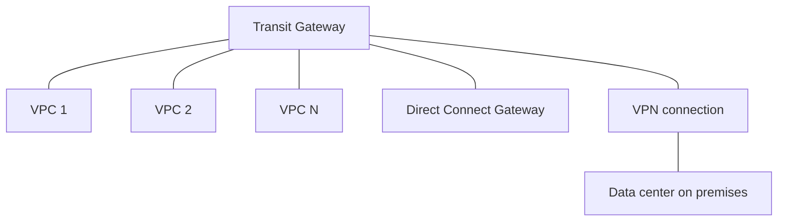

# 🌐 Transit Gateway: Một hub nối hàng nghìn VPC và on-premises

> Nguồn: `175-Transit-Gateway-Overview.txt` · [Udemy](https://ua.udemy.com/course/aws-certified-cloud-practitioner-new/learn/lecture/20056288)

Chúng ta đã học **VPC peering**, **Site-to-Site VPN** và **Direct Connect**. Khi hạ tầng AWS lớn dần, **network topology** sẽ trở nên rất phức tạp — kiểu "mớ bòng bong" kết nối. AWS tạo ra **Transit Gateway** để giải quyết chính bài toán đó.

*Đây là dịch vụ "một phát ăn ngay" cho các câu hỏi quy mô lớn trong đề thi.*

---

### 🧩 Vấn đề: topology ngày càng rối

Nếu bạn có một hạ tầng nghiêm túc trên AWS, việc nối từng cặp VPC với nhau bằng peering, rồi thêm Site-to-Site VPN, rồi Direct Connect... sẽ khiến sơ đồ mạng trở nên **cực kỳ phức tạp**. Càng nhiều VPC, càng nhiều kết nối, càng nhiều route — đúng nghĩa một mớ hỗn độn.

---

### 🎯 Transit Gateway: hub-and-spoke cho mọi kết nối

**Transit Gateway** tạo ra một **peering connection** giữa **hàng nghìn VPC** và hệ thống on-premises theo mô hình **hub-and-spoke (trục trung tâm — nan hoa)**.

Thay vì:

* Peer từng VPC với nhau,
* Tự tạo từng kết nối và route riêng giữa chúng với Direct Connect và Site-to-Site VPN,

...tất cả được gom vào **một gateway duy nhất**:

Transit Gateway hoạt động với:

* **Amazon VPCs**
* **VPN connections**
* **Direct Connect gateways**

---

### 💡 Mẹo thi: nhìn từ khóa là chọn được đáp án

Khi đề thi mô tả việc kết nối **hàng trăm hoặc hàng nghìn VPC** với nhau, kèm cả **hạ tầng on-premises**, thì đừng nghĩ ngợi gì nữa: chọn **Transit Gateway**.

---

### 🎯 Tự kiểm tra nhanh

**Câu 1:** Transit Gateway ra đời để giải quyết vấn đề gì?

<b>Xem đáp án</b>

**Đáp án:** Network topology trở nên quá phức tạp khi nối nhiều VPC và on-premises.

Giải thích: Càng nhiều VPC, càng nhiều peering connection và route — rất khó quản lý.

Tham chiếu: Mục Vấn đề topology ngày càng rối.

**Câu 2:** Transit Gateway hoạt động theo mô hình nào?

<b>Xem đáp án</b>

**Đáp án:** Hub-and-spoke (trục trung tâm — nan hoa).

Giải thích: Mọi VPC, VPN và Direct Connect gateway đều kết nối vào một hub trung tâm.

Tham chiếu: Mục Transit Gateway.

**Câu 3:** Transit Gateway kết nối được những gì?

<b>Xem đáp án</b>

**Đáp án:** Amazon VPCs, VPN connections và Direct Connect gateways.

Giải thích: Cùng với hệ thống on-premises của bạn.

Tham chiếu: Mục Transit Gateway.

**Câu 4:** Lợi ích chính so với việc peer từng cặp VPC là gì?

<b>Xem đáp án</b>

**Đáp án:** Không cần peer các VPC với nhau, không cần nhiều kết nối và route riêng — tất cả nằm trong một gateway.

Giải thích: Một gateway duy nhất cung cấp toàn bộ chức năng kết nối.

Tham chiếu: Mục Transit Gateway.

**Câu 5:** Đề thi nói "kết nối hàng nghìn VPC và on-premises" — bạn chọn gì?

<b>Xem đáp án</b>

**Đáp án:** Transit Gateway.

Giải thích: Đây là từ khóa nhận diện dịch vụ này trong đề.

Tham chiếu: Mục Mẹo thi.

---

Vậy là các bạn đã có trong tay "chiếc hub vạn năng" cho mọi kết nối quy mô lớn. *Chỉ cần thấy "hàng trăm/hàng nghìn VPC" là chọn ngay Transit Gateway — đơn giản vậy thôi.*

Ở bài tiếp theo, chúng ta sẽ **tổng kết toàn bộ VPC & Networking** để chuẩn bị bước vào phần tiếp theo của khóa học. Hẹn gặp các bạn! 🚀
