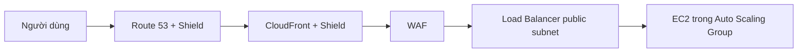

# 🛡️ Chống DDoS trên AWS: Shield, WAF và lá chắn nhiều lớp

> Nguồn: `178-DDoS-Protection-WAF-Shield.txt` · [Udemy](https://ua.udemy.com/course/aws-certified-cloud-practitioner-new/learn/lecture/20056310)

Tiếp nối chủ đề bảo mật, bài này mình sẽ nói về cách tự bảo vệ trước **DDoS attack** — một trong những kiểu tấn công khiến ứng dụng của bạn "sập" chỉ trong vài phút. Tin tốt là AWS có sẵn cả một bộ công cụ để chặn đứng nó.

Các bạn sẽ làm quen với **Shield**, **WAF**, cùng vai trò của **CloudFront** và **Route 53** — đây là những dịch vụ rất hay xuất hiện trong đề thi.

---

### ⚠️ DDoS attack hoạt động như thế nào?

**DDoS (Distributed Denial-of-Service — tấn công từ chối dịch vụ phân tán)** diễn ra theo kịch bản sau:

1. Kẻ tấn công (hacker) muốn hạ gục application server của bạn.
2. Hắn dựng **nhiều master server**, và các server này điều khiển một lượng lớn **bot**.
3. Toàn bộ bot đồng loạt gửi request đến application server của bạn.
4. Server không được thiết kế để chịu ngần ấy request nên bị **quá tải (overwhelmed)**, ngừng hoạt động — tức là bị **denied service**.
5. Người dùng bình thường không thể kết nối, ứng dụng của bạn coi như "down".

Nghe đáng sợ đấy, nhưng trên AWS bạn hoàn toàn có thể phòng thủ.

---

### 🛡️ AWS Shield Standard và Shield Advanced

**Shield gồm 2 phiên bản:**

| Tiêu chí | Shield Standard | Shield Advanced |
|---|---|---|
| Chi phí | Miễn phí | ~3000 USD/tháng/tổ chức |
| Kích hoạt | Tự động cho mọi khách hàng | Bạn chủ động bật |
| Mức độ | Tấn công DDoS phổ biến | Tấn công tinh vi hơn |
| Phạm vi | Website, ứng dụng | EC2, ELB, CloudFront, Global Accelerator, Route 53 |
| Hỗ trợ | — | Đội response team 24/7 |
| Phí phát sinh khi bị tấn công | — | AWS chịu |

* **Shield Standard** là dịch vụ miễn phí, được kích hoạt cho **mọi khách hàng AWS**, bảo vệ trước các đòn DDoS phổ biến như **SYN/UDP Reflection Floods**, **Reflection attacks** và các tấn công **layer 3, layer 4**.
* **Shield Advanced** là dịch vụ tùy chọn, giá khoảng **3000 USD/tháng/tổ chức**, cho bạn bảo vệ 24/7 trước các cuộc tấn công tinh vi nhắm vào **EC2, ELB, CloudFront, Global Accelerator và Route 53**. Bạn còn được tiếp cận **response team**, và mọi chi phí phát sinh trong lúc bị tấn công sẽ do **AWS chịu**.

*Mẹo thi: bản miễn phí bật mặc định cho mọi khách hàng; còn cần đội hỗ trợ và mức phòng thủ cao hơn thì mới cần Shield Advanced.*

---

### 🔍 WAF — Web Application Firewall

**WAF (Web Application Firewall — tường lửa ứng dụng web)** giúp lọc các request cụ thể dựa trên rules, bảo vệ ứng dụng web khỏi các khai thác phổ biến ở **layer 7 (HTTP)** — khác với layer 4 vốn dành cho TCP.

Vì hoạt động ở layer 7, WAF chỉ triển khai được trên các thiết bị "thân thiện với HTTP":

* **Application Load Balancer**
* **API Gateway** (*dịch vụ này nằm ngoài phạm vi đề thi*)
* **CloudFront**

Trên WAF, bạn định nghĩa **Web ACL (Web Access Control Lists)** với các rule có thể:

* Lọc theo **địa chỉ IP**, **HTTP headers**, **body** và các **chuỗi (strings)**.
* Chống các đòn tấn công phổ biến như **SQL injection** và **Cross-Site Scripting**.
* Áp **size constraints** để chặn request quá lớn.
* **Geo-match** để chặn truy cập từ một số quốc gia.
* **Rate-based rules** để đếm tần suất sự kiện — ví dụ một người dùng không được gửi quá **5 request/giây** — qua đó giảm thiệt hại khi bị DDoS.

---

### 🗺️ Kiến trúc tham chiếu chống DDoS

Sơ đồ mẫu của AWS kết hợp nhiều lớp bảo vệ như sau:

1. Người dùng được định tuyến qua **DNS trên Route 53**, vốn được Shield bảo vệ — DNS an toàn trước DDoS.
2. Dùng **CloudFront distribution** để cache nội dung tại edge, cũng được Shield bảo vệ.
3. Khi cần lọc và chặn đòn tấn công, dùng **WAF**.
4. Phía sau là **load balancer trong public subnet** giúp mở rộng quy mô.
5. Cuối cùng, **EC2 instance trong Auto Scaling Group** giúp tăng capacity khi nhu cầu tăng vọt.

*Và đừng quên: hãy sẵn sàng scale khi bị tấn công — Auto Scaling chính là chìa khóa.*

---

### 🎯 Tự kiểm tra nhanh

**Câu 1:** Shield Standard có mất phí không và được kích hoạt thế nào?

<b>Xem đáp án</b>

**Đáp án:** Miễn phí và tự động kích hoạt cho mọi khách hàng AWS.
Giải thích: Bản này bảo vệ trước các tấn công DDoS phổ biến như SYN/UDP Reflection Floods.
Tham chiếu: Mục AWS Shield Standard và Shield Advanced.

**Câu 2:** Shield Advanced có chi phí khoảng bao nhiêu?

<b>Xem đáp án</b>

**Đáp án:** Khoảng 3000 USD/tháng cho mỗi tổ chức.
Giải thích: Đổi lại bạn có đội response team và bảo vệ tinh vi hơn; phí phát sinh khi bị tấn công do AWS chịu.
Tham chiếu: Mục AWS Shield Standard và Shield Advanced.

**Câu 3:** WAF hoạt động ở layer nào và triển khai trên những dịch vụ nào?

<b>Xem đáp án</b>

**Đáp án:** Layer 7 (HTTP), triển khai trên Application Load Balancer, API Gateway và CloudFront.
Giải thích: Vì là layer 7 nên WAF chỉ gắn được với các thiết bị HTTP-friendly.
Tham chiếu: Mục WAF — Web Application Firewall.

**Câu 4:** Rule nào giới hạn số request mỗi giây để chống DDoS?

<b>Xem đáp án</b>

**Đáp án:** Rate-based rules.
Giải thích: Rule đếm số lần xảy ra sự kiện, ví dụ không quá 5 request/giây từ một người dùng.
Tham chiếu: Mục WAF — Web Application Firewall.

**Câu 5:** Dịch vụ nào bảo vệ DNS của bạn khỏi DDoS?

<b>Xem đáp án</b>

**Đáp án:** Route 53 kết hợp với Shield.
Giải thích: Trong kiến trúc mẫu, Route 53 được Shield bảo vệ nên DNS an toàn trước tấn công.
Tham chiếu: Mục Kiến trúc tham chiếu chống DDoS.

---

Tóm lại, chống DDoS trên AWS là sự kết hợp của **Shield + WAF + CloudFront + Route 53**, thêm cả **Auto Scaling** để sẵn sàng mở rộng. Các bạn chỉ cần nắm ở mức high level là đủ cho đề thi.

Ở bài tiếp theo, mình sẽ giới thiệu **AWS Network Firewall** — "người gác cổng" bảo vệ cả VPC. Hẹn gặp các bạn ở đó! 🚀
