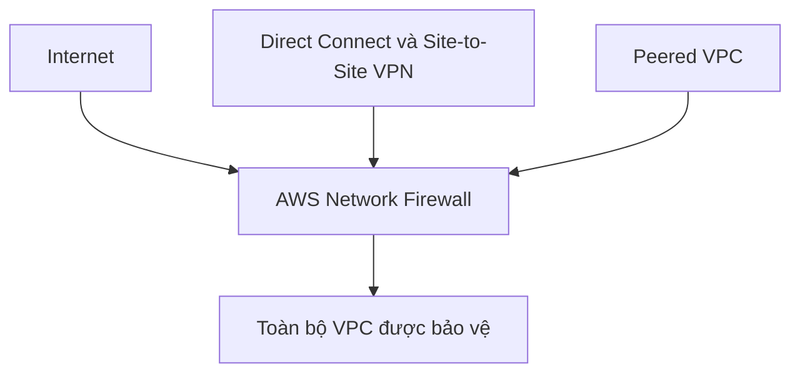

# 🧱 AWS Network Firewall: Bảo vệ cả VPC trong một dịch vụ

> Nguồn: `179-AWS-Network-Firewall.txt` · [Udemy](https://ua.udemy.com/course/aws-certified-cloud-practitioner-new/learn/lecture/38535894)

Nếu đề thi hỏi bạn làm sao để bảo vệ **VPC (Virtual Private Cloud — đám mây riêng ảo)** một cách tổng thể, thì câu trả lời chính là **AWS Network Firewall**. Bài này khá ngắn nhưng là dạng câu hỏi "nhận diện dịch vụ" rất dễ xuất hiện trong đề.

---

### 🎯 Khi đề thi hỏi về bảo vệ VPC

Cách ghi nhớ rất đơn giản: **Network Firewall bảo vệ toàn bộ VPC của bạn trong một lần**, chứ không phải từng tài nguyên riêng lẻ.

* Đây là dịch vụ cấp **VPC-level (cấp VPC)**.
* Nó luôn sẵn sàng "đứng canh" mọi luồng traffic ra vào VPC của bạn.
* So với các cơ chế bảo vệ khác, cách tiếp cận này bao quát hơn hẳn.

---

### 🛡️ Bảo vệ layer 3 đến layer 7, mọi hướng

Network Firewall có thể **inspect (kiểm tra) mọi traffic ở mọi hướng**, với khả năng bảo vệ trải từ **layer 3 đến layer 7**:

* Traffic **đi ra internet (outbound)**.
* Traffic **đi vào từ internet (inbound)**.
* Traffic **đến và đi từ Direct Connect** (kết nối riêng tới AWS).
* Traffic **đến và đi từ Site-to-Site VPN**.
* Traffic với **Peered VPC** (VPC được kết nối ngang hàng).

Nói cách khác, gần như mọi luồng traffic trong sơ đồ trên đều có thể được Network Firewall che chắn.

---

### 💡 Network Firewall khác NACL ở điểm nào?

Điểm mấu chốt mình muốn các bạn ghi nhớ:

* **NACL** hoạt động ở **subnet level (cấp subnet)**.
* **AWS Network Firewall** hoạt động ở **VPC level (cấp VPC)**.

Vì vậy Network Firewall là cơ chế bảo vệ **tốt hơn hẳn** khi bạn cần kiểm soát toàn diện một VPC, thay vì phải cấu hình rải rác cho từng subnet.

*Mẹo thi: thấy câu hỏi nhắc đến "protect your VPC", hãy nghĩ ngay đến **AWS Network Firewall**.*

---

Vậy là xong một dịch vụ ngắn gọn nhưng quan trọng. Các bạn chỉ cần nhớ: bảo vệ **toàn VPC**, từ **layer 3 đến layer 7**, **mọi hướng traffic** — đó là Network Firewall.

Bài tiếp theo, chúng ta sẽ nâng cấp lên mức quản lý tập trung với **AWS Firewall Manager**. Hẹn gặp các bạn ở đó! 🚀
