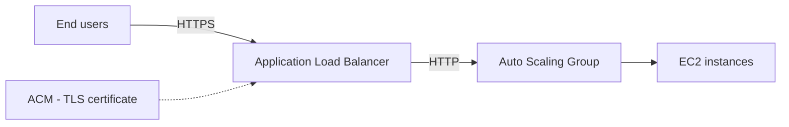

# 🔒 AWS Certificate Manager (ACM): HTTPS dễ như ăn kẹo

> Nguồn: `184-AWS-Certificate-Manager-ACM-Overview.txt` · [Udemy](https://ua.udemy.com/course/aws-certified-cloud-practitioner-new/learn/lecture/26623502)

**ACM (AWS Certificate Manager)** là dịch vụ giúp bạn **provision, manage và deploy chứng chỉ SSL/TLS** một cách dễ dàng. Mục đích chính: mang lại **in-flight encryption (mã hóa trên đường truyền)** cho website thông qua các **HTTPS endpoint**.

---

### 🎯 ACM là gì?

**AWS Certificate Manager (ACM)** cho phép bạn:

* **Provision (cấp phát)**, **manage (quản lý)** và **deploy (triển khai)** chứng chỉ **SSL/TLS**.
* Cung cấp **HTTPS endpoint** cho website của bạn — tức là **in-flight encryption** cho người dùng cuối.

**ACM hỗ trợ cả public lẫn private TLS certificates**, và đặc biệt: **miễn phí với public TLS certificates**.

Một tính năng cực hay nữa là **tự động gia hạn chứng chỉ TLS (automatic TLS certificate renewal)** — *mình dùng nó suốt, rất đỡ công*.

---

### 🗺️ Ví dụ: Application Load Balancer với HTTPS

Hãy tưởng tượng kiến trúc của bạn:

* **Application Load Balancer** kết nối tới backend qua **HTTP**, phía sau là **Auto Scaling Group** chứa các **EC2 instance**.
* Nhưng bạn muốn **end user truy cập qua HTTPS**.

Cách giải quyết:

1. Dùng **ACM**, kết nối với **domain** của bạn.
2. ACM lo việc **cấp phát và duy trì TLS certificates**.
3. Chứng chỉ được **nạp lên Application Load Balancer**.
4. Load balancer **tự động phục vụ HTTPS** cho client — và bạn có **in-flight encryption trên public web**.

---

### 🔌 ACM tích hợp với những dịch vụ nào?

ACM có khả năng **tích hợp**, tức là nạp chứng chỉ TLS lên nhiều dịch vụ khác nhau:

* **Elastic Load Balancer**
* **CloudFront distributions**
* **API Gateway**

*Mẹo thi: nếu đề hỏi dịch vụ nào giúp tạo chứng chỉ và làm in-flight encryption — hãy nghĩ ngay đến **ACM**.*

---

### 🎯 Tự kiểm tra nhanh

**Câu 1:** ACM là viết tắt của gì và dùng để làm gì?

<b>Xem đáp án</b>

**Đáp án:** AWS Certificate Manager — cấp phát, quản lý và triển khai chứng chỉ SSL/TLS.
Giải thích: Mục tiêu là mang HTTPS (in-flight encryption) đến website của bạn.
Tham chiếu: Mục ACM là gì.

**Câu 2:** Public TLS certificates trên ACM có mất phí không?

<b>Xem đáp án</b>

**Đáp án:** Miễn phí.
Giải thích: ACM hỗ trợ cả public lẫn private certificates; public thì miễn phí.
Tham chiếu: Mục ACM là gì.

**Câu 3:** Tính năng nào giúp chứng chỉ không hết hạn mà bạn không phải làm gì?

<b>Xem đáp án</b>

**Đáp án:** Automatic TLS certificate renewal (tự động gia hạn).
Giải thích: Giảng viên nhấn mạnh đây là tính năng rất hữu ích và dùng thường xuyên.
Tham chiếu: Mục ACM là gì.

**Câu 4:** ACM tích hợp với những dịch vụ nào?

<b>Xem đáp án</b>

**Đáp án:** Elastic Load Balancer, CloudFront và API Gateway.
Giải thích: ACM nạp chứng chỉ TLS lên các dịch vụ này để phục vụ HTTPS.
Tham chiếu: Mục ACM tích hợp với những dịch vụ nào.

**Câu 5:** Trong ví dụ ALB, backend kết nối tới EC2 bằng giao thức gì?

<b>Xem đáp án</b>

**Đáp án:** HTTP.
Giải thích: ALB nhận HTTPS từ end user, còn phía sau kết nối bằng HTTP tới Auto Scaling Group.
Tham chiếu: Mục Ví dụ: Application Load Balancer với HTTPS.

---

Vậy là xong một dịch vụ nhỏ nhưng cực kỳ thực dụng: **ACM giúp bạn có HTTPS, tự động gia hạn, và miễn phí với chứng chỉ public**. Hãy nhớ cặp đôi "in-flight encryption + certificates = ACM" cho đề thi nhé.

Bài tiếp theo, chúng ta sẽ học cách quản lý **secrets** an toàn với **AWS Secrets Manager**. Hẹn gặp các bạn ở đó! 🚀
