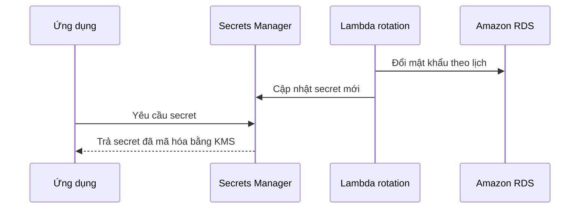

# 🕵️ AWS Secrets Manager: Quản lý và xoay vòng bí mật tự động

> Nguồn: `185-Secrets-Manager-Overview.txt` · [Udemy](https://ua.udemy.com/course/aws-certified-cloud-practitioner-new/learn/lecture/20237342)

Làm sao để lưu mật khẩu database mà không dán nó vào code? Câu trả lời của AWS là **Secrets Manager** — dịch vụ mới hơn, chuyên để **lưu trữ secret (bí mật)** và quan trọng hơn: **tự động xoay vòng** chúng theo lịch.

---

### 🎯 Secrets Manager là gì?

Đúng như tên gọi, **Secrets Manager** là cách tuyệt vời để **lưu trữ secrets**. Điểm mạnh vượt trội so với việc lưu chay:

* Bạn có thể **force rotation (buộc xoay vòng)** secrets — nghĩa là chúng **phải thay đổi sau mỗi X ngày**. Ví dụ: *"Cứ 90 ngày, tôi muốn đổi mật khẩu một lần"* — Secrets Manager làm được điều này.
* Bạn có thể **tự động hóa việc sinh secret bằng Lambda**.
* Dịch vụ **tích hợp với Amazon RDS**: dùng Secrets Manager để **tạo mật khẩu cho RDS tự động**.
* Các secret **được mã hóa bằng KMS** (dịch vụ chúng ta vừa học) **một cách tự động**.

*Mẹo thi: hễ thấy đề nhắc đến secret của RDS cần được quản lý và **xoay vòng (rotated)** — hãy nghĩ ngay đến **Secrets Manager**.*

---

### 🔄 Xoay vòng tự động hoạt động thế nào?

Mô hình hoạt động gọn gàng như sau:

**Lambda function** chịu trách nhiệm xoay mật khẩu, Secrets Manager lưu trữ và phân phối secret, còn ứng dụng chỉ việc **gọi API để lấy secret** thay vì hard-code mật khẩu.

---

### 💰 Chi phí và thao tác trên console

Secrets Manager là **dịch vụ trả phí**, nhưng mình sẽ chỉ các bạn cách dùng rất nhanh:

1. Mở **Secrets Manager** trên console — bạn có thể **create, manage, rotate và retrieve** secret trong suốt vòng đời của nó.
2. Chọn **Store a new secret**. Về giá: **40 cent mỗi secret mỗi tháng**, cộng thêm phí **API call** — nhưng có **30 ngày dùng thử miễn phí**.
3. Chọn loại secret — ví dụ **credential cho database**: **RDS**, **Redshift** hoặc database khác, hoặc một loại secret tùy ý.
4. Với secret RDS, bạn khai báo **username, password**, cách **mã hóa secret** và **database RDS nào sẽ liên kết** với secret đó.
5. Muốn lưu một secret bất kỳ cũng được — ví dụ password với giá trị **MYSECRETPASSWORD**.
6. Bấm **Next**, đặt tên secret — ví dụ **myproductionapplicationpassword** (*tên này dở tệ, các bạn đừng bắt chước nhé!*).
7. **Configure rotation**: bật **automatic rotation**, ví dụ **mỗi 30 ngày**, rồi chọn **Lambda function** sẽ xoay mật khẩu — function này bạn cần **tạo trước**.
8. **Review** lại: secret đã tạo, có giá trị, rotation tự động bằng Lambda, kèm **sample code** để ứng dụng lấy secret.

Mình không tạo thật trong bài này, nhưng vậy là các bạn đã nắm đủ về Secrets Manager.

---

### 🎯 Tự kiểm tra nhanh

**Câu 1:** Dịch vụ nào giúp lưu trữ và xoay vòng secrets?

<b>Xem đáp án</b>

**Đáp án:** AWS Secrets Manager.
Giải thích: Dịch vụ mới hơn, chuyên lưu secret và hỗ trợ force rotation theo lịch.
Tham chiếu: Mục Secrets Manager là gì.

**Câu 2:** Secrets Manager tích hợp với dịch vụ nào của AWS để tạo mật khẩu tự động?

<b>Xem đáp án</b>

**Đáp án:** Amazon RDS.
Giải thích: Secrets Manager có thể tạo mật khẩu cho RDS tự động, dùng Lambda để xoay vòng.
Tham chiếu: Mục Secrets Manager là gì.

**Câu 3:** Secrets được mã hóa bằng dịch vụ nào?

<b>Xem đáp án</b>

**Đáp án:** KMS.
Giải thích: Secret được mã hóa bằng KMS một cách tự động.
Tham chiếu: Mục Secrets Manager là gì.

**Câu 4:** Chi phí của Secrets Manager là bao nhiêu?

<b>Xem đáp án</b>

**Đáp án:** 40 cent mỗi secret mỗi tháng, cộng phí API call; có 30 ngày dùng thử miễn phí.
Giải thích: Đây là dịch vụ trả phí nhưng có free trial.
Tham chiếu: Mục Chi phí và thao tác trên console.

**Câu 5:** Thành phần nào thực hiện việc xoay mật khẩu tự động?

<b>Xem đáp án</b>

**Đáp án:** Một Lambda function.
Giải thích: Bạn cần tạo Lambda function trước, rồi chọn nó khi cấu hình rotation.
Tham chiếu: Mục Chi phí và thao tác trên console.

---

Vậy là các bạn đã biết cách quản lý bí mật "chuẩn AWS": **lưu trong Secrets Manager, mã hóa bằng KMS, xoay vòng bằng Lambda**. *Nhớ câu thần chú cho đề thi: secret + RDS + rotation = Secrets Manager.*

Bài cuối của section này, chúng ta sẽ tìm hiểu **AWS Artifact** — nơi tải các báo cáo compliance. Hẹn gặp các bạn ở đó! 🚀
