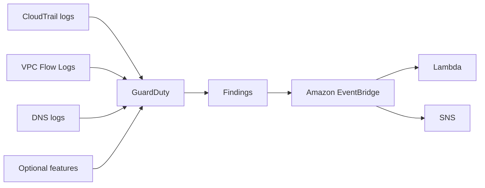

# 🕵️ GuardDuty: "Vệ sĩ" phát hiện mối đe dọa thông minh cho tài khoản AWS

> Nguồn: `187-GuardDuty-Overview.txt` · [Udemy](https://ua.udemy.com/course/aws-certified-cloud-practitioner-new/learn/lecture/20056330)

Hành trình bảo mật của chúng ta tiếp tục với **Amazon GuardDuty** — dịch vụ phát hiện mối đe dọa thông minh (intelligent threat discovery) để bảo vệ tài khoản AWS. Đây là cái tên rất dễ xuất hiện trong đề thi, nên các bạn học kỹ bài này nhé!

---

### 🧠 GuardDuty là gì và bật nó dễ đến mức nào?

GuardDuty dùng **thuật toán machine learning (học máy)**, thực hiện **anomaly detection (phát hiện bất thường)** và kết hợp **dữ liệu bên thứ ba (third-party data)** để tìm ra các mối đe dọa. Cách kích hoạt cực nhẹ nhàng:

1. Bật dịch vụ chỉ với **một click**.
2. Có **30 ngày dùng thử (trial)**.
3. **Không cần cài đặt phần mềm** nào cả.

*Đúng là một dịch vụ thân thiện với người mới, phải không nào?*

---

### 🔍 GuardDuty phân tích những nguồn dữ liệu nào?

* **CloudTrail event logs** — tìm **API call bất thường** và **triển khai không được phép (unauthorized deployments)**; phân tích cả **management events** (ví dụ sự kiện **Create VPC Subnet**) lẫn **data events** (ví dụ trên S3: **GetObject**, **ListObjects**, **DeleteObjects**).
* **VPC Flow Logs** — tìm **luồng internet bất thường** và **địa chỉ IP bất thường**.
* **DNS logs** — phát hiện EC2 instance **gửi dữ liệu mã hóa trong DNS query**, dấu hiệu instance đã bị xâm nhập (compromised).

Ba nguồn **VPC Flow Logs, CloudTrail logs và DNS logs** luôn được đưa vào GuardDuty. Ngoài ra còn các **tính năng tùy chọn (optional features)** để phân tích sâu hơn: **EKS audit logs**, **runtime monitoring**, **RDS & Aurora login events**, **EBS**, **Lambda**, **S3 data events** — danh sách này sẽ còn dài thêm theo thời gian.

---

### 🚨 Từ findings đến tự động hóa với EventBridge

Khi GuardDuty tạo ra **findings**, một **event sẽ được tạo trong Amazon EventBridge**. Từ đó, các bạn đặt **rules** để kích hoạt tự động hóa bằng **Lambda function** hoặc gửi thông báo qua **SNS topic**.

Và đây là mẹo thi đắt giá: GuardDuty là công cụ rất tốt để **chống tấn công tiền mã hóa (cryptocurrency attacks)**, vì nó có **finding chuyên dụng** cho loại tấn công này.

---

### 🎯 Tự kiểm tra nhanh

**Câu 1:** GuardDuty dùng những kỹ thuật gì để phát hiện mối đe dọa?

<b>Xem đáp án</b>

**Đáp án:** Machine learning, anomaly detection và dữ liệu bên thứ ba.
Giải thích: Bộ ba này giúp GuardDuty phân tích các nguồn dữ liệu đầu vào. Tham chiếu: Mục GuardDuty là gì.

**Câu 2:** Ba nguồn dữ liệu luôn được đưa vào GuardDuty là gì?

<b>Xem đáp án</b>

**Đáp án:** VPC Flow Logs, CloudTrail logs và DNS logs.
Giải thích: Ngoài ra còn nhiều tính năng tùy chọn như EKS, RDS/Aurora, EBS, Lambda. Tham chiếu: Mục GuardDuty phân tích những nguồn dữ liệu nào.

**Câu 3:** DNS logs giúp GuardDuty phát hiện điều gì?

<b>Xem đáp án</b>

**Đáp án:** EC2 instance gửi dữ liệu mã hóa trong DNS query — dấu hiệu instance đã bị xâm nhập.
Giải thích: Đây là một trong các dạng bất thường GuardDuty tìm ra. Tham chiếu: Mục Nguồn dữ liệu.

**Câu 4:** Khi GuardDuty có findings, sự kiện được tạo ở đâu và dùng để làm gì?

<b>Xem đáp án</b>

**Đáp án:** Sự kiện được tạo trong Amazon EventBridge; từ đó rules có thể gọi Lambda hoặc gửi SNS.
Giải thích: EventBridge là điểm nối để tự động hóa và thông báo. Tham chiếu: Mục Từ findings đến tự động hóa.

**Câu 5:** GuardDuty đặc biệt hữu ích để chống lại loại tấn công nào?

<b>Xem đáp án</b>

**Đáp án:** Tấn công tiền mã hóa (cryptocurrency attacks) — nhờ finding chuyên dụng.
Giải thích: Đây là chi tiết rất hay được hỏi trong đề thi. Tham chiếu: Mục Từ findings đến tự động hóa.

---

Vậy là các bạn đã nắm trọn GuardDuty: bật một click, theo dõi CloudTrail — VPC Flow Logs — DNS logs, rồi đẩy findings qua EventBridge để tự động hóa. *Đừng quên chi tiết "chống tấn công tiền mã hóa" nhé — đề thi rất thích chi tiết này!*

Ở bài tiếp theo, chúng ta sẽ làm quen với **Amazon Inspector** — "bác sĩ" chuyên quét lỗ hổng bảo mật cho EC2, ECR và Lambda. Hẹn gặp các bạn! 🚀
