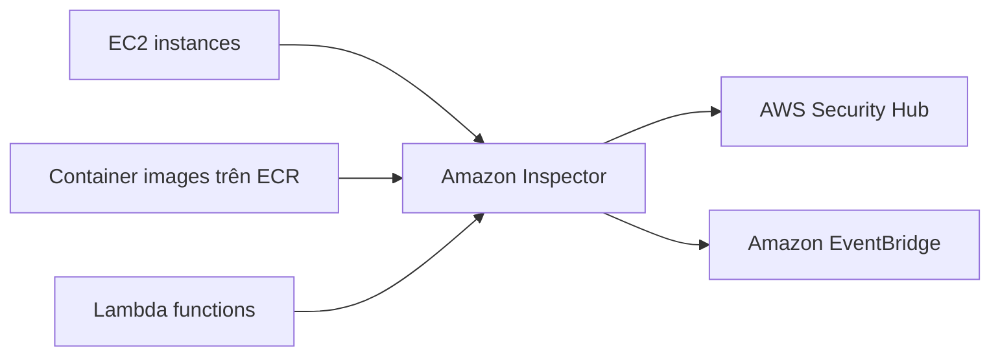

# 🔎 Amazon Inspector: Quét lỗ hổng bảo mật tự động cho hạ tầng AWS

> Nguồn: `188-Inspector-Overview.txt` · [Udemy](https://ua.udemy.com/course/aws-certified-cloud-practitioner-new/learn/lecture/20056334)

Tiếp nối GuardDuty, chúng ta đến với **Amazon Inspector** — dịch vụ chạy **đánh giá bảo mật tự động (automated security assessments)**. Nếu GuardDuty săn hành vi đáng ngờ, thì Inspector chuyên đi tìm **lỗ hổng** trong hạ tầng của các bạn.

---

### 🖥️ Quét EC2 instances

Inspector tận dụng **Systems Manager agent** trên các EC2 instance của bạn để bắt đầu đánh giá bảo mật. Nó phân tích:

* **Khả năng truy cập mạng ngoài ý muốn (unintended network accessibility)**.
* **Các lỗ hổng đã biết (known vulnerabilities)** trong hệ điều hành đang chạy.

Quá trình này diễn ra **liên tục (continuously)**.

---

### 📦 Quét container images và Lambda functions

Inspector không chỉ nhìn vào EC2:

* **Container images đẩy lên Amazon ECR** (ví dụ Docker image): khi image được push lên ECR, Inspector phân tích để tìm **lỗ hổng đã biết**.
* **Lambda functions**: khi function được triển khai, Inspector phân tích **lỗ hổng phần mềm trong code của function** và **các package dependency**. Việc đánh giá diễn ra **ngay lúc function được deploy**.

Sau khi hoàn tất, Inspector **báo findings vào AWS Security Hub** và **gửi findings/events vào Amazon EventBridge**. Nhờ đó các bạn có một nơi trung tâm để xem lỗ hổng trên toàn hạ tầng, còn EventBridge cho phép chạy tự động hóa.

---

### 📊 Inspector đánh giá chính xác những gì?

Các bạn chỉ cần nhớ: **Inspector CHỈ dành cho** 3 thứ:

1. **EC2 instance đang chạy**.
2. **Container image trên Amazon ECR**.
3. **Lambda function**.

Cơ chế quét:

* Quét **liên tục, chỉ khi cần thiết**.
* Dựa trên **cơ sở dữ liệu lỗ hổng CVE** cho package của EC2, ECR và Lambda.
* Kiểm tra **network reachability (khả năng truy cập mạng)** trên Amazon EC2.
* Khi **cơ sở dữ liệu CVE được cập nhật**, Inspector **tự động chạy lại** để đảm bảo toàn bộ hạ tầng được kiểm tra thêm một lần nữa.
* Mỗi lần chạy, một **risk score (điểm rủi ro)** được gán cho các lỗ hổng để **ưu tiên xử lý (prioritization)**.

---

### 🎯 Tự kiểm tra nhanh

**Câu 1:** Inspector đánh giá EC2 instance dựa trên agent nào?

<b>Xem đáp án</b>

**Đáp án:** Systems Manager agent.
Giải thích: Agent này cho phép Inspector thu thập thông tin trên instance. Tham chiếu: Mục Quét EC2 instances.

**Câu 2:** Trên EC2, Inspector phân tích những khía cạnh nào?

<b>Xem đáp án</b>

**Đáp án:** Khả năng truy cập mạng ngoài ý muốn và lỗ hổng đã biết trong hệ điều hành.
Giải thích: Quá trình này chạy liên tục. Tham chiếu: Mục Quét EC2 instances.

**Câu 3:** Inspector kiểm tra Lambda function vào thời điểm nào và tìm gì?

<b>Xem đáp án</b>

**Đáp án:** Ngay khi function được deploy; tìm lỗ hổng phần mềm trong code và package dependency.
Giải thích: Tương tự, container image trên ECR được quét khi push lên. Tham chiếu: Mục Quét container images và Lambda functions.

**Câu 4:** Findings của Inspector được gửi đến những đâu?

<b>Xem đáp án</b>

**Đáp án:** AWS Security Hub và Amazon EventBridge.
Giải thích: Security Hub để xem tập trung, EventBridge để tự động hóa. Tham chiếu: Mục Quét container images và Lambda functions.

**Câu 5:** Khi cơ sở dữ liệu CVE được cập nhật, Inspector làm gì?

<b>Xem đáp án</b>

**Đáp án:** Tự động chạy lại để kiểm tra toàn bộ hạ tầng thêm một lần nữa.
Giải thích: Mỗi lần chạy, một risk score được gán cho lỗ hổng để ưu tiên. Tham chiếu: Mục Inspector đánh giá chính xác những gì.

---

Tóm gọn: **Inspector = EC2 + ECR + Lambda**, quét CVE liên tục và gán risk score để ưu tiên sửa. *Các bạn nhớ đừng nhầm Inspector với GuardDuty nhé: một bên tìm lỗ hổng, một bên tìm hành vi độc hại.*

Ở bài tiếp theo, chúng ta sẽ tìm hiểu **AWS Config** — công cụ ghi lại mọi thay đổi cấu hình và kiểm tra compliance. Hẹn gặp các bạn! 🚀
