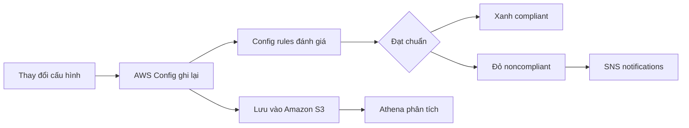

# 📏 AWS Config: Ghi lại mọi thay đổi cấu hình và kiểm tra compliance

> Nguồn: `189-Config-Overview.txt` · [Udemy](https://ua.udemy.com/course/aws-certified-cloud-practitioner-new/learn/lecture/20056338)

Có bao giờ các bạn tự hỏi: "Ai đã đổi cấu hình security group của mình? Bucket nào đang public?" — **AWS Config** sinh ra để trả lời những câu hỏi đó. Đây là bài hands-on khá dài nhưng cực kỳ thực dụng, mình sẽ tóm gọn để các bạn nắm chắc.

---

### 🎯 Config giúp bạn những gì?

Config hỗ trợ **auditing (kiểm toán)** và ghi nhận **compliance (tuân thủ)** của tài nguyên bằng cách **ghi lại cấu hình và các thay đổi theo thời gian**. Trước đây, khi thay đổi cấu hình thủ công trên AWS, chúng ta không có danh sách các thay đổi — Config giải quyết đúng vấn đề đó.

* Dữ liệu cấu hình có thể lưu vào **Amazon S3**, sau đó phân tích bằng **Athena** hoặc khôi phục lại.
* Config trả lời được: security group có **SSH mở tự do** không? bucket có **public access** không? cấu hình **ALB** đã thay đổi thế nào theo thời gian?
* Nhận **cảnh báo qua SNS notifications** mỗi khi hạ tầng thay đổi.
* Config là dịch vụ **theo từng region (per-region)**, nhưng các bạn có thể tạo nhiều cấu hình Config và **tổng hợp (aggregate) kết quả xuyên tài khoản, xuyên region**.

---

### ⚙️ Hands-on: bật Config và chọn Config rules

Lưu ý ngay: **Config không phải dịch vụ miễn phí** — bật là sẽ phải trả tiền. Quy trình mình thực hiện:

1. Chọn ghi lại **toàn bộ tài nguyên trong region**, bao gồm cả **global resources**; Config sẽ tạo một **bucket** để lưu cấu hình.
2. Chọn **SNS topic** để nhận thông báo thay đổi (mình tắt tạm thời) và tạo **service-linked role** cho Config.
3. Chọn **Config rules** để kiểm tra tuân thủ, ví dụ: **restricted-ssh**, **rds-instance-public-access-check**, **s3-bucket-logging-enabled**, **s3-account-level-public-access-blocks**.

Trong demo, mình bật rule **restricted-ssh** để kiểm tra compliance của các security group.

---

### 🧪 Demo: sửa một tài nguyên noncompliant

Sau khi Config ghi nhận xong, console hiển thị **inventory** toàn bộ tài nguyên: **5 security group, 3 subnet, 1 InternetGateway**... và có **1 rule noncompliant**: restricted-ssh, với **3 trong 5 security group** không đạt. Rule này mô tả việc security group đang cho phép **SSH không giới hạn**.

Cách xử lý:

1. Mở **Resource Timeline** — xem configuration timeline (cấu hình được ghi ngày **2/6**) và compliance timeline (đang noncompliant vì **port SSH mở cho mọi người**).
2. Vào **EC2 console**, tìm security group, thấy inbound rule **SSH port 22 mở cho tất cả**, xóa rule này và save.
3. Quay lại Config, chọn **Actions → Re-evaluate** để chạy lại rule ngay (không cần chờ).
4. Kết quả: chỉ còn **2 tài nguyên noncompliant** — tức mình đã sửa được 1; resource chuyển **xanh (compliant)**.

Điểm hay: nếu mở **Configuration Timeline**, các bạn thấy rule đã bị xóa, và **CloudTrail integration** chỉ ra rằng **root user** đã remove security ingress rule đó — xem được chi tiết ngay trong CloudTrail.

*Config cực kỳ hữu ích để đảm bảo mọi tài nguyên nhân viên tạo trong công ty đều tuân thủ đúng quy tắc bảo mật mà bạn đặt ra.*

---

### 🎯 Tự kiểm tra nhanh

**Câu 1:** Config được dùng để làm gì?

<b>Xem đáp án</b>

**Đáp án:** Kiểm toán và ghi nhận compliance, ghi lại cấu hình tài nguyên và thay đổi theo thời gian.
Giải thích: Đây là chức năng cốt lõi của Config. Tham chiếu: Mục Config giúp bạn những gì.

**Câu 2:** Dữ liệu cấu hình của Config lưu ở đâu và phân tích bằng gì?

<b>Xem đáp án</b>

**Đáp án:** Lưu vào Amazon S3, sau đó có thể phân tích bằng Athena hoặc khôi phục.
Giải thích: S3 là nơi chứa dữ liệu cấu hình. Tham chiếu: Mục Config giúp bạn những gì.

**Câu 3:** Config là dịch vụ theo region hay toàn cầu, và có tổng hợp đa tài khoản được không?

<b>Xem đáp án</b>

**Đáp án:** Per-region, nhưng có thể tổng hợp kết quả xuyên nhiều tài khoản và nhiều region.
Giải thích: Bạn tạo nhiều cấu hình Config và aggregate lại. Tham chiếu: Mục Config giúp bạn những gì.

**Câu 4:** Config có phải dịch vụ miễn phí không?

<b>Xem đáp án</b>

**Đáp án:** Không — bật Config là bạn sẽ phải trả tiền.
Giải thích: Cần cân nhắc trước khi bật. Tham chiếu: Mục Hands-on bật Config.

**Câu 5:** Trong demo, làm sao tài nguyên chuyển từ noncompliant sang compliant?

<b>Xem đáp án</b>

**Đáp án:** Xóa inbound rule SSH port 22 mở cho mọi người, rồi dùng Actions → Re-evaluate.
Giải thích: Resource chuyển xanh, và CloudTrail ghi nhận root user đã xóa rule. Tham chiếu: Mục Demo.

---

Vậy là các bạn đã hiểu trọn vẹn cách dùng **Config** để theo dõi cấu hình và compliance theo thời gian. *Đừng quên: Config tính phí, và nó là per-region nhưng vẫn aggregate được nhé.*

Ở bài tiếp theo, chúng ta sẽ gặp **Amazon Macie** — dịch vụ dùng machine learning để tìm dữ liệu nhạy cảm trong S3. Hẹn gặp các bạn! 🚀
