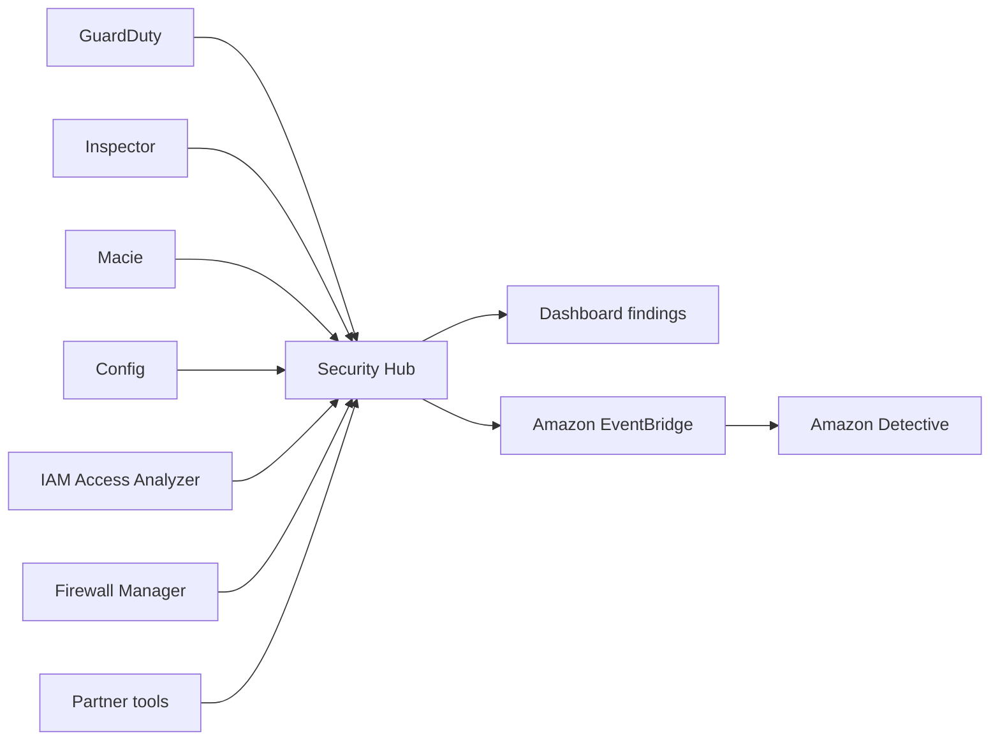

# 🛡️ AWS Security Hub: Trung tâm điều phối an ninh đa tài khoản

> Nguồn: `191-Security-Hub-Overview.txt` · [Udemy](https://ua.udemy.com/course/aws-certified-cloud-practitioner-new/learn/lecture/24682620)

Khi bạn có GuardDuty, Inspector, Macie... mỗi dịch vụ báo findings ở một nơi, làm sao để nhìn tất cả cùng lúc? Câu trả lời là **AWS Security Hub** — công cụ bảo mật trung tâm giúp quản lý an ninh trên nhiều tài khoản AWS và tự động hóa các kiểm tra bảo mật.

---

### 🎯 Security Hub làm được gì?

* Là **central security tool (công cụ bảo mật trung tâm)** để quản lý an ninh **trên nhiều tài khoản AWS** và **tự động hóa security checks**.
* Có **integrated dashboard (bảng điều khiển tích hợp)** hiển thị **trạng thái bảo mật và compliance hiện tại**, giúp bạn nhanh chóng hành động.
* **Tổng hợp alerts** từ nhiều dịch vụ và nhiều **partner tools** khác nhau về một mối.
* Điều kiện tiên quyết: **bạn phải bật AWS Config** thì Security Hub mới hoạt động.

Các dịch vụ gửi findings về Security Hub:

* **Config**, **GuardDuty**, **Inspector**, **Macie**.
* **IAM Access Analyzer**, **AWS Systems Manager**.
* **AWS Firewall Manager**, **AWS Health**, **AWS Partner Solutions**.
* Danh sách có thể còn dài thêm theo thời gian — nhưng ý tưởng là tất cả hội tụ về **một dashboard, một hub trung tâm**.

---

### 🔄 Luồng hoạt động của Security Hub

Security Hub bao phủ **nhiều tài khoản cùng lúc**, gom findings và nhờ các **automatic checks (kiểm tra tự động)** để hiển thị lên dashboard. Mỗi khi có vấn đề bảo mật, một **event được tạo trong EventBridge**. Và để điều tra nguồn gốc của vấn đề, bạn dùng **Amazon Detective**.

---

### 💰 Giá và dùng thử

* **Pricing per check**: 1.000 checks đầu tiên có một mức giá, càng nhiều checks thì chi phí càng tăng.
* **Ingestion events**: **10.000 events đầu tiên miễn phí**, sau đó bạn trả tiền **theo từng finding**.
* Security Hub có **30 ngày dùng thử (trial)**.

Quy trình bật Security Hub trong console:

1. Bật **AWS Config** trước (bắt buộc).
2. Chọn **security standards** muốn tuân thủ — có **3 lựa chọn**.
3. Chọn **integrations** dựa trên các dịch vụ bạn đã bật.
4. Bấm **Enable Security Hub** là xong.

---

### 🎯 Tự kiểm tra nhanh

**Câu 1:** Security Hub là loại công cụ gì?

<b>Xem đáp án</b>

**Đáp án:** Công cụ bảo mật trung tâm, quản lý an ninh trên nhiều tài khoản AWS và tự động hóa security checks.
Giải thích: Nó gom mọi findings về một dashboard duy nhất. Tham chiếu: Mục Security Hub làm được gì.

**Câu 2:** Điều kiện tiên quyết để Security Hub hoạt động là gì?

<b>Xem đáp án</b>

**Đáp án:** Phải bật AWS Config.
Giải thích: Không có Config thì Security Hub không chạy được. Tham chiếu: Mục Security Hub làm được gì.

**Câu 3:** Kể tên ít nhất 4 dịch vụ gửi findings về Security Hub.

<b>Xem đáp án</b>

**Đáp án:** Ví dụ: GuardDuty, Inspector, Macie, Config, IAM Access Analyzer, Firewall Manager, Systems Manager, AWS Health.
Giải thích: Ngoài ra còn partner tools. Tham chiếu: Mục Luồng hoạt động.

**Câu 4:** Khi có vấn đề bảo mật, Security Hub tạo event ở đâu và dùng dịch vụ nào để điều tra nguồn gốc?

<b>Xem đáp án</b>

**Đáp án:** Event được tạo trong EventBridge; dùng Amazon Detective để tìm nguồn gốc.
Giải thích: Detective giúp biết security issue đến từ đâu. Tham chiếu: Mục Luồng hoạt động.

**Câu 5:** Chính sách giá của Security Hub có gì đáng nhớ?

<b>Xem đáp án</b>

**Đáp án:** Tính giá theo check; 10.000 events đầu miễn phí, sau đó trả theo finding; có 30 ngày dùng thử.
Giải thích: Càng nhiều check thì chi phí càng cao. Tham chiếu: Mục Giá và dùng thử.

---

Tóm lại: **Security Hub = một dashboard cho mọi findings**, bắt buộc bật **Config** trước, và kết hợp với **Detective** khi cần truy nguồn gốc. *Đây là dạng câu hỏi "dịch vụ nào tổng hợp findings" rất hay gặp — các bạn nhớ kỹ nhé!*

Ở bài tiếp theo, chúng ta sẽ đi sâu vào **Amazon Detective** — "thám tử" chuyên tìm nguyên nhân gốc của sự cố bảo mật. Hẹn gặp các bạn! 🚀
