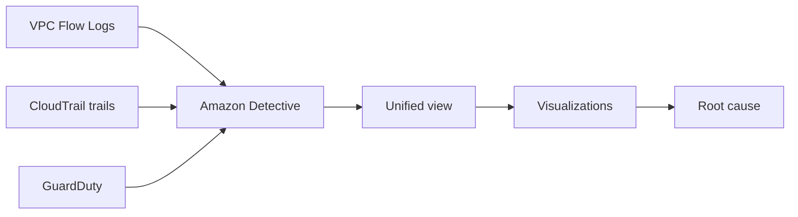

# 🔍 Amazon Detective: Truy tìm tận gốc các sự cố bảo mật

> Nguồn: `192-Amazon-Detective-Overview.txt` · [Udemy](https://ua.udemy.com/course/aws-certified-cloud-practitioner-new/learn/lecture/24682624)

Khi GuardDuty, Macie hay Security Hub đã chỉ ra các **findings**, câu hỏi tiếp theo luôn là: *"Chuyện này xảy ra như thế nào và bắt đầu từ đâu?"* Đó chính là nhiệm vụ của **Amazon Detective** — bài này ngắn nhưng cực kỳ dễ nhớ.

---

### ❓ Vì sao chúng ta cần Detective?

Các dịch vụ như **GuardDuty**, **Macie**, **Security Hub** giúp **nhận diện vấn đề bảo mật tiềm ẩn**, nhưng chúng không cho bạn biết **nguyên nhân gốc (root cause)**.

Việc phân tích sâu để cô lập nguyên nhân gốc có thể **rất lâu và phức tạp**, vì phải phân tích dữ liệu từ nhiều nơi khác nhau rồi liên kết chúng lại. Trong bảo mật, bạn cần tìm root cause **càng nhanh càng tốt** — bởi rất có thể đang tồn tại một **lỗ hổng trong kiến trúc** của bạn.

---

### 🕵️ Detective làm được gì?

* **Phân tích, điều tra và nhanh chóng xác định root cause** của các vấn đề bảo mật hoặc **hoạt động đáng ngờ (suspicious activities)**.
* Sử dụng **machine learning** và **graphs** ở backend để giúp bạn nhanh chóng lần ra nguồn gốc vấn đề.
* **Tự động thu thập và xử lý events** từ:
  1. **VPC Flow Logs**.
  2. **CloudTrail trails**.
  3. **GuardDuty**.
* Từ đó tạo ra một **unified view (góc nhìn thống nhất)** và cung cấp **visualizations (trực quan hóa)** kèm chi tiết, ngữ cảnh để bạn đi đến tận cùng nguyên nhân.

---

### 🎯 Ghi nhớ nhanh cho kỳ thi

* **Detective** = điều tra **root cause**, dùng **machine learning + graphs**.
* Nguồn dữ liệu: **VPC Flow Logs, CloudTrail, GuardDuty**.
* Phân biệt với Security Hub: **Security Hub tổng hợp findings**, còn **Detective truy tìm nguồn gốc**.
* Tình huống điển hình: *"Bạn có findings và cần biết chúng đến từ đâu?"* → nghĩ ngay đến **Amazon Detective**.

---

### 🎯 Tự kiểm tra nhanh

**Câu 1:** Amazon Detective được dùng để làm gì?

<b>Xem đáp án</b>

**Đáp án:** Phân tích, điều tra và nhanh chóng xác định root cause của sự cố bảo mật hoặc hoạt động đáng ngờ.
Giải thích: Tên "Detective" đã nói rõ mục đích. Tham chiếu: Mục Detective làm được gì.

**Câu 2:** Detective dùng công nghệ gì ở backend?

<b>Xem đáp án</b>

**Đáp án:** Machine learning và graphs.
Giải thích: Giúp lần theo mối liên hệ giữa các dữ liệu. Tham chiếu: Mục Detective làm được gì.

**Câu 3:** Detective tự động thu thập events từ những nguồn nào?

<b>Xem đáp án</b>

**Đáp án:** VPC Flow Logs, CloudTrail trails và GuardDuty.
Giải thích: Ba nguồn này tạo nên unified view. Tham chiếu: Mục Detective làm được gì.

**Câu 4:** Detective mang lại cho bạn thứ gì để tìm nguyên nhân gốc?

<b>Xem đáp án</b>

**Đáp án:** Một unified view cùng visualizations kèm chi tiết và ngữ cảnh.
Giải thích: Nhờ đó bạn nhanh chóng thấy vấn đề đến từ đâu. Tham chiếu: Mục Detective làm được gì.

**Câu 5:** Khi đã có findings từ GuardDuty/Macie/Security Hub nhưng cần biết chúng đến từ đâu, bạn dùng dịch vụ nào?

<b>Xem đáp án</b>

**Đáp án:** Amazon Detective.
Giải thích: Security Hub tổng hợp findings, Detective truy nguồn gốc. Tham chiếu: Mục Ghi nhớ nhanh.

---

Vậy là các bạn đã nắm gọn **Detective: ML + graphs, VPC Flow Logs + CloudTrail + GuardDuty, và mục tiêu duy nhất là root cause**. *Cặp bài trùng cần nhớ: Security Hub gom findings — Detective truy nguồn gốc.*

Ở bài tiếp theo, chúng ta sẽ tìm hiểu cách **báo cáo hành vi lạm dụng (AWS Abuse)** — một chủ đề nhỏ nhưng từng xuất hiện trong đề thi. Hẹn gặp các bạn! 🚀
