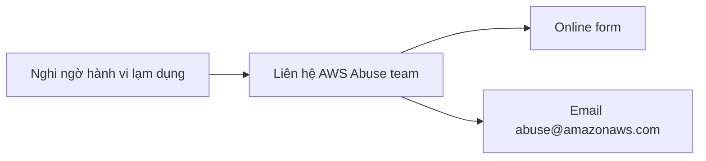

# 🚨 AWS Abuse: Báo cáo hành vi lạm dụng trên AWS như thế nào?

> Nguồn: `193-AWS-Abuse.txt` · [Udemy](https://ua.udemy.com/course/aws-certified-cloud-practitioner-new/learn/lecture/24682626)

Có một chủ đề nhỏ nhưng **từng xuất hiện trong đề thi**: nếu bạn nghi ngờ tài nguyên AWS bị dùng cho mục đích lạm dụng hoặc bất hợp pháp, bạn phải làm gì? Bài này rất ngắn, mình sẽ nói nhanh và gọn.

---

### 🚩 Những hành vi bị coi là lạm dụng

Nếu bạn nghi ngờ một số tài nguyên trên AWS — ví dụ các **địa chỉ IP** hoặc **EC2 instance** — đang bị dùng cho mục đích lạm dụng hoặc bất hợp pháp, bạn có thể báo cáo với AWS. Các hành vi bị coi là lạm dụng/vi phạm gồm:

* **Spam**: bạn nhận email không mong muốn từ các IP thuộc sở hữu của AWS; website và forum bị spam bởi tài nguyên AWS.
* **Port scanning**: ai đó thực hiện quét cổng từ AWS — điều này không được chấp nhận.
* **Tấn công DDoS** (Distributed Denial of Service — tấn công từ chối dịch vụ phân tán).
* **Intrusion attempts (nỗ lực xâm nhập)**: ai đó cố đăng nhập vào tài nguyên của bạn.
* **Lưu trữ nội dung đáng ngờ hoặc vi phạm bản quyền** — nội dung bất hợp pháp được host trên AWS.
* **Phát tán malware**: dĩ nhiên bạn không thể host malware trên AWS.

---

### 📮 Báo cáo cho ai và bằng cách nào?

Khi nghi ngờ bất kỳ hoạt động nào kể trên, việc bạn cần làm là **liên hệ đội ngũ Abuse team của AWS**:

1. Điền **online form (biểu mẫu trực tuyến)**, hoặc
2. Gửi email tới **abuse@amazonaws.com**.

---

### 🎯 Ghi nhớ nhanh cho kỳ thi

* Nghi ngờ tài nguyên AWS bị dùng cho mục đích **abusive hoặc illegal** → **contact the abuse team**.
* Chỉ cần nhớ **2 kênh**: **form** và **email abuse@amazonaws.com**.
* *Đây là dạng câu hỏi "làm gì tiếp theo" — đừng chọn các dịch vụ kỹ thuật, hãy chọn liên hệ abuse team nhé!*

---

Vậy là xong phần AWS Abuse — ngắn nhưng đủ để bạn xử lý gọn câu hỏi tình huống trong đề. *Một chữ thôi: "abuse team" khi thấy dấu hiệu lạm dụng.*

Ở bài tiếp theo, chúng ta sẽ điểm qua **quyền hạn đặc biệt của root user** — nhóm câu hỏi rất hay gặp trong kỳ thi. Hẹn gặp các bạn! 🚀
