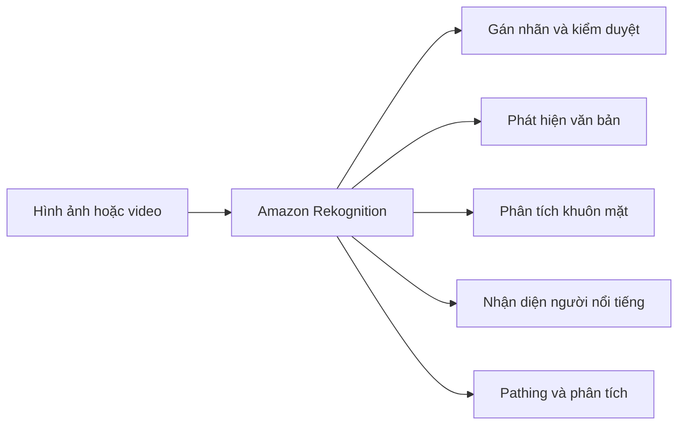

# 🔍 Amazon Rekognition: Nhận diện hình ảnh, khuôn mặt và văn bản bằng Machine Learning

> Nguồn: `197-Rekognition-Overview.txt` · [Udemy](https://ua.udemy.com/course/aws-certified-cloud-practitioner-new/learn/lecture/20056346)

Chào mừng các bạn đến với chương **Machine Learning**! Tin vui cho những ai đang lo lắng: đề thi **không yêu cầu hiểu sâu về machine learning**, chỉ có một vài dịch vụ nhất định các bạn phải nhớ. Dịch vụ đầu tiên chính là **Amazon Rekognition**.

*Đừng lo nếu bạn chưa từng học về AI — mình sẽ giải thích thật đơn giản, đúng trọng tâm đề thi.*

---

### 🎯 Amazon Rekognition là gì?

Đúng như tên gọi, **Amazon Rekognition** dùng **machine learning (học máy)** để **nhận diện đồ vật, con người, văn bản và bối cảnh** trong cả hình ảnh lẫn video.

Với Rekognition, các bạn có thể:

* **Phân tích khuôn mặt (facial analysis)** và **tìm kiếm khuôn mặt (facial search)** để xác minh người dùng hoặc đếm số người.
* Xây dựng **cơ sở dữ liệu khuôn mặt quen thuộc**, hoặc so sánh khuôn mặt với **người nổi tiếng**.

---

### 🛠️ Các use case (trường hợp sử dụng) chính

* **Gán nhãn (labeling)** cho hình ảnh và video.
* **Kiểm duyệt nội dung (content moderation)** — đảm bảo nội dung phù hợp với mọi lứa tuổi.
* **Phát hiện văn bản (text detection)** trong ảnh.
* **Phát hiện và phân tích khuôn mặt** — ví dụ: giới tính, độ tuổi, cảm xúc.
* **Tìm kiếm và xác minh khuôn mặt** cho các ứng dụng bảo mật.
* **Nhận diện người nổi tiếng (celebrity recognition)**.
* **Pathing** — phân tích đường di chuyển, vị trí của người và vật.

---

### 🖼️ Trang web Rekognition — nhìn là hiểu

Trang web của Rekognition trực quan hóa từng tính năng nên các bạn có thể xem để hiểu nhanh hơn:

* **Nhận diện thành phần trong ảnh**: với một bức ảnh, dịch vụ xác định được *person* (người), *rock* (hòn đá), *mountain bike* (xe đạp leo núi), *crest* (đỉnh) và *outdoors* (ngoài trời).
* **Gán nhãn**: nhận ra **Golden Retriever** hay chung hơn là **dog** (chó).
* **Kiểm duyệt nội dung**: đảm bảo nội dung phù hợp với mọi lứa tuổi.
* **Phát hiện văn bản**: ví dụ trong một cuộc thi chạy, đọc được số báo danh của từng runner.
* **Phân tích khuôn mặt**: người này trông vui, đang cười, mắt mở và là nữ.
* **Nhận diện người nổi tiếng**: chụp ảnh một người — và người đó chính là **CTO của AWS**.
* **Pathing**: theo dõi một trận bóng đá để biết mọi người di chuyển về đâu, phục vụ **phân tích thời gian thực (real-time analytics)**.

---

### 🎯 Tự kiểm tra nhanh

**Câu 1:** Amazon Rekognition dùng machine learning để làm gì?

<b>Xem đáp án</b>

**Đáp án:** Nhận diện đồ vật, con người, văn bản và bối cảnh trong hình ảnh và video.
Giải thích: Đây là định nghĩa cốt lõi của dịch vụ.
Tham chiếu: Mục Amazon Rekognition là gì.

**Câu 2:** Rekognition hỗ trợ những tính năng nào liên quan đến khuôn mặt?

<b>Xem đáp án</b>

**Đáp án:** Phân tích khuôn mặt, tìm kiếm khuôn mặt để xác minh người dùng, đếm số người, xây dựng cơ sở dữ liệu khuôn mặt quen thuộc và so sánh với người nổi tiếng.
Giải thích: Đây là nhóm tính năng nổi bật nhất của Rekognition.
Tham chiếu: Mục Amazon Rekognition là gì.

**Câu 3:** "Pathing" trong Rekognition được dùng để làm gì?

<b>Xem đáp án</b>

**Đáp án:** Phân tích đường di chuyển, vị trí — ví dụ theo dõi trận bóng đá cho real-time analytics.
Giải thích: Pathing giúp hiểu luồng di chuyển trong video.
Tham chiếu: Mục Các use case chính.

**Câu 4:** Content moderation của Rekognition giúp gì?

<b>Xem đáp án</b>

**Đáp án:** Kiểm duyệt nội dung để đảm bảo phù hợp với mọi lứa tuổi.
Giải thích: Đây là một use case tiêu biểu của dịch vụ.
Tham chiếu: Mục Các use case chính.

**Câu 5:** Mức độ kiến thức Rekognition cần cho kỳ thi CLF-C02 là gì?

<b>Xem đáp án</b>

**Đáp án:** Chỉ cần nắm ở mức high level — hiểu dịch vụ làm gì và các use case tiêu biểu.
Giải thích: Machine learning không được hỏi sâu trong đề thi.
Tham chiếu: Mục Amazon Rekognition là gì.

---

Với đề thi, các bạn chỉ cần nắm Rekognition ở **mức high level (tổng quan)** và nhớ các use case tiêu biểu là đủ. *Đừng học thuộc lòng máy móc — hãy gắn mỗi dịch vụ với một tình huống thực tế, đề thi sẽ trở nên dễ hơn rất nhiều.*

Bài tiếp theo chúng ta sẽ đến với **Amazon Transcribe** — dịch vụ biến giọng nói thành văn bản. Hẹn gặp các bạn ở đó! 🚀
