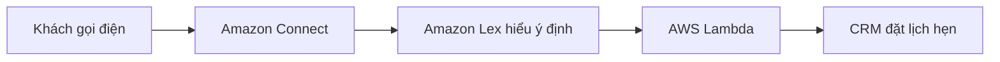

# 🤖 Amazon Lex & Amazon Connect: Chatbot và tổng đài thông minh trên cloud

> Nguồn: `201-Lex-Connect-Overview.txt` · [Udemy](https://ua.udemy.com/course/aws-certified-cloud-practitioner-new/learn/lecture/20515578)

Tiếp theo chương Machine Learning, chúng ta cùng làm quen với cặp đôi **Amazon Lex** và **Amazon Connect** — bộ công cụ để xây dựng **chatbot hội thoại** và **tổng đài chăm sóc khách hàng thông minh**.

Hai dịch vụ này thường đi cùng nhau trong đề thi, nên các bạn hãy nắm thật chắc nhé.

---

### 🎯 Amazon Lex — công nghệ đứng sau Alexa

**Amazon Lex** chính là **công nghệ đứng sau các thiết bị Alexa của Amazon**. Nếu bạn chưa biết Alexa: đó là chiếc loa nhỏ trong nhà, bạn hỏi *"Alexa, what's the weather like tomorrow?"* và nó trả lời *"The weather is good, it'll be 24 degrees and it'll be sunny"* (Thời tiết đẹp, 24 độ và trời nắng).

Lex cung cấp:

* **ASR (Automatic Speech Recognition — nhận dạng giọng nói tự động)**: chuyển lời nói thành văn bản.
* **NLU (Natural Language Understanding — hiểu ngôn ngữ tự nhiên)**: hiểu **intent (ý định)** của người gọi — tức hiểu cả câu chứ không chỉ từng chữ.
* Nền tảng để xây dựng **chatbot** và **call center bot (bot cho tổng đài)**.

---

### ☎️ Amazon Connect — tổng đài trên cloud

**Amazon Connect** là một **visual contact center (tổng đài liên hệ trực quan)** cho phép:

* **Nhận cuộc gọi** và **tạo contact flow (luồng xử lý liên hệ)**.
* Hoạt động hoàn toàn **trên cloud**.
* **Tích hợp với CRM (hệ thống quản lý quan hệ khách hàng)** hoặc các dịch vụ AWS khác.

Điểm hấp dẫn so với giải pháp truyền thống:

* **Không trả trước (no upfront payment)**.
* Rẻ hơn khoảng **80%** so với các giải pháp contact center truyền thống.

---

### 🔄 Luồng xây dựng contact center thông minh

1. Khách gọi đến số do **Amazon Connect** định nghĩa để đặt lịch hẹn.
2. **Lex** streaming toàn bộ thông tin cuộc gọi và hiểu **intent** của cuộc gọi.
3. Lex **gọi (invoke) đúng function AWS Lambda** cần thiết.
4. Function đó xử lý nghiệp vụ thông minh, ví dụ: *"Có người muốn đặt lịch hẹn với Tom vào 3 giờ chiều mai"* — rồi **ghi lịch vào CRM** bằng code.

**Nhớ nhanh:** **Lex = ASR + hiểu ý định**, **Connect = tổng đài liên hệ trên cloud**. Đó là toàn bộ ý tưởng đằng sau cặp dịch vụ này.

---

### 🎯 Tự kiểm tra nhanh

**Câu 1:** Amazon Lex là công nghệ đứng sau sản phẩm nào của Amazon?

<b>Xem đáp án</b>

**Đáp án:** Các thiết bị Alexa.
Giải thích: Lex dùng chính công nghệ đang vận hành Alexa.
Tham chiếu: Mục Amazon Lex.

**Câu 2:** Lex dùng ASR và NLU để làm gì?

<b>Xem đáp án</b>

**Đáp án:** ASR chuyển lời nói thành văn bản; NLU giúp Lex hiểu ý định (intent) của người gọi.
Giải thích: Kết hợp hai công nghệ này để xây dựng chatbot hội thoại.
Tham chiếu: Mục Amazon Lex.

**Câu 3:** Amazon Connect là gì?

<b>Xem đáp án</b>

**Đáp án:** Visual contact center chạy trên cloud — nhận cuộc gọi, tạo contact flow, tích hợp CRM và các dịch vụ AWS.
Giải thích: Connect chính là "tổng đài" của câu chuyện.
Tham chiếu: Mục Amazon Connect.

**Câu 4:** Lợi ích kinh tế của Amazon Connect so với giải pháp truyền thống là gì?

<b>Xem đáp án</b>

**Đáp án:** Không trả trước, rẻ hơn khoảng 80% so với contact center truyền thống.
Giải thích: Đây là con số giảng viên nhấn mạnh, rất dễ xuất hiện trong đề.
Tham chiếu: Mục Amazon Connect.

**Câu 5:** Trong luồng đặt lịch hẹn, Lex làm gì sau khi hiểu được intent?

<b>Xem đáp án</b>

**Đáp án:** Lex gọi (invoke) đúng function AWS Lambda để xử lý — ví dụ ghi lịch hẹn vào CRM.
Giải thích: Lambda chính là phần "nghiệp vụ thông minh" của luồng.
Tham chiếu: Mục Luồng xây dựng contact center thông minh.

---

Vậy là các bạn đã nắm chắc cặp đôi **Lex + Connect**: **Lex** lo ASR và hiểu ý định để làm chatbot, **Connect** lo tổng đài trên cloud. *Hai dịch vụ này chỉ thật sự tỏa sáng khi đi cùng nhau — hãy nhớ luồng xử lý qua Lambda để không bị nhầm lẫn.*

Bài tiếp theo chúng ta sẽ gặp **Amazon Comprehend** — dịch vụ xử lý ngôn ngữ tự nhiên (NLP). Hẹn gặp các bạn! 🚀
