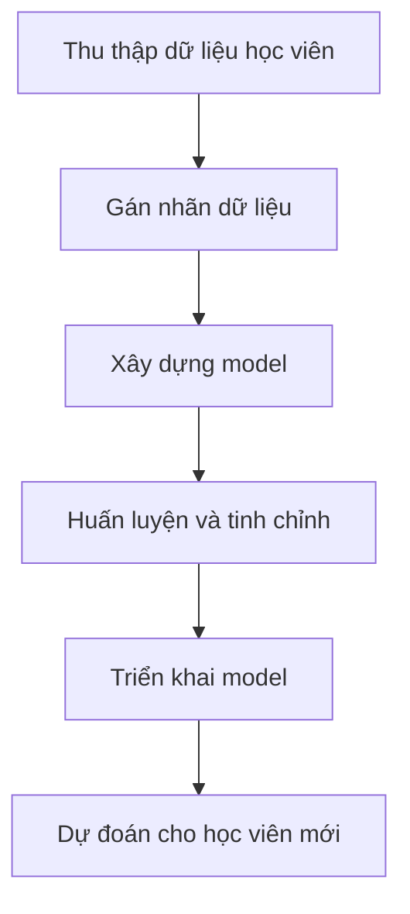

# 🧪 Amazon SageMaker: Xây, huấn luyện và triển khai model Machine Learning

> Nguồn: `203-SageMaker-AI-Overview.txt` · [Udemy](https://ua.udemy.com/course/aws-certified-cloud-practitioner-new/learn/lecture/20587274)

Các dịch vụ ML chúng ta gặp từ đầu chương đều có **mục đích rất cụ thể**: dịch text, transcribe audio, chuyển text thành audio hay phân tích văn bản. Còn **Amazon SageMaker** là một **dịch vụ machine learning cấp cao hơn** — nơi **developer (lập trình viên)** và **data scientist (nhà khoa học dữ liệu)** trong tổ chức của bạn tự tay **xây dựng model machine learning**.

SageMaker phức tạp và "nặng đô" hơn hẳn, nhưng nó giải quyết một bài toán rất thật.

---

### 🎯 Vì sao cần SageMaker?

Để xây dựng một model machine learning, bạn phải trải qua một loạt bước và làm chúng ở nhiều nơi — rất cồng kềnh. Bạn còn phải **provision (cấp phát) server** để huấn luyện model, càng tốn công hơn.

SageMaker ra đời để **đồng hành cùng bạn xuyên suốt quy trình đó**, thay vì phải tự xoay xở từng công đoạn.

---

### 📈 Ví dụ: dự đoán điểm thi CLF-C02

Giả sử mình muốn xây model dự đoán **điểm thi Cloud Practitioner** của các bạn:

1. **Thu thập dữ liệu**: khảo sát khoảng **10.000 học viên** về số năm kinh nghiệm IT, số năm kinh nghiệm AWS, thời gian học khóa, số đề thi thử đã làm...
2. **Gán nhãn (labeling)**: xác định mỗi cột dữ liệu nghĩa là gì, và gán **điểm thi thật** — có bạn chỉ được **670** (chưa đậu, có thể vì chưa học hết khóa), có bạn đậu với điểm cao như **990** hay **934**.
3. **Xây model (build)**: tìm cách dự đoán điểm số từ dữ liệu lịch sử.
4. **Huấn luyện và tinh chỉnh (train & tune)**: liên tục cải thiện model để khớp dữ liệu và kết quả đầu ra hơn.
5. **Triển khai (deploy)**: khi có học viên mới, mình khảo sát kinh nghiệm IT, AWS, thời gian học — đưa vào model và nhận dự đoán: *"Học viên này sẽ đậu với **906 điểm**."*

Toàn bộ quy trình **labeling, building, training, tuning và deploying** đều có thể thực hiện trong SageMaker.

---

### 🎯 Tự kiểm tra nhanh

**Câu 1:** SageMaker dành cho đối tượng nào?

<b>Xem đáp án</b>

**Đáp án:** Developers và data scientists — những người trực tiếp xây dựng model machine learning.
Giải thích: Đây là điểm khác biệt so với các dịch vụ ML "đóng gói sẵn".
Tham chiếu: Mục Vì sao cần SageMaker.

**Câu 2:** SageMaker khác gì các dịch vụ ML có mục đích cụ thể như Translate hay Transcribe?

<b>Xem đáp án</b>

**Đáp án:** SageMaker là dịch vụ ML cấp cao hơn, cho phép tự xây model; phức tạp và khó dùng hơn.
Giải thích: Các dịch vụ kia chỉ làm một việc cụ thể; SageMaker làm cả quy trình.
Tham chiếu: Mục Vì sao cần SageMaker.

**Câu 3:** Trong ví dụ, dữ liệu được thu thập từ bao nhiêu học viên và gồm những gì?

<b>Xem đáp án</b>

**Đáp án:** Khoảng 10.000 học viên — gồm số năm kinh nghiệm IT, số năm kinh nghiệm AWS, thời gian học khóa, số đề thi thử đã làm...
Giải thích: Dữ liệu càng nhiều, model dự đoán càng tốt.
Tham chiếu: Mục Ví dụ dự đoán điểm thi.

**Câu 4:** "Labeling" trong ví dụ nghĩa là gì?

<b>Xem đáp án</b>

**Đáp án:** Xác định ý nghĩa từng cột dữ liệu và gán điểm thi thực tế (ví dụ 670, 990, 934).
Giải thích: Đây là bước đầu tiên và khá phức tạp trong quy trình.
Tham chiếu: Mục Ví dụ dự đoán điểm thi.

**Câu 5:** SageMaker hỗ trợ những bước nào của quy trình ML?

<b>Xem đáp án</b>

**Đáp án:** Gán nhãn, xây dựng, huấn luyện, tinh chỉnh và triển khai model.
Giải thích: SageMaker đồng hành trọn vẹn từ dữ liệu đến dự đoán.
Tham chiếu: Mục Ví dụ dự đoán điểm thi.

---

Vậy là các bạn đã hiểu **SageMaker** khác biệt thế nào: không phải một dịch vụ "một việc", mà là **nền tảng ML đầy đủ** cho developer và data scientist. *Đừng sợ phần này — đề thi chỉ cần bạn nhớ SageMaker là dịch vụ để **build, train và deploy model machine learning**.*

Bài tiếp theo chúng ta sẽ gặp **Amazon Kendra** — công cụ tìm kiếm tài liệu thông minh. Hẹn gặp các bạn! 🚀
