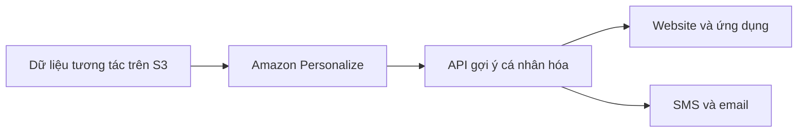

# 🎁 Amazon Personalize: Gợi ý cá nhân hóa theo thời gian thực

> Nguồn: `205-Personalize-Overview.txt` · [Udemy](https://ua.udemy.com/course/aws-certified-cloud-practitioner-new/learn/lecture/26623520)

**Amazon Personalize** là một **dịch vụ machine learning được quản lý hoàn toàn**, giúp bạn xây dựng ứng dụng có khả năng **gợi ý cá nhân hóa theo thời gian thực (real-time personalized recommendations)**.

Đây chính là **công nghệ mà Amazon.com đang dùng** để gợi ý sản phẩm cho khách hàng mỗi ngày.

---

### 🎯 Personalize có thể gợi ý những gì?

* **Gợi ý sản phẩm cá nhân hóa (personalized product recommendation)**.
* **Re-ranking (sắp xếp lại thứ hạng)** kết quả hiển thị.
* **Customized direct marketing (tiếp thị trực tiếp được cá nhân hóa)**.

Ví dụ: một người dùng đã mua rất nhiều **dụng cụ làm vườn** — Personalize sẽ gợi ý món đồ tiếp theo phù hợp với sở thích của riêng người đó.

---

### 🛒 Cách Amazon.com tận dụng công nghệ này

Khi bạn mua sắm trên Amazon.com và đã mua vài sản phẩm, bạn sẽ thấy Amazon bắt đầu gợi ý các sản phẩm **cùng danh mục — hoặc thậm chí khác hoàn toàn** — dựa trên cách bạn tìm kiếm, cách bạn mua hàng và sở thích của bạn.

**Personalize chính là cách bạn truy cập công nghệ đó từ bên trong AWS.**

---

### 🔌 Tích hợp vào ứng dụng của bạn

* **Đọc dữ liệu đầu vào từ Amazon S3** — ví dụ dữ liệu tương tác người dùng.
* Dùng **Amazon Personalize API** để tích hợp dữ liệu **theo thời gian thực**.
* Personalize cung cấp một **API gợi ý cá nhân hóa** cho website, ứng dụng web và ứng dụng mobile của bạn.
* Bạn còn có thể gửi **SMS hoặc email** để cá nhân hóa nội dung.

Điểm đáng giá: bạn **không cần tự build, train và deploy** giải pháp ML — mọi thứ đã được đóng gói sẵn. Xây dựng model chỉ mất **vài ngày, không phải vài tháng**.

Use case tiêu biểu: **retail (bán lẻ), media (truyền thông) và entertainment (giải trí)**.

---

### 🎯 Tự kiểm tra nhanh

**Câu 1:** Amazon Personalize dùng để làm gì?

<b>Xem đáp án</b>

**Đáp án:** Xây dựng ứng dụng có gợi ý cá nhân hóa theo thời gian thực.
Giải thích: Đây là chức năng cốt lõi của dịch vụ.
Tham chiếu: Mục Personalize có thể gợi ý những gì.

**Câu 2:** Công nghệ của Personalize giống với nền tảng nào?

<b>Xem đáp án</b>

**Đáp án:** Amazon.com — chính nền tảng này dùng công nghệ tương tự để gợi ý sản phẩm.
Giải thích: Personalize là cách bạn truy cập công nghệ đó trong AWS.
Tham chiếu: Mục Cách Amazon.com tận dụng công nghệ này.

**Câu 3:** Dữ liệu đầu vào của Personalize thường được đọc từ đâu?

<b>Xem đáp án</b>

**Đáp án:** Amazon S3 — ví dụ dữ liệu tương tác người dùng.
Giải thích: Ngoài ra còn có thể tích hợp real-time qua API.
Tham chiếu: Mục Tích hợp vào ứng dụng của bạn.

**Câu 4:** Xây dựng model với Personalize mất bao lâu?

<b>Xem đáp án</b>

**Đáp án:** Vài ngày, không phải vài tháng — bạn không cần tự build, train và deploy.
Giải thích: Giải pháp đã được đóng gói sẵn để dùng ngay.
Tham chiếu: Mục Tích hợp vào ứng dụng của bạn.

**Câu 5:** Use case tiêu biểu của Personalize thuộc những ngành nào?

<b>Xem đáp án</b>

**Đáp án:** Retail (bán lẻ), media (truyền thông) và entertainment (giải trí).
Giải thích: Đây là các ngành tận dụng gợi ý cá nhân hóa nhiều nhất.
Tham chiếu: Mục Tích hợp vào ứng dụng của bạn.

---

Vậy là các bạn đã nắm được **Amazon Personalize**: gợi ý theo thời gian thực, cùng công nghệ với Amazon.com, tích hợp qua API và S3, xây model chỉ trong vài ngày. *Đề thi nhắc đến **recommendations** là nghĩ ngay Personalize nhé.*

Bài tiếp theo chúng ta sẽ gặp **Amazon Textract** — dịch vụ trích xuất văn bản từ tài liệu quét. Hẹn gặp các bạn! 🚀
