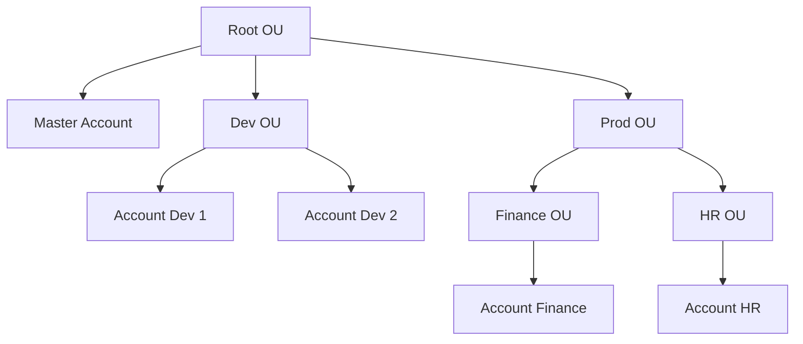

# 🏢 AWS Organizations: Quản lý cả "rừng" tài khoản AWS trong một tổ chức

> Nguồn: `208-Organizations-Overview.txt` · [Udemy](https://ua.udemy.com/course/aws-certified-cloud-practitioner-new/learn/lecture/20056424)

Chúng ta bắt đầu chặng mới về **Account Management, Billing & Support (quản lý tài khoản, thanh toán và hỗ trợ)** với dịch vụ mở màn: **AWS Organizations**. Đây là dịch vụ khá đơn giản nhưng xuất hiện dày đặc trong đề thi, nên các bạn đừng bỏ qua bất kỳ chi tiết nào nhé.

---

### 🌍 AWS Organizations là gì?

**AWS Organizations** là một **global service (dịch vụ toàn cầu)**, cho phép các bạn quản lý nhiều tài khoản AWS bằng cách gom chúng vào một tổ chức:

* Tài khoản chính gọi là **Master Account (tài khoản gốc)**.
* Các tài khoản còn lại gọi là **Child Accounts (tài khoản con)**.

Mục tiêu rất rõ ràng: một nơi để tạo, tổ chức và kiểm soát toàn bộ tài khoản AWS của bạn.

---

### 💰 Lợi ích chi phí: Consolidated Billing và ưu đãi theo khối lượng

Khi gom tài khoản vào tổ chức, các bạn nhận được **Consolidated Billing (thanh toán gộp)**:

* Mọi tài khoản được **Master Account thanh toán thay** — cuối kỳ chỉ có **một hóa đơn dài duy nhất**.
* Các tài khoản con **không cần thiết lập phương thức thanh toán riêng**.

Đi kèm là lợi ích từ **aggregated usage (tổng hợp mức sử dụng)**:

* Khi dùng nhiều **EC2** hay **S3**, bạn được **giảm giá theo khối lượng**; nếu tách lẻ nhiều tài khoản, bạn có thể mất ưu đãi đó — còn Organizations gộp mức sử dụng nên **được discount nhiều hơn**.
* **Reserved Instances được chia sẻ giữa các tài khoản**: tài khoản nào không dùng hết thì tài khoản khác dùng được, tiếp tục tối đa hóa tiết kiệm.

Ngoài ra, Organizations cung cấp **API để tự động hóa việc tạo tài khoản AWS** — rất hữu ích khi bạn muốn tạo tài khoản theo quy trình, ví dụ tạo hàng loạt **Sandbox Accounts (tài khoản môi trường thử nghiệm)**.

---

### 🗂️ Chiến lược đa tài khoản (Multi Account Strategy)

Một tổ chức có thể tạo tài khoản theo **phòng ban**, theo **cost center (trung tâm chi phí)**, theo **môi trường (dev/test/prod)** hoặc theo **quy định pháp lý (regulatory restrictions)**. Lý do để tách nhiều tài khoản:

* Dùng **SCP** để chặn một dịch vụ không được phép dùng trong tài khoản đó.
* Cô lập tài nguyên tốt hơn — ví dụ mỗi tài khoản có **VPC riêng**.
* Có **service limit (giới hạn dịch vụ) riêng** cho từng tài khoản.
* Tách riêng **tài khoản dành cho logging (ghi log)**.

Đây là một **trade-off giữa Multi Accounts và One Account with Multiple VPC** — và giảng viên chia sẻ rằng bản thân thích **Multi Account** hơn. Để vận hành gọn gàng, các bạn nên:

* Dùng **tagging standards (chuẩn gắn thẻ)** thống nhất giữa mọi tài khoản cho mục đích thanh toán.
* Bật **CloudTrail** trên tất cả tài khoản và gửi log về **một tài khoản S3 trung tâm**.
* Gửi **CloudWatch Logs** về **một tài khoản logging trung tâm**.

Về cách sắp xếp, bạn có thể chia theo **Business Unit (đơn vị kinh doanh)**, theo **môi trường**, theo **dự án (Project-1, Project-2, Project-3)** hoặc kết hợp cả ba. Cấu trúc trông như thế này:

**Root OU** chứa mọi thứ, kể cả Master Account, và các **OU (Organizational Unit — đơn vị tổ chức)** có thể **lồng nhau tùy ý** — ví dụ trong Prod OU lại có Finance OU và HR OU với các tài khoản riêng.

---

### 🔐 Service Control Policy (SCP) — chủ đề thi cực kỳ phổ biến

**SCP (Service Control Policy)** cho phép **whitelist (danh sách trắng) hoặc blacklist (danh sách đen) các IAM action**, áp dụng ở **cấp OU hoặc cấp Account**. Đây là nội dung được giảng viên đánh dấu là **câu hỏi thi phổ biến**, các bạn nhớ kỹ:

* SCP **không áp dụng cho Master Account** — Master Account không hề bị ảnh hưởng.
* SCP áp dụng cho **Users và Roles** trong tài khoản, **kể cả Root user**: nếu OU cấm EC2 thì cả admin trong tài khoản cũng không dùng được EC2.
* SCP **không áp dụng cho service-linked roles** — tức các role mà dịch vụ khác dùng để tích hợp với Organizations.
* SCP phải có **explicit Allow (cho phép tường minh)** mới cho phép — mặc định nó **không cho phép gì cả**.

Use case điển hình, cũng là thứ đề thi hay hỏi:

* **Giới hạn quyền dùng dịch vụ** — ví dụ cấm dùng **EMR** trong các tài khoản production.
* **Ép tuân thủ PCI Compliance** bằng cách vô hiệu hóa tường minh những dịch vụ chưa đạt chuẩn PCI trên AWS.

Về hình thức, **SCP trông giống hệt một IAM Policy**. Ví dụ: cho phép mọi thứ bằng `Allow * on *` nhưng thêm `Deny` với `DynamoDB *` trên mọi resource. Một chiến lược khác là **chỉ whitelist** một vài dịch vụ — chẳng hạn chỉ cho phép **EC2** và **CloudWatch**, còn mọi dịch vụ khác đều không dùng được.

*Muốn xem thêm ví dụ về OU và SCP? Có link tài liệu chính thức ngay trong slide bài giảng nhé.*

---

### 🎯 Tự kiểm tra nhanh

**Câu 1:** Trong AWS Organizations, tài khoản chính được gọi là gì?

<b>Xem đáp án</b>

**Đáp án:** Master Account — còn được gọi là management account.

Giải thích: Tài khoản chính đứng ra thanh toán và quản lý các tài khoản con.

Tham chiếu: Mục AWS Organizations là gì.

**Câu 2:** Lợi ích nào đến từ việc gộp mức sử dụng (aggregated usage)?

<b>Xem đáp án</b>

**Đáp án:** Được hưởng volume discount (giảm giá theo khối lượng) và chia sẻ ưu đãi Reserved Instances/Savings Plans giữa các tài khoản.

Giải thích: Gộp usage giúp cả tổ chức đạt mốc ưu đãi cao hơn; RI không dùng hết được tài khoản khác dùng tiếp.

Tham chiếu: Mục Lợi ích chi phí.

**Câu 3:** Mặc định SCP có cho phép mọi thứ không?

<b>Xem đáp án</b>

**Đáp án:** Không. SCP mặc định không cho phép gì cả — phải có explicit Allow mới cho phép.

Giải thích: Đây là điểm rất hay bị hỏi trong đề thi.

Tham chiếu: Mục Service Control Policy.

**Câu 4:** SCP có hiệu lực với Master Account không?

<b>Xem đáp án</b>

**Đáp án:** Không — SCP không áp dụng cho Master Account.

Giải thích: SCP chỉ tác động lên các tài khoản trong OU, không tác động lên tài khoản gốc.

Tham chiếu: Mục Service Control Policy.

**Câu 5:** SCP không áp dụng cho loại role nào?

<b>Xem đáp án</b>

**Đáp án:** Service-linked roles (role liên kết dịch vụ).

Giải thích: Đây là các role mà dịch vụ khác dùng để tích hợp với Organizations.

Tham chiếu: Mục Service Control Policy.

---

Vậy là các bạn đã nắm trọn bức tranh về **AWS Organizations**: từ mô hình Master/Child Account, hóa đơn gộp, đến chiến lược đa tài khoản và SCP. *Đây là nhóm kiến thức "ăn điểm" trong đề thi — cứ đọc lại vài lần là nhớ ngay.*

Ở bài tiếp theo, chúng ta sẽ **hands-on** (bài tùy chọn): tạo organization, mời tài khoản con, tạo OU lồng nhau và tự tay viết SCP chặn S3. Hẹn gặp các bạn ở đó! 🚀
