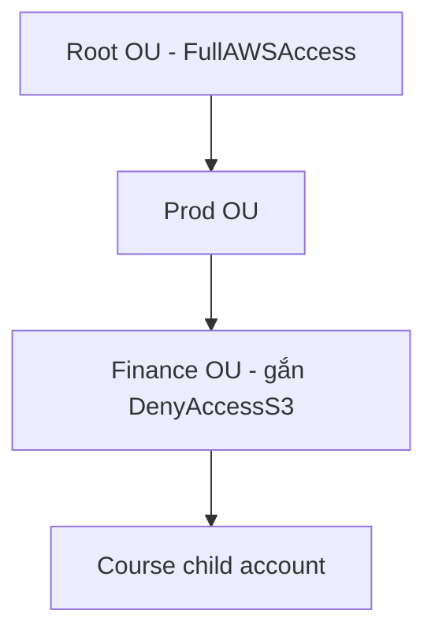

# 🛠️ Hands-on: Tự tay tạo AWS Organization, OU lồng nhau và SCP chặn S3

> Nguồn: `209-Organizations-Hands-On.txt` · [Udemy](https://ua.udemy.com/course/aws-certified-cloud-practitioner-new/learn/lecture/20237050)

Được rồi, lý thuyết đã xong — giờ chúng ta **thực hành với AWS Organizations**. *Đây là bài hands-on tùy chọn và hơi phức tạp*, nên nếu bạn chỉ muốn xem mình làm thì cũng không sao; còn nếu muốn làm theo, mình khuyên **tạo hai tài khoản AWS mới** để có một tài khoản master và một tài khoản child.

---

### 🧭 Chuẩn bị: hai tài khoản tách biệt

Organizations là **global service** vì nó liên quan đến việc gom nhóm tài khoản, không gắn với region nào.

Để demo, mình đã tạo sẵn **hai tài khoản mới hoàn toàn**, không dùng tài khoản chính của mình:

* **AWS course master account** — tài khoản sẽ đóng vai master.
* **AWS course child account** — tài khoản sẽ được mời vào tổ chức.

*Nếu muốn làm theo, các bạn cứ tạo hai tài khoản mới với tên tùy ý — miễn có một master và một child.*

---

### 🏗️ Tạo Organization và mời tài khoản con

Từ tài khoản master, mình vào dịch vụ **Organizations** và tạo organization. Quá trình này diễn ra rất nhanh, và ngay sau đó:

* Tổ chức có sẵn **Root OU**.
* Bên trong Root OU là tài khoản master — còn gọi là **management account (tài khoản quản lý)**.

Tiếp theo, mình muốn thêm tài khoản thứ hai vào tổ chức. Có **hai lựa chọn**:

1. **Create account** — tạo tài khoản mới: bạn nhập tên tài khoản, email của chủ tài khoản và một **IAM role sẽ được tạo trong tài khoản đích** để cho phép tổ chức quản lý nó.
2. **Invite existing account** — mời tài khoản có sẵn: bạn cần cung cấp **email gắn với tài khoản** hoặc **account ID**.

Mình chọn gửi lời mời tới email của tài khoản child, và lời mời xuất hiện trong danh sách **pending invitations**. Lưu ý: **sau hai tuần không được chấp nhận, lời mời sẽ hết hạn**.

Sang tài khoản child, mình mở Organizations → **Invitations**, refresh trang và thấy lời mời từ tài khoản master. Một điểm cần nhớ: tổ chức này đang bật **full features**, nghĩa là nó có **toàn quyền kiểm soát tài khoản của bạn** — ngay khi tham gia tổ chức, bạn chấp nhận bị quản lý bởi master của tổ chức đó. Mình bấm accept, thế là tài khoản child đã vào tổ chức; ở đây bạn chỉ thấy **organization ID** và **feature set**, đồng thời tài khoản **có thể rời tổ chức** nếu muốn.

---

### 🗂️ Tạo OU lồng nhau và di chuyển tài khoản

Quay lại tài khoản master, vào **AWS accounts**, chúng ta thấy Root OU chứa hai tài khoản: master và child. Giờ mình tạo **OU (Organizational Unit — đơn vị tổ chức)** để sắp xếp:

1. Chọn Root OU → **Action** → **Create new OU** → tạo OU tên **Dev**.
2. Tạo thêm OU **Test** và OU **Prod**.
3. Trong Prod OU, tạo tiếp các OU lồng bên trong như **Finance** và **HR** — tượng trưng cho phòng tài chính và nhân sự có ứng dụng production.

Bạn có thể **lồng OU bao nhiêu tầng tùy thích**. Sau đó mình **move tài khoản child** vào OU **Finance** nằm trong Prod. *Một best practice đáng nhớ: hãy để management account ở lại Root OU, dù bạn hoàn toàn có thể di chuyển nó.*

---

### 🔐 Bật SCP, tạo policy chặn S3 và kiểm chứng sức mạnh

Vào mục **Policies**, hiện có **bốn loại policy** nhưng đều đang bị vô hiệu hóa. Mình bật **service control policy** — loại quan trọng nhất để giới hạn quyền của tài khoản con. Ngoài ra:

* **Backup policy** cho phép triển khai **backup plan toàn tổ chức**, đảm bảo mọi tài khoản đều có backup.
* **Tag policy** giúp **chuẩn hóa cách dùng tag** giữa các tài khoản.

*Từ góc độ thi cử, chủ yếu các bạn cần nắm SCP — nhưng biết thêm hai loại policy kia cũng rất tốt.*

Trong danh sách SCP có sẵn policy **Full AWS access** cho phép mọi tài khoản dùng mọi dịch vụ. Mình tạo policy mới với tên gọi kiểu **DenyAccess to S3**:

* Statement chọn dịch vụ **S3**, để **all actions**.
* Resource cũng để `*`.
* Đặt Sid là `deny S3`, rồi bấm **Create policy**.

Giờ mình **attach policy này vào OU Finance**. Cơ chế **inheritance (kế thừa)** hoạt động như sau:

* Root OU có policy gắn trực tiếp; Prod OU có policy gắn trực tiếp **và** policy kế thừa từ Root.
* Finance OU nhận policy từ Prod, từ Root và policy gắn trực tiếp.
* Tài khoản child trong Finance OU thừa hưởng toàn bộ các policy phía trên — nên **DenyAccessS3 được kế thừa từ Finance**.

Lưu ý nhỏ: bạn sẽ thấy **FullAWSAccess xuất hiện lặp lại nhiều lần** ở các cấp — đó là vì mình bật SCP **sau khi** đã tạo các OU, nên policy mặc định được gắn vào từng phần tử.

Để kiểm chứng, mình mở **S3 console** trong tài khoản child: buckets đang được tải nhưng **không có quyền list buckets**, nên không thể dùng Amazon S3 — dù mình đang đăng nhập bằng **root user của tài khoản**. Đó chính là sức mạnh của SCP: giới hạn được một tài khoản có thể làm gì, ngay cả với quyền cao nhất.

---

Vậy là các bạn đã tự tay trải qua toàn bộ vòng đời: tạo organization, mời tài khoản con, tạo OU lồng nhau, gắn SCP và kiểm chứng nó hoạt động. *Nếu chưa làm theo được ngay thì cũng đừng lo — chỉ cần hiểu mạch thao tác là đủ.*

Ở bài tiếp theo, chúng ta sẽ tìm hiểu **Consolidated Billing** — cơ chế gộp hóa đơn và chia sẻ ưu đãi trong tổ chức. Hẹn gặp các bạn ở đó! 🚀
