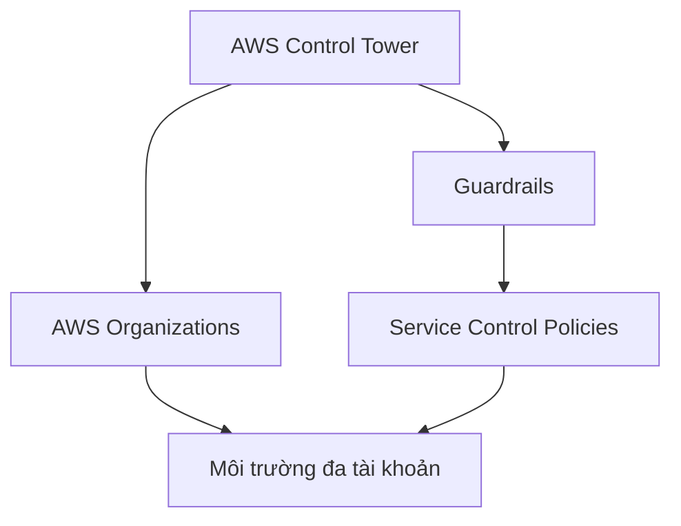

# 🏰 AWS Control Tower: Dựng môi trường đa tài khoản chuẩn best practices trong vài cú click

> Nguồn: `211-AWS-Control-Tower-Overview.txt` · [Udemy](https://ua.udemy.com/course/aws-certified-cloud-practitioner-new/learn/lecture/24682634)

Nếu việc tự tay dựng organization, áp chính sách bảo mật và sắp xếp hàng chục tài khoản nghe có vẻ mệt, thì **AWS Control Tower** sinh ra để giải quyết đúng bài toán đó. Đây là cách **thiết lập và quản trị môi trường AWS đa tài khoản an toàn, tuân thủ chuẩn mực** dựa trên best practices của AWS.

---

### 🎯 Control Tower giải quyết vấn đề gì?

Thay vì làm mọi thứ thủ công — tạo organization, rồi tự áp các thực hành bảo mật lên từng tài khoản — các bạn dùng **Control Tower** để tạo môi trường đa tài khoản AWS **chỉ với vài cú click**.

Nói cách khác, Control Tower gói sẵn những "khuôn mẫu tốt nhất" của AWS và tự động hóa việc dựng môi trường cho bạn, giúp tiết kiệm thời gian lẫn công sức thiết lập ban đầu.

---

### ⚙️ Bốn lợi ích nổi bật

1. **Tự động hóa thiết lập** môi trường AWS chỉ trong vài cú click.
2. **Tự động hóa quản lý policy liên tục** thông qua **guardrails (hàng rào bảo vệ)**.
3. **Phát hiện vi phạm policy và tự động khắc phục (remediate)** chúng.
4. **Giám sát mức độ tuân thủ (compliance)** qua **interactive dashboard (bảng điều khiển tương tác)**.

*Nghe rất hợp cho doanh nghiệp muốn "chuẩn hóa" AWS ngay từ ngày đầu, đúng không nào?*

---

### 🧱 Nền móng: Control Tower chạy trên AWS Organizations

Một chi tiết cực kỳ quan trọng cần nhớ: **Control Tower hoạt động bên trên AWS Organizations**. Cụ thể:

* Nó **tự động thiết lập Organizations** để tổ chức các tài khoản cho bạn.
* Nó **triển khai SCP (Service Control Policies)** để đảm bảo các **guardrails hoạt động hiệu quả**.

Nhờ đó, bạn vừa có cấu trúc tài khoản gọn gàng, vừa có lớp chính sách bảo vệ được thực thi xuyên suốt.

---

### 🎯 Tự kiểm tra nhanh

**Câu 1:** AWS Control Tower dùng để làm gì?

<b>Xem đáp án</b>

**Đáp án:** Thiết lập và quản trị môi trường AWS đa tài khoản an toàn, tuân thủ, dựa trên best practices.

Giải thích: Control Tower thay thế cách làm thủ công bằng vài cú click.

Tham chiếu: Mục Control Tower giải quyết vấn đề gì.

**Câu 2:** Control Tower chạy trên nền dịch vụ nào của AWS?

<b>Xem đáp án</b>

**Đáp án:** AWS Organizations.

Giải thích: Nó tự động thiết lập Organizations để sắp xếp các tài khoản.

Tham chiếu: Mục Nền móng.

**Câu 3:** Guardrails là gì trong Control Tower?

<b>Xem đáp án</b>

**Đáp án:** Là cơ chế giúp tự động hóa quản lý policy liên tục cho môi trường.

Giải thích: Guardrails giúp phát hiện vi phạm và giữ môi trường đúng chuẩn.

Tham chiếu: Mục Bốn lợi ích nổi bật.

**Câu 4:** Control Tower giúp gì trong việc giám sát tuân thủ?

<b>Xem đáp án</b>

**Đáp án:** Cung cấp interactive dashboard để giám sát mức độ compliance.

Giải thích: Dashboard cho bạn nhìn thấy tình trạng tuân thủ của môi trường.

Tham chiếu: Mục Bốn lợi ích nổi bật.

**Câu 5:** Control Tower triển khai gì để đảm bảo guardrails hoạt động hiệu quả?

<b>Xem đáp án</b>

**Đáp án:** SCP (Service Control Policies).

Giải thích: SCP được áp lên organizations để thực thi các guardrails.

Tham chiếu: Mục Nền móng.

---

Tóm gọn lại: **Control Tower = thiết lập nhanh + guardrails + dashboard tuân thủ, tất cả chạy trên Organizations và SCP**. Đây là dịch vụ bạn sẽ gặp trong đề với các câu hỏi dạng "dịch vụ nào giúp dựng môi trường đa tài khoản theo best practices".

Bài tiếp theo là một buổi **hands-on xem cho biết**: thiết lập Landing Zone với Control Tower trông như thế nào. Hẹn gặp các bạn ở đó! 🚀
