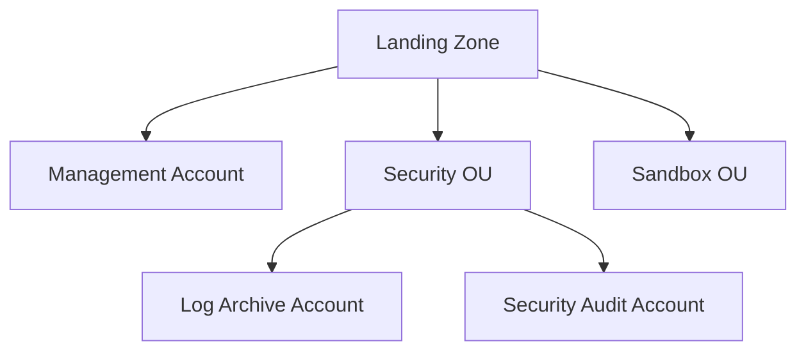

# 🧪 Hands-on (chỉ nên xem): Thiết lập Landing Zone với AWS Control Tower

> Nguồn: `212-AWS-Control-Tower-Hands-On.txt` · [Udemy](https://ua.udemy.com/course/aws-certified-cloud-practitioner-new/learn/lecture/24682640)

Bài này mình sẽ **thiết lập Control Tower** trực tiếp trên màn hình — nhưng có một điều quan trọng phải nói trước: **mình KHÔNG khuyên các bạn làm theo**. Các bạn chỉ cần ngồi xem để hiểu Control Tower hoạt động thế nào là đủ.

---

### ⚠️ Vì sao mình khuyên không tự làm theo?

* Thiết lập này **khá phức tạp**.
* Nó **tạo ra rất nhiều tài khoản** và tài nguyên.
* Sẽ **có chi phí phát sinh** khi tạo và dùng các dịch vụ mới — và có thể **rất tốn kém**.

Vì vậy, hãy xem mình thao tác để nắm quy trình, thay vì bấm theo. *An toàn cho ví tiền của các bạn là trên hết!*

---

### 🌍 Tạo Landing Zone: Home Region và các region

Bước đầu tiên là tạo **Landing Zone (vùng đất nền tảng)** cho Control Tower:

* Chọn **Home Region** — nơi đặt "nhà" của Control Tower.
* Có tùy chọn **region deny setting**: bật lên để **chặn một số region** không cho dùng.
* Chọn **additional regions for governance (các region bổ sung cần quản trị)** — tức những region bạn muốn được giám sát vì mục đích governance.

Để đơn giản, mình giữ **toàn bộ giá trị mặc định**.

---

### 🏗️ OU, tài khoản log archive, audit và cấu hình bổ sung

Tiếp theo, Control Tower tạo các **OU (Organizational Unit)** nằm trong organization của bạn:

* Một **Security OU** được tạo sẵn để chứa **log archive account** và **security audit account**.
* Thêm một OU nữa gọi là **Sandbox** — nơi chứa các tài khoản khác của bạn. Bạn có thể tạo thêm OU sau khi Landing Zone hoàn tất.

Sau đó là bước tạo các tài khoản chuyên dụng bằng email:

1. **Log archive account** — ví dụ `stephane+archive@example.com`.
2. **Security audit account** — ví dụ `stephane+audit@example.com`.

Ở phần **additional configurations**, có một số lựa chọn đáng chú ý:

* **AWS account access configuration**: dùng **IAM Identity Center** để truy cập mọi tài khoản trong Control Tower (mặc định, được khuyên dùng), hoặc **self-manage account access** — cách này **phức tạp hơn nhiều**.
* **Bật CloudTrail** cho toàn bộ Landing Zone — tất nhiên nên bật.
* **Gửi log sang Amazon S3**: tùy chọn, mình không đổi gì.
* **KMS encryption**: tùy chọn, có thể dùng KMS key để mã hóa mọi thứ — mình cũng bỏ qua cho đơn giản.

Mình bấm **Setup Landing Zone** để các bạn thấy quá trình chạy, và hệ thống báo sẽ mất **khoảng 60 phút**. Trong lúc chờ, Control Tower sẽ dựng: **2 OU**, **3 tài khoản dùng chung (shared accounts)**, một **native cloud directory với group được cấu hình sẵn và single sign-on access**, **20 preventive guardrails** để thực thi policy và **2 detective guardrails** để phát hiện vi phạm cấu hình.

---

### 📊 Sau khi thiết lập: quản lý tất cả từ Control Tower

Khi Landing Zone sẵn sàng, vào **Organizations** bạn sẽ thấy các tài khoản đã được tạo, cùng hai nhóm OU: **core** (chứa audit và archive) và **custom** (hiện chưa có tài khoản). Lưu ý quan trọng: **đừng quản lý tài khoản qua Organizations** — mọi thao tác nên thực hiện qua **Control Tower**.

Dashboard của Control Tower gợi ý các việc nên làm:

* **Add hoặc register OU**.
* **Cấu hình account factory**.
* **Thêm guardrails**.
* **Review users and access**.
* **Review shared accounts**.

Bạn cũng thấy được **tài nguyên không tuân thủ (non-compliant resources)** theo các rule đã định, thông tin về **OU đã đăng ký và mức độ compliance**, cùng toàn bộ tài khoản đã enroll. Danh sách **guardrails** có những rule rất hợp lý như:

* **Disallow deletion of log archive** — cấm xóa log archive.
* **Disallow public read access to log archive** — cấm truy cập đọc công khai vào log archive.
* **Disallow configuration changes to CloudTrail** — cấm thay đổi cấu hình CloudTrail.

Control Tower còn có **account factory** để enroll tài khoản mới, và mục **users and access** để quản lý người dùng qua **single sign-on** với một **user portal URL**.

---

### 🔑 Đăng nhập qua SSO portal

Từ **SSO portal**, mình bấm sign-in và đăng nhập bằng mật khẩu đã tạo. Thế là mình vào được trang SSO và có thể truy cập **cả ba tài khoản AWS**:

* **Audit account**
* **Log archive account**
* **Tài khoản chính (Stephane CCP)**

Với mỗi tài khoản, bạn có thể mở **management console** hoặc lấy **command line / programmatic access**. Mình thử vào audit account — và đúng là vào được ngay, cho thấy sức mạnh của Control Tower trong việc quản lý tập trung nhiều tài khoản.

---

Control Tower thật sự tiện khi bạn cần dựng nhiều tài khoản theo best practices và quản lý từ một nơi. **Nếu bạn là một tổ chức muốn có môi trường AWS đa tài khoản chuẩn mực, hãy dùng Control Tower.** Còn với mục đích học thi, chỉ cần hiểu nó làm gì là đủ.

Bài tiếp theo chúng ta sẽ tìm hiểu **AWS Resource Access Manager (AWS RAM)** — cách chia sẻ tài nguyên giữa các tài khoản. Hẹn gặp các bạn ở đó! 🚀
