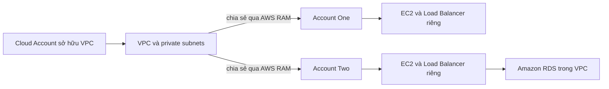

# 🤝 AWS RAM: Chia sẻ tài nguyên giữa các tài khoản mà không cần nhân bản

> Nguồn: `213-AWS-Resource-Access-Manager-AWS-RAM.txt` · [Udemy](https://ua.udemy.com/course/aws-certified-cloud-practitioner-new/learn/lecture/38535912)

Tiếp theo chương trình, chúng ta làm quen với **AWS Resource Access Manager (AWS RAM)** — dịch vụ giúp các tài khoản AWS **chia sẻ tài nguyên với nhau**. Đây là một dịch vụ nhỏ gọn, dễ hiểu, nhưng ý tưởng đằng sau nó rất đáng nhớ.

---

### 🎯 AWS RAM là gì?

Với **AWS RAM**, bạn có thể **chia sẻ những tài nguyên do tài khoản của mình sở hữu** cho:

* Bất kỳ tài khoản AWS nào khác.
* Hoặc các tài khoản nằm trong **organization** của bạn.

Lợi ích lớn nhất: **tránh nhân bản tài nguyên (resource duplication)** — thay vì mỗi tài khoản phải tạo một bản riêng, các tài khoản cùng dùng chung một tài nguyên.

Một số tài nguyên được hỗ trợ bao gồm:

* **Aurora databases**
* **VPC Subnets (subnet trong VPC)**
* **Transit Gateway**
* Và **rất nhiều tài nguyên khác**

*Các bạn không cần nhớ hết danh sách tài nguyên được hỗ trợ — chỉ cần nắm ý tưởng cốt lõi của RAM là đủ cho kỳ thi.*

---

### 🌐 Ví dụ: chia sẻ VPC giữa các tài khoản

Hãy tưởng tượng một **cloud account** sở hữu một **VPC**, bên trong VPC có các **private subnet**. Khi dùng RAM, tài khoản này có thể **chia sẻ VPC đó** cho **Account One** và **Account Two** — những tài khoản hoàn toàn khác, nhưng vẫn truy cập được cùng một VPC và cùng các subnet.

Kết quả cụ thể: nếu **Account Two** tạo **EC2 instances** và **load balancer** trong VPC được chia sẻ, các tài nguyên này có thể **kết nối trực tiếp từ góc độ network** tới, ví dụ, một **Amazon RDS database** hoặc **application load balancer** nằm trong VPC đó.

---

### 💡 Vì sao RAM hữu ích?

* **Không phải nhân bản tài nguyên** — tiết kiệm công sức và tránh dư thừa.
* Vì VPC được chia sẻ, **mọi tài nguyên trong VPC đều kết nối được với nhau về mặt network**, giúp **đơn giản hóa việc triển khai (deployment)** của bạn.

*Hãy nhớ một câu ngắn gọn: RAM = chia sẻ tài nguyên giữa các tài khoản, tránh tạo trùng lặp.*

---

Chúng ta vừa đi qua một dịch vụ nhỏ nhưng thú vị: **AWS RAM** giúp các tài khoản dùng chung tài nguyên như VPC, subnet, Aurora database hay Transit Gateway mà không cần copy. Trong đề thi, chỉ cần nhận ra tình huống "chia sẻ tài nguyên giữa nhiều tài khoản" là bạn nghĩ ngay tới RAM.

Bài tiếp theo chúng ta sẽ tìm hiểu **AWS Service Catalog** — giải pháp self-service giúp người dùng triển khai tài nguyên đúng chuẩn tổ chức. Hẹn gặp các bạn ở đó! 🚀
