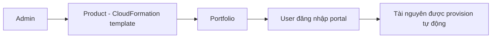

# 🛍️ AWS Service Catalog: "Cửa hàng" self-service cho tài nguyên AWS đã được phê duyệt

> Nguồn: `214-AWS-Service-Catalog---Overview.txt` · [Udemy](https://ua.udemy.com/course/aws-certified-cloud-practitioner-new/learn/lecture/36566038)

Nếu bạn từng thấy đồng nghiệp mới dùng AWS tạo ra đủ thứ "lạ hoắc" không khớp với chuẩn chung của công ty, thì **AWS Service Catalog** chính là giải pháp. Dịch vụ này cho phép tổ chức cung cấp một **cổng self-service (tự phục vụ)** để nhân viên triển khai tài nguyên một cách an toàn và đúng chuẩn.

---

### 🎯 Vấn đề: người mới dùng AWS có quá nhiều lựa chọn

Những người mới với AWS thường **có quá nhiều lựa chọn** — và nếu bạn để mặc họ làm mọi thứ mình muốn, **những gì họ tạo ra có thể không nằm trong chuẩn chung** mà phần còn lại của tổ chức đang dùng.

Trong khi đó, nhiều người dùng chỉ cần một **self-service portal (cổng tự phục vụ)** nhanh gọn, cho phép họ **triển khai một tập sản phẩm đã được phê duyệt (authorized products)** — và những sản phẩm này phải do **admin định nghĩa trước**. Các sản phẩm đó có thể gồm **máy ảo (virtual machines), cơ sở dữ liệu (databases), lựa chọn lưu trữ (storage options)** và nhiều thứ khác.

---

### 🧱 Products và Portfolios — cách admin chuẩn bị "hàng"

Cách hoạt động của Service Catalog rất trực quan:

1. **Admin tạo products (sản phẩm)** — mỗi product thực chất là một **CloudFormation template** với các **parameter (tham số) phù hợp**.
2. Các product được gom vào một **portfolio (danh mục)** — hiểu đơn giản là **bộ sưu tập các product**.
3. Admin **định nghĩa ai được phép triển khai product nào** trong portfolio đó.

Nói cách khác: admin kiểm soát "trên kệ có gì" và "ai được mua gì".

---

### 🚀 Trải nghiệm self-service của người dùng

Khi là người dùng, bạn đăng nhập vào **portal của Service Catalog** và thấy ngay **danh sách rút gọn các product mình được phép dùng** — dựa trên quyền của bạn.

Khi người dùng **launch (khởi chạy)** một product, tài nguyên sẽ được **CloudFormation tự động provision (cấp phát)**. Điểm hay là bạn biết chắc chúng:

* Được **cấu hình đúng chuẩn**.
* Được **gắn tag đúng chuẩn**.
* **Tuân theo cách tổ chức của bạn vận hành**.

Ví dụ: một người dùng muốn có nhanh một **RDS database** nhưng không biết tạo sao cho đúng — bạn có thể cung cấp nó như một **service trong Service Catalog**, và họ chỉ việc launch.

---

Vậy là xong một dịch vụ mang tính "quản trị" rõ rệt: **Service Catalog = product là CloudFormation template, gói trong portfolio, phân quyền cho người dùng self-service, đảm bảo mọi thứ đúng chuẩn và đúng tag**.

Bài tiếp theo, chúng ta sẽ chuyển sang chủ đề "nóng" của kỳ thi: **các mô hình định giá của AWS** — nơi có rất nhiều con số và trade-off cần nhớ. Hẹn gặp các bạn ở đó! 🚀
