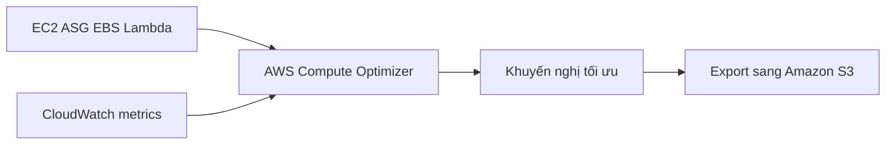

# 🔎 AWS Compute Optimizer: Gợi ý tài nguyên tối ưu, tiết kiệm tới 25% chi phí

> Nguồn: `217-Compute-Optimizer-Overview.txt` · [Udemy](https://ua.udemy.com/course/aws-certified-cloud-practitioner-new/learn/lecture/26623534)

Làm sao biết instance của mình đang "ăn" quá nhiều tiền so với nhu cầu thật? Câu trả lời nằm ở **AWS Compute Optimizer** — dịch vụ giúp **giảm chi phí và cải thiện hiệu năng** bằng cách **đề xuất tài nguyên tối ưu** cho workload của bạn. Bài này ngắn thôi nhưng rất đáng nhớ vì có một con số "đắt giá".

---

### 🎯 Bài toán: tài nguyên thừa hay thiếu đều là vấn đề

Compute Optimizer sẽ **phân tích các EC2 instance và Auto Scaling Group** của bạn, rồi chỉ ra:

* Instance nào đang **over-provisioned (cấp phát thừa)** — tức mạnh hơn nhu cầu, gây lãng phí tiền.
* Instance nào đang **under-provisioned (cấp phát thiếu)** — tức yếu hơn nhu cầu, ảnh hưởng hiệu năng.

Từ đó bạn **xây dựng phương án tối ưu**, vừa có góc nhìn chi phí tốt hơn, vừa cải thiện hiệu năng.

---

### 🧠 Cách hoạt động: Machine Learning + CloudWatch metrics

Điều thú vị là Compute Optimizer **dùng machine learning (học máy) bên dưới** để làm việc này:

* Phân tích **resource configuration (cấu hình tài nguyên)** của bạn.
* Theo dõi **CloudWatch metrics** để hiểu **mức độ sử dụng (utilization)** thực tế.

Nhờ vậy, các khuyến nghị không dựa trên cảm tính mà dựa trên dữ liệu vận hành thật của hệ thống.

---

### 📊 Tài nguyên được hỗ trợ và lợi ích

Compute Optimizer hỗ trợ các loại tài nguyên sau:

* **EC2 instances**
* **Auto Scaling Groups**
* **EBS volumes**
* **Lambda functions**

Lợi ích cụ thể:

* Giúp bạn **giảm chi phí tới 25%** mà **không cần làm gì nhiều** — chỉ cần nghe theo khuyến nghị.
* Các **recommendation (khuyến nghị)** có thể được **export (xuất) sang Amazon S3** để lưu trữ và phân tích tiếp.

*Một dịch vụ "lời" đúng nghĩa: bật lên, đọc gợi ý, tối ưu — và tiết kiệm.*

---

Nhớ ngắn gọn: **Compute Optimizer = phân tích EC2, ASG, EBS, Lambda bằng machine learning và CloudWatch metrics, giúp giảm tới 25% chi phí, khuyến nghị xuất được sang S3**. Trong đề thi, cứ thấy từ khóa "recommend optimal resources" hay "over/under-provisioned" là bạn nghĩ ngay tới Compute Optimizer.

Bài tiếp theo chúng ta sẽ bước vào bộ công cụ **Billing & Costing** — những dịch vụ giúp bạn theo dõi và kiểm soát hóa đơn AWS. Hẹn gặp các bạn ở đó! 🚀
