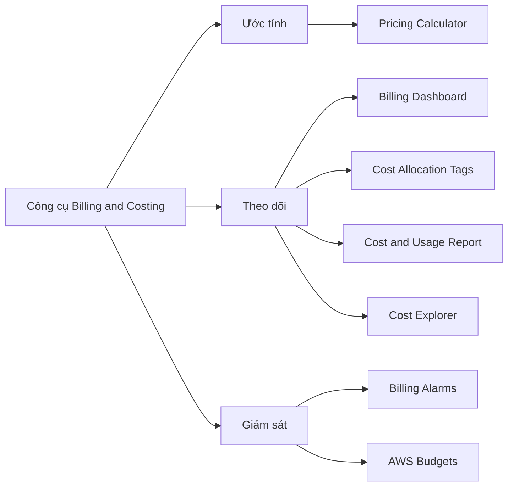

# 💰 Bức tranh tổng quan các công cụ Billing & Costing trên AWS

> Nguồn: `218-Billing-Costing-Tools-Overview.txt` · [Udemy](https://ua.udemy.com/course/aws-certified-cloud-practitioner-new/learn/lecture/20261186)

Hôm nay chúng ta bước sang chủ đề **billing & costing (thanh toán và chi phí)** — nghe có vẻ hơi khô khan, nhưng đây là phần **chắc chắn có trong đề thi**, nên các bạn đừng bỏ qua nhé. Mình sẽ điểm qua toàn bộ công cụ theo ba nhóm: ước tính, theo dõi và giám sát chi phí.

*Các bạn cần biết TẤT CẢ các công cụ này cho kỳ thi CLF-C02 — mình hứa rằng đến cuối bài, bạn sẽ tự tin chọn đúng đáp án.*

---

### 🎯 Ba nhóm công cụ bạn phải phân biệt

Toàn bộ công cụ billing & costing trên AWS chia thành ba nhóm rõ ràng:

1. **Ước tính chi phí (estimate)** — tính trước chi phí của một kiến trúc.
2. **Theo dõi chi phí (track)** — xem chi tiết các khoản đã và đang phát sinh.
3. **Giám sát chi phí (monitor)** — nhận cảnh báo khi có bất thường.

Đề thi rất hay hỏi công cụ nào thuộc nhóm nào, nên các bạn nhớ nằm lòng ba nhóm này.

---

### 🧮 Nhóm ước tính: AWS Pricing Calculator

Nhóm này chỉ có đúng một công cụ: **AWS Pricing Calculator**. Nó cho phép các bạn **ước tính chi phí cho một kiến trúc giải pháp cụ thể** trước khi triển khai. Mình sẽ dành một bài riêng để thực hành cùng công cụ này, nên ở đây các bạn chỉ cần nhớ tên và chức năng.

---

### 📊 Nhóm theo dõi: bốn công cụ cốt lõi

Khi tài nguyên đã chạy và phát sinh chi phí, đây là những công cụ giúp các bạn "soi" hóa đơn:

* **Billing Dashboard** — xem tổng quan chi phí.
* **Cost Allocation Tags** — gắn tag để nhóm và lọc chi phí chi tiết.
* **Cost and Usage Report** — bộ dữ liệu chi phí chi tiết nhất.
* **Cost Explorer** — trực quan hóa và dự báo chi phí.

Bốn cái tên này rất dễ bị trộn lẫn trong đề, nên mình sẽ có bài riêng cho từng nhóm chức năng.

---

### 🚨 Nhóm giám sát: Alarms và Budgets

Cuối cùng là nhóm giám sát, gồm hai công cụ:

* **Billing Alarms** — cảnh báo khi chi phí vượt một ngưỡng bạn đặt ra.
* **AWS Budgets** — đặt ngân sách, cảnh báo khi vượt ngân sách thực tế hoặc vượt dự báo.

Đúng là khá nhiều dịch vụ phải nhớ, nhưng chỉ cần bám theo ba nhóm trên là các bạn sẽ không bao giờ chọn nhầm.

---

### 🎯 Tự kiểm tra nhanh

**Câu 1:** AWS Pricing Calculator thuộc nhóm công cụ nào?

<b>Xem đáp án</b>

**Đáp án:** Nhóm ước tính chi phí (estimate cost).

Giải thích: Đây là công cụ duy nhất của nhóm này.

Tham chiếu: Mục Nhóm ước tính.

**Câu 2:** Bốn công cụ nào thuộc nhóm theo dõi chi phí?

<b>Xem đáp án</b>

**Đáp án:** Billing Dashboard, Cost Allocation Tags, Cost and Usage Report và Cost Explorer.

Giải thích: Đây là các công cụ giúp xem chi tiết chi phí đã phát sinh.

Tham chiếu: Mục Nhóm theo dõi.

**Câu 3:** Hai công cụ thuộc nhóm giám sát chi phí là gì?

<b>Xem đáp án</b>

**Đáp án:** Billing Alarms và AWS Budgets.

Giải thích: Cả hai đều dùng để cảnh báo khi chi phí vượt ngưỡng.

Tham chiếu: Mục Nhóm giám sát.

**Câu 4:** Cost Explorer nằm ở nhóm nào?

<b>Xem đáp án</b>

**Đáp án:** Nhóm theo dõi chi phí (track cost).

Giải thích: Cost Explorer giúp trực quan hóa và dự báo chi phí.

Tham chiếu: Mục Nhóm theo dõi.

**Câu 5:** Vì sao giảng viên nhấn mạnh phải học hết các công cụ billing?

<b>Xem đáp án</b>

**Đáp án:** Vì đề thi yêu cầu bạn phải biết hết các công cụ này.

Giải thích: Tuy chủ đề có thể hơi khô khan, đây là kiến thức chắc chắn xuất hiện trong bài thi.

Tham chiếu: Mục Ba nhóm công cụ.

---

Vậy là các bạn đã có trong tay **bản đồ ba nhóm công cụ** billing & costing. Nghe thì nhiều, nhưng chỉ cần nhớ nhóm chức năng là mọi thứ sẽ rõ ràng.

Ở bài tiếp theo, chúng ta sẽ mở **AWS Pricing Calculator** và tự tay tạo một estimate đầu tiên. Hẹn gặp các bạn ở đó! 🚀
