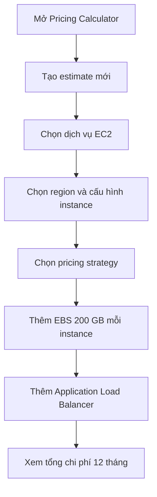

# 🧮 Ước tính chi phí trên cloud với AWS Pricing Calculator

> Nguồn: `219-Estimating-Costs-in-the-Cloud---Pricing-Calculator.txt` · [Udemy](https://ua.udemy.com/course/aws-certified-cloud-practitioner-new/learn/lecture/20056406)

Muốn biết trước một kiến trúc sẽ tốn bao nhiêu tiền mỗi năm trước khi triển khai? Đó chính là lúc **AWS Pricing Calculator** phát huy tác dụng. Trong bài này, mình sẽ cùng các bạn tạo một bản ước tính hoàn chỉnh cho workload EC2 kèm load balancer — học qua thực hành luôn nhé!

---

### 🎯 Pricing Calculator là gì?

**AWS Pricing Calculator** cho phép các bạn **ước tính chi phí cho một kiến trúc giải pháp cụ thể (designated solution architecture)**. Công cụ này có địa chỉ web riêng, và các bạn sẽ biết chính xác — ví dụ — kiến trúc của mình tốn bao nhiêu tiền trong một năm.

Cách làm rất trực quan: tạo một **estimate (bản ước tính)**, chọn các dịch vụ mình sẽ dùng, cấu hình từng dịch vụ, rồi cộng dồn chi phí lại.

---

### 🧱 Tạo estimate đầu tiên với EC2

Giả sử workload của chúng ta chạy trên **EC2**. Đây là các bước mình thao tác:

1. Tạo estimate mới và tìm dịch vụ **EC2** để cấu hình.
2. Chọn **region (vùng)** triển khai.
3. Chọn **quick estimate (ước tính nhanh)** hoặc **advanced estimate (ước tính nâng cao)** — mình chọn quick cho nhanh gọn.
4. Chọn hệ điều hành **Linux**, cấu hình **4 vCPU và 16 GiB RAM**, rồi chọn instance **T4g.xlarge** với số lượng **4 instance**.
5. Khai báo mức sử dụng dự kiến: **80% mỗi tháng**.
6. Chọn **pricing strategy (chiến lược giá)**: **EC2 Instance Savings Plans với kỳ hạn 1 năm và no upfront (không trả trước)**.

Tiếp đó, khai báo **Amazon Elastic Block Store (EBS)**: **200 GB dung lượng cho mỗi instance**. Bấm **Add to estimate** là các bạn đã có ngay chi phí cho phần EC2.

---

### ⚖️ Thêm Application Load Balancer và xem tổng chi phí

Giờ mình thêm một **load balancer (bộ cân bằng tải)** vào kiến trúc:

1. Tìm **load balancer** và chọn **Elastic Load Balancing**.
2. Chọn **Application Load Balancer** ở cùng region, số lượng **1**.
3. Khai báo lưu lượng dự kiến: khoảng **5 GB dữ liệu xử lý mỗi giờ** và khoảng **5 kết nối mỗi giây**.

Bấm **Add to estimate**, và lúc này chúng ta có **tổng chi phí 12 tháng** cho toàn bộ kiến trúc: **khoảng 4.500 USD**.

Pricing Calculator còn chi tiết hơn thế: các bạn có thể **tạo nhóm (groups)**, **thêm gói support**, thêm nhiều dịch vụ khác — nói chung là một công cụ rất toàn diện của AWS.

---

### 🎯 Tự kiểm tra nhanh

**Câu 1:** AWS Pricing Calculator dùng để làm gì?

<b>Xem đáp án</b>

**Đáp án:** Ước tính chi phí cho một kiến trúc giải pháp cụ thể trước khi triển khai.

Giải thích: Công cụ này giúp bạn biết trước chi phí, ví dụ theo năm.

Tham chiếu: Mục Pricing Calculator là gì.

**Câu 2:** Trong demo, mình chọn instance nào và bao nhiêu cái?

<b>Xem đáp án</b>

**Đáp án:** T4g.xlarge, 4 instance, chạy Linux với 4 vCPU và 16 GiB RAM.

Giải thích: Đây là cấu hình workload EC2 giả định trong bài.

Tham chiếu: Mục Tạo estimate đầu tiên với EC2.

**Câu 3:** Pricing strategy được chọn là gì?

<b>Xem đáp án</b>

**Đáp án:** EC2 Instance Savings Plans, kỳ hạn 1 năm, không trả trước (no upfront).

Giải thích: Đây là cách giảm chi phí cho workload dài hạn.

Tham chiếu: Mục Tạo estimate đầu tiên với EC2.

**Câu 4:** Mỗi instance được gán bao nhiêu dung lượng EBS?

<b>Xem đáp án</b>

**Đáp án:** 200 GB mỗi instance.

Giải thích: EBS được khai báo riêng sau khi cấu hình EC2.

Tham chiếu: Mục Tạo estimate đầu tiên với EC2.

**Câu 5:** Tổng chi phí 12 tháng của kiến trúc trong demo là bao nhiêu?

<b>Xem đáp án</b>

**Đáp án:** Khoảng 4.500 USD.

Giải thích: Con số này gồm EC2, EBS và Application Load Balancer.

Tham chiếu: Mục Thêm Application Load Balancer.

---

Vậy là các bạn đã biết cách dựng một bản ước tính từ con số 0 — kỹ năng cực hữu ích để lên ngân sách trước khi triển khai.

Ở bài tiếp theo, chúng ta sẽ học cách **theo dõi chi phí thực tế** trong tài khoản AWS. Hẹn gặp các bạn ở đó! 🚀
