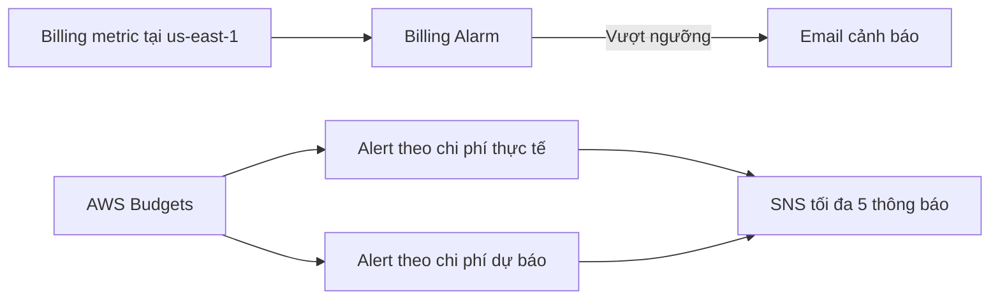

# 🚨 Giám sát chi phí với Billing Alarms và AWS Budgets

> Nguồn: `221-Monitoring-Costs-in-the-Cloud---Billing-Alarms-AWS-Budgets.txt` · [Udemy](https://ua.udemy.com/course/aws-certified-cloud-practitioner-new/learn/lecture/20118372)

Chúng ta đã biết cách theo dõi chi phí; giờ là lúc chuyển sang **giám sát (monitoring)** — tức là để AWS chủ động cảnh báo khi hóa đơn có dấu hiệu vượt ngưỡng. Bài này gồm hai công cụ: **Billing Alarms** và **AWS Budgets**.

---

### 📍 Billing metric — chỉ số sống ở us-east-1

Điều đầu tiên các bạn phải nhớ: **billing metric (chỉ số thanh toán) chỉ được lưu ở region us-east-1 trong CloudWatch**. Tuy vậy, dữ liệu tại us-east-1 được **tổng hợp cho tất cả region** trong tài khoản AWS của bạn.

Một điểm quan trọng nữa: chỉ số này phản ánh **chi phí thực tế (actual cost)**, **không phải chi phí dự báo (projected cost)**.

Từ billing metric, bạn tạo được **billing alarm (cảnh báo thanh toán)**:

* Đây là một alarm đơn giản, **không mạnh bằng AWS Budgets**.
* Công dụng chính: gửi **email thông báo** khi chi phí vượt một ngưỡng bạn đặt.
* Trong demo, mình đặt ngưỡng **70 USD** và ngay khi vượt qua, mình nhận được email cảnh báo.

---

### 💰 AWS Budgets — cảnh báo thông minh hơn

**AWS Budgets** gửi cảnh báo khi **chi phí thực tế vượt ngân sách** hoặc khi **chi phí dự báo vượt ngân sách**. Có **bốn loại budget**:

1. **Usage budget** — theo dõi mức sử dụng.
2. **Cost budget** — theo dõi chi phí.
3. **Reservation budget** — theo dõi reserved instances, gồm cả **utilization (mức tận dụng)**; hỗ trợ **EC2 Reserved Instances, ElastiCache Reserved Instances, RDS và Redshift**.
4. **Savings plan budget**.

Vài thông số cần nhớ:

* Hỗ trợ tối đa **5 SNS notification mỗi budget** — có thể gửi email, **trigger Lambda function**, v.v.
* Bộ lọc phong phú: **service, linked account, tag, purchase option, instance type, region, AZ, API operation**...
* Các tùy chọn này **giống hệt Cost Explorer**, và hai công cụ được liên kết với nhau.

---

### 🧪 Tạo budget trong console

Trong console, mình vào **Budgets** và thấy một budget cũ tên **"Don't go over 10 dollars"** — đã bị vượt vì tài khoản được dùng khá nhiều. Budget hiển thị **số tiền đã dùng**, **số dự báo** và **so sánh hiện tại với ngân sách**.

Khi tạo budget mới, bạn có hai lựa chọn: dùng **template (mẫu)** hoặc **tự tùy chỉnh (customize)** với 4 loại budget ở trên. Với **cost budget**, các bước là:

1. Đặt **budget name** — ví dụ **DemoBudget**.
2. Chọn **period**: monthly, daily, quarterly hoặc annually; recurring hay expiring.
3. Đặt **thời gian bắt đầu và kết thúc**, ví dụ ngân sách cố định **10 USD**.
4. **Filter budget scope**: tất cả dịch vụ AWS, hoặc chỉ một số dịch vụ cụ thể (ví dụ **Key Management Service**) để xem ngân sách riêng cho chúng.
5. Thêm **budget alert**: ví dụ khi đạt **80% ngân sách thực tế** thì gửi email, và **80% ngân sách dự báo** cũng gửi email.

Trên biểu đồ, bạn sẽ thấy rõ **các ngưỡng cảnh báo** nằm ở đâu so với tình hình hiện tại, và có thể **drill down thẳng sang Cost Explorer** để phân tích sâu hơn.

---

### 🎯 Tự kiểm tra nhanh

**Câu 1:** Billing metric được lưu ở đâu?

<b>Xem đáp án</b>

**Đáp án:** Region us-east-1 trong CloudWatch, nhưng dữ liệu được tổng hợp cho mọi region.

Giải thích: Đây là chi tiết rất hay xuất hiện trong đề thi.

Tham chiếu: Mục Billing metric.

**Câu 2:** Billing metric phản ánh chi phí thực tế hay chi phí dự báo?

<b>Xem đáp án</b>

**Đáp án:** Chi phí thực tế (actual cost), không phải projected cost.

Giải thích: Billing alarm dựa trên chỉ số này để cảnh báo khi vượt ngưỡng.

Tham chiếu: Mục Billing metric.

**Câu 3:** AWS Budgets có bốn loại budget nào?

<b>Xem đáp án</b>

**Đáp án:** Usage, cost, reservation và savings plan.

Giải thích: Mỗi loại phục vụ một mục đích theo dõi khác nhau.

Tham chiếu: Mục AWS Budgets.

**Câu 4:** Mỗi budget hỗ trợ tối đa bao nhiêu SNS notification?

<b>Xem đáp án</b>

**Đáp án:** 5 SNS notification.

Giải thích: Bạn có thể gửi email hoặc trigger Lambda function từ các thông báo này.

Tham chiếu: Mục AWS Budgets.

**Câu 5:** Reservation budget theo dõi utilization cho những dịch vụ nào?

<b>Xem đáp án</b>

**Đáp án:** EC2 Reserved Instances, ElastiCache Reserved Instances, RDS và Redshift.

Giải thích: Đây là các dịch vụ có reservation được Budgets hỗ trợ.

Tham chiếu: Mục AWS Budgets.

---

Vậy là các bạn đã biết cách để AWS tự động "cảnh báo" khi hóa đơn có dấu hiệu vượt ngưỡng — cả với billing alarm đơn giản lẫn bộ Budgets linh hoạt hơn hẳn.

Ở bài tiếp theo, chúng ta sẽ tìm hiểu **AWS Cost Anomaly Detection** — công cụ dùng machine learning để phát hiện chi tiêu bất thường. Hẹn gặp lại! 🚀
