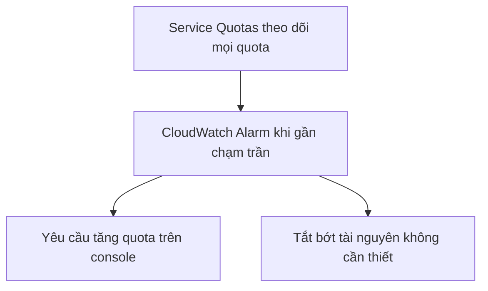

# 📏 AWS Service Quotas: Đừng để chạm trần giới hạn dịch vụ

> Nguồn: `223-AWS-Service-Quotas.txt` · [Udemy](https://ua.udemy.com/course/aws-certified-cloud-practitioner-new/learn/lecture/36566076)

Trên AWS, mọi thứ đều có **giới hạn** — và giới hạn đó được gọi là **quota**. Bài này mình nói về **AWS Service Quotas**: cách nhận cảnh báo khi sắp chạm trần và cách xin tăng giới hạn khi cần.

---

### 🧱 Quota là gì?

Với AWS, bạn có các **limit (giới hạn)** và chúng được gọi là **quotas**. Đôi khi bạn sẽ **chạm phải** chúng — ví dụ bạn tiến gần đến giới hạn số **Lambda function chạy cùng lúc (concurrent executions)**, hoặc các giới hạn quan trọng khác trong tài khoản.

Vì đây là những giới hạn quan trọng, bạn cần **được thông báo ngay khi chạm tới**. Đó là lúc **Service Quotas** phát huy tác dụng.

---

### 🔔 Cảnh báo bằng CloudWatch Alarms

Điểm rất tiện: bạn có thể **tạo CloudWatch Alarm ngay trên console Service Quotas** để nhận cảnh báo — ví dụ khi **Lambda concurrent executions** đang tiến sát quota của bạn.

Vậy là chỉ với vài cú nhấp, bạn luôn biết mình đang cách "trần" bao xa, thay vì bị động phát hiện khi hệ thống đã gặp lỗi.

---

### 📈 Tăng quota hoặc thu hẹp tài nguyên

Khi chạm giới hạn, bạn có hai hướng xử lý:

1. **Yêu cầu tăng quota (request a quota increase)** trực tiếp từ console Service Quotas — AWS sẽ mở rộng giới hạn cho bạn.
2. Hoặc **tắt bớt tài nguyên (shut down resources)** nếu bạn nhận ra mình đang chạy quá nhiều thứ không cần thiết.

Tóm lại, **Service Quotas giám sát toàn bộ quota trên AWS** (rất nhiều đấy!), cho phép bạn **nhận cảnh báo qua CloudWatch Alarms** và **xin tăng quota ngay trong console**.

---

### 🎯 Tự kiểm tra nhanh

**Câu 1:** Giới hạn trên AWS được gọi là gì?

<b>Xem đáp án</b>

**Đáp án:** Quota.

Giải thích: Đây là thuật ngữ AWS dùng cho các limit trong tài khoản.

Tham chiếu: Mục Quota là gì.

**Câu 2:** Bạn tạo cảnh báo quota ở đâu?

<b>Xem đáp án</b>

**Đáp án:** Tạo CloudWatch Alarm trực tiếp trên console Service Quotas.

Giải thích: Ví dụ cảnh báo khi Lambda concurrent executions tiến sát quota.

Tham chiếu: Mục Cảnh báo bằng CloudWatch Alarms.

**Câu 3:** Ví dụ quota mà giảng viên nhắc đến là gì?

<b>Xem đáp án</b>

**Đáp án:** Số Lambda function chạy cùng lúc (concurrent executions).

Giải thích: Đây là kiểu giới hạn dễ bị chạm trong thực tế.

Tham chiếu: Mục Quota là gì.

**Câu 4:** Muốn tăng quota thì làm thế nào?

<b>Xem đáp án</b>

**Đáp án:** Gửi yêu cầu tăng quota (request a quota increase) từ console Service Quotas.

Giải thích: AWS sẽ xử lý để mở rộng giới hạn cho bạn.

Tham chiếu: Mục Tăng quota hoặc thu hẹp tài nguyên.

**Câu 5:** Ngoài việc tăng quota, bạn có thể làm gì khi tiến sát giới hạn?

<b>Xem đáp án</b>

**Đáp án:** Tắt bớt tài nguyên không cần thiết (shut down resources).

Giải thích: Có thể bạn đang chạy quá nhiều thứ mà không cần đến.

Tham chiếu: Mục Tăng quota hoặc thu hẹp tài nguyên.

---

Vậy là các bạn đã biết cách **theo dõi quota, nhận cảnh báo và xin tăng giới hạn** — kỹ năng nhỏ nhưng giúp vận hành tài khoản AWS an toàn hơn.

Ở bài tiếp theo, chúng ta sẽ tìm hiểu **AWS Trusted Advisor** — trợ lý rà soát toàn diện tài khoản AWS của bạn. Hẹn gặp các bạn ở đó! 🚀
