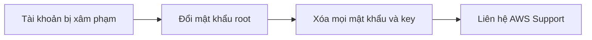

# ✅ Best practices quản lý tài khoản AWS: Bản tổng hợp cần nhớ

> Nguồn: `226-Account-Best-Practices-Summary.txt` · [Udemy](https://ua.udemy.com/course/aws-certified-cloud-practitioner-new/learn/lecture/20056442)

Đây là bài **tổng kết các best practices (thực hành tốt nhất)** khi vận hành tài khoản AWS — từ quản lý nhiều tài khoản, bảo mật IAM, ghi log cho đến xử lý khi tài khoản bị xâm phạm. *Đây là dạng kiến thức tổng hợp rất hay được hỏi trong đề thi.*

---

### 🏢 Nhiều tài khoản? Hãy quản lý tập trung

* Nếu muốn vận hành **nhiều tài khoản**, AWS khuyến nghị dùng **AWS Organizations**.
* Muốn **giới hạn tài khoản nào được làm gì** (giới hạn "quyền lực" của từng account), hãy dùng **SCP (Service Control Policies)**.
* Muốn thiết lập nhiều tài khoản với **best practices bảo mật chuẩn**, dùng **AWS Control Tower** — dịch vụ nằm trên nền **Organizations**.
* Dùng **tags và cost allocation tags** để quản lý và tính phí tài khoản dễ dàng.

---

### 🔐 IAM, ghi log và giám sát

* Nhớ các **IAM guideline**: bật **MFA (multifactor authentication)**, **least privilege (quyền tối thiểu)**, tạo **password policy** và bật **password rotation (xoay vòng mật khẩu)**.
* Dùng **AWS Config** để ghi lại **cấu hình tài nguyên và mức tuân thủ (compliance)** theo thời gian — phòng khi có sự cố.
* **CloudFormation** cực hữu ích để triển khai **stack xuyên nhiều tài khoản và nhiều region**, giúp bạn quản lý mọi tài khoản cùng lúc.
* **Trusted Advisor** giúp bạn có được insight và chọn đúng gói support phù hợp với nhu cầu.

---

### 📤 Nhật ký và triển khai chuẩn

* Gửi **service logs** và **access logs** qua **Amazon S3** hoặc **CloudWatch Logs** — thậm chí có thể đặt ở **một tài khoản riêng chuyên để ghi log** cho đúng best practices bảo mật.
* Dùng **CloudTrail** để ghi lại **các API call** được thực hiện trong tài khoản hoặc giữa các region khác nhau.
* Dùng **AWS Service Catalog** để cho phép người dùng tạo các **stack định sẵn (predefined stacks)** do **quản trị viên định nghĩa trước**.

---

### 🚑 Khi tài khoản bị xâm phạm

Nếu tài khoản của bạn không may bị compromise, hãy làm ngay ba việc:

1. **Đổi mật khẩu root**.
2. **Xóa toàn bộ mật khẩu và key**.
3. **Liên hệ AWS Support**.

---

### 🎯 Tự kiểm tra nhanh

**Câu 1:** Muốn quản lý nhiều tài khoản AWS, bạn dùng dịch vụ nào?

<b>Xem đáp án</b>

**Đáp án:** AWS Organizations.

Giải thích: Đây là cách được AWS khuyến nghị để vận hành nhiều account.

Tham chiếu: Mục Nhiều tài khoản, hãy quản lý tập trung.

**Câu 2:** Dùng gì để giới hạn quyền của từng tài khoản?

<b>Xem đáp án</b>

**Đáp án:** SCP (Service Control Policies).

Giải thích: SCP quy định tài khoản nào được làm gì.

Tham chiếu: Mục Nhiều tài khoản, hãy quản lý tập trung.

**Câu 3:** Dịch vụ nào giúp thiết lập nhiều tài khoản theo best practices bảo mật?

<b>Xem đáp án</b>

**Đáp án:** AWS Control Tower, nằm trên nền AWS Organizations.

Giải thích: Control Tower giúp tạo và quản lý nhiều account an toàn hơn.

Tham chiếu: Mục Nhiều tài khoản, hãy quản lý tập trung.

**Câu 4:** Ghi lại các API call trong tài khoản dùng dịch vụ nào?

<b>Xem đáp án</b>

**Đáp án:** CloudTrail.

Giải thích: CloudTrail ghi nhận API call trong tài khoản và giữa các region.

Tham chiếu: Mục Nhật ký và triển khai chuẩn.

**Câu 5:** Khi tài khoản bị xâm phạm, cần làm ngay những gì?

<b>Xem đáp án</b>

**Đáp án:** Đổi mật khẩu root, xóa toàn bộ mật khẩu và key, rồi liên hệ AWS Support.

Giải thích: Đây là ba bước xử lý khẩn cấp khi tài khoản bị compromise.

Tham chiếu: Mục Khi tài khoản bị xâm phạm.

---

Vậy là các bạn đã có một checklist hoàn chỉnh cho việc quản lý tài khoản AWS: tổ chức tập trung, bảo mật IAM, ghi log đầy đủ và sẵn sàng xử lý sự cố.

Ở bài tiếp theo, chúng ta sẽ **tổng kết toàn bộ công cụ billing** trong section này — bản recap cực gọn để ôn thi. Hẹn gặp các bạn ở đó! 🚀
