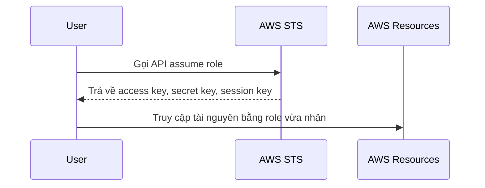

# 🔑 AWS STS: Dịch vụ trung tâm cấp quyền truy cập tạm thời cho AWS

> Nguồn: `228-Security-Token-Service-STS-Overview.txt` · [Udemy](https://ua.udemy.com/course/aws-certified-cloud-practitioner-new/learn/lecture/26623546)

Có một dịch vụ mà chúng ta đã dùng suốt khóa học mà không hề hay biết, và nó nằm ngay **trung tâm của AWS**: **AWS STS (Security Token Service)**. Bài này mình sẽ giúp các bạn hiểu nó làm gì, hoạt động ra sao và vì sao đề thi rất thích hỏi về nó.

*Đừng lo nếu khái niệm "token" nghe có vẻ trừu tượng — mình sẽ giải thích thật đơn giản.*

---

### 🎯 STS là gì?

**AWS STS (Security Token Service)** cho phép các bạn tạo ra **temporary, limited-privilege credentials (thông tin đăng nhập tạm thời, quyền hạn giới hạn)** để truy cập tài nguyên AWS.

* Đây là **short-term credentials (thông tin đăng nhập ngắn hạn)** — trông giống như **access key** và **secret access key** mà các bạn đã biết.
* Điểm đặc biệt: các bạn **cấu hình được thời gian hết hạn (expiration period)** của chúng.

Cách hoạt động cơ bản:

1. User có quyền truy cập vào một **role**.
2. User muốn dùng role đó nên thực hiện **assume the role (nhận vai trò)** bằng một **STS API call**.
3. STS trả về **temporary security credentials** gồm **3 thành phần**: **access key**, **secret key** và **session key** — session key này bị giới hạn thời gian.
4. Dùng 3 credential đó, user truy cập tài nguyên AWS với đúng role vừa assume.

---

### 💼 Ba use case điển hình của STS

STS xuất hiện trong rất nhiều tình huống thực tế:

1. **Identity federation (liên kết danh tính):** quản lý danh tính trong các hệ thống bên ngoài, rồi cấp cho họ **STS token** để truy cập tài nguyên AWS.
2. **IAM roles access:** cho truy cập **cross-account (khác tài khoản)** hoặc **same-account (cùng tài khoản)** — chính là ví dụ assume role ở trên.
3. **IAM role gắn cho EC2 instance:** đây là cách chúng ta đã dùng ngầm trong khóa học. Chạy phía sau là một **script tự động refresh credential của EC2** thông qua **Security Token Service**.

---

### ⚠️ Mẹo thi: khi nào chọn STS?

Quy tắc rất dễ nhớ: hễ đề bài yêu cầu tạo **temporary, limited-privilege credentials** để truy cập AWS thì đáp án là **STS**.

Các bạn cũng sẽ gặp các tình huống như **identity federation**, **cross-account access** hay **ứng dụng cần credential tạm thời** — tất cả đều xoay quanh dịch vụ này. *Nắm chắc một ý này thôi là các bạn đã ăn trọn điểm cho dạng câu hỏi về STS.*

---

### 🎯 Tự kiểm tra nhanh

**Câu 1:** STS là viết tắt của gì?

<b>Xem đáp án</b>

**Đáp án:** Security Token Service.
Giải thích: Dịch vụ nằm ở trung tâm AWS, chuyên cấp credential tạm thời.
Tham chiếu: Mục STS là gì.

**Câu 2:** STS trả về những credential nào?

<b>Xem đáp án</b>

**Đáp án:** access key, secret key và session key.
Giải thích: Bộ ba temporary security credentials này có thời hạn giới hạn.
Tham chiếu: Mục STS là gì.

**Câu 3:** Điểm đặc biệt của credential do STS cấp là gì?

<b>Xem đáp án</b>

**Đáp án:** Là credential tạm thời, quyền hạn giới hạn và cấu hình được thời gian hết hạn.
Giải thích: Đây chính là cụm từ khóa "temporary, limited-privilege credentials".
Tham chiếu: Mục STS là gì.

**Câu 4:** Use case nào liên quan tới EC2 instance?

<b>Xem đáp án</b>

**Đáp án:** Gắn IAM role cho EC2 instance — script chạy ngầm tự refresh credential của EC2 qua STS.
Giải thích: Đây là cách chúng ta đã dùng STS mà không nhận ra trong khóa học.
Tham chiếu: Mục Ba use case điển hình.

**Câu 5:** Đề cho "cần temporary, limited-privilege credentials để truy cập AWS" — chọn dịch vụ nào?

<b>Xem đáp án</b>

**Đáp án:** AWS STS.
Giải thích: Đây là quy tắc nhận diện nhanh trong đề thi.
Tham chiếu: Mục Mẹo thi.

---

Vậy là các bạn đã hiểu vai trò của **STS**: dịch vụ đứng sau mọi **credential tạm thời** trong AWS. *Chỉ cần nhớ cụm "temporary, limited privileges" là các bạn đã nắm chắc điểm thi này.*

Ở bài tiếp theo, chúng ta sẽ tìm hiểu **Amazon Cognito** — cách quản lý danh tính cho hàng triệu người dùng web và mobile. Hẹn gặp các bạn! 🚀
