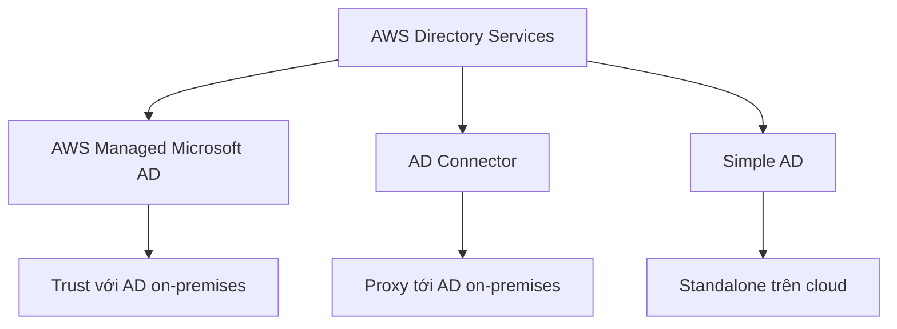

# 🏢 AWS Directory Services: Đưa Microsoft Active Directory lên AWS

> Nguồn: `230-Directory-Services-Overview.txt` · [Udemy](https://ua.udemy.com/course/aws-certified-cloud-practitioner-new/learn/lecture/20587292)

Bài này chúng ta bắt đầu từ **Microsoft Active Directory (AD)** — thứ mà các bạn sẽ gặp ở hầu hết công ty dùng Windows — rồi xem AWS mở rộng nó như thế nào bằng **AWS Directory Services**. *Đừng lo, với đề Cloud Practitioner các bạn chỉ cần nắm một ý cốt lõi, mình sẽ chỉ rõ ở cuối bài.*

---

### 🧱 Microsoft Active Directory (AD) là gì?

AD không phải là dịch vụ của AWS, mà là công nghệ của Microsoft:

* AD có mặt trên **mọi Windows Server đã cài AD Domain Services**.
* Nó là một **database of objects (cơ sở dữ liệu các đối tượng)**, bao gồm:
  * **user accounts** (tài khoản người dùng)
  * **computers** (máy tính)
  * **printers** (máy in)
  * **file shares** (chia sẻ file)
  * **security groups** (nhóm bảo mật)
* AD mang lại **Centralized Security Management (quản lý bảo mật tập trung)**: bạn tạo account, gán permission — tất cả trong một nơi.

---

### 🔐 Ví dụ đời thường: đăng nhập một lần trong công ty

Hãy tưởng tượng bạn có một **laptop Windows** kết nối vào mạng nội bộ của công ty:

* Có một **Domain Controller** định nghĩa rằng bạn — chẳng hạn John — có một **password**.
* Vì mọi máy trong công ty đều kết nối tới Domain Controller, bạn có thể dùng **cùng một username và password** để đăng nhập vào **bất kỳ máy nào**.
* Nhờ đó, bạn dùng đăng nhập của mình một cách liền mạch trên nhiều máy và nhiều dịch vụ khác nhau.

AD thường chạy trong hệ thống **on-premises (tại chỗ, trong hạ tầng của công ty)**.

---

### ☁️ AWS mở rộng Active Directory như thế nào?

AWS **không có sẵn Active Directory**, nhưng các bạn có thể mở rộng AD bằng **AWS Directory Services** với **3 lựa chọn**:

1. **AWS Managed Microsoft AD** — tạo **Active Directory của riêng bạn trên AWS**:
   * Quản lý user **cục bộ (locally)**.
   * Hỗ trợ **MFA (multifactor authentication — xác thực đa yếu tố)**.
   * Nếu đã có AD on-premises, bạn có thể lập **trust (quan hệ tin cậy)** giữa hai bên để chúng **join** với nhau và tin cậy lẫn nhau.
2. **AD Connector** — một **proxy**:
   * **Chuyển tiếp request từ AWS đến AD on-premises** của bạn.
   * Hỗ trợ MFA, nhưng **user vẫn sống trên AD on-premises**.
   * Bạn xác thực vào AD Connector, và nó proxy request vào AD on-prem.
3. **Simple AD** — **không phải Microsoft Active Directory**, mà là một **AD-compatible managed directory (thư mục được quản lý tương thích AD)** trên AWS:
   * **Không thể join** với AD on-premises.
   * Chỉ là một Active Directory **độc lập (standalone)** trên cloud.

---

### 📊 Bảng đối chiếu ba lựa chọn

| Lựa chọn | Bản chất | Đặc điểm chính |
|---|---|---|
| **AWS Managed Microsoft AD** | AD của riêng bạn trên AWS | Quản lý user cục bộ; hỗ trợ MFA; lập trust với AD on-premises |
| **AD Connector** | Proxy | Chuyển request từ AWS tới AD on-premises; hỗ trợ MFA; user nằm ở on-premises |
| **Simple AD** | AD-compatible managed directory | Standalone trên cloud; không join được với AD on-premises |

---

### 🎯 Điều duy nhất cần nhớ cho kỳ thi CLF-C02

Chi tiết về 3 lựa chọn là kiến thức dành cho **Certified Solutions Architect Associate hoặc Professional** — các bạn không cần nhớ hết khi thi Cloud Practitioner.

Điều duy nhất cần nhớ: **hễ đề nhắc tới Active Directory / Microsoft Active Directory thì hãy nghĩ ngay đến AWS Directory Services.** *Một câu chốt, nhưng là cả một điểm thi đấy!*

---

### 🎯 Tự kiểm tra nhanh

**Câu 1:** Active Directory lưu trữ những loại đối tượng nào?

<b>Xem đáp án</b>

**Đáp án:** user accounts, computers, printers, file shares, security groups...
Giải thích: AD là một database of objects, kèm quản lý bảo mật tập trung.
Tham chiếu: Mục Microsoft Active Directory là gì.

**Câu 2:** Domain Controller trong ví dụ của giảng viên giúp ích gì?

<b>Xem đáp án</b>

**Đáp án:** Cho phép dùng cùng một username/password đăng nhập vào mọi máy công ty kết nối tới nó.
Giải thích: Nhờ vậy việc đăng nhập trở nên liền mạch trên nhiều máy và dịch vụ.
Tham chiếu: Mục Ví dụ đời thường.

**Câu 3:** AWS Managed Microsoft AD có đặc điểm gì?

<b>Xem đáp án</b>

**Đáp án:** Tạo AD của riêng bạn trên AWS, quản lý user cục bộ, hỗ trợ MFA và lập trust với AD on-premises.
Giải thích: Đây là lựa chọn đầy đủ nhất trong ba lựa chọn Directory Services.
Tham chiếu: Mục AWS mở rộng Active Directory.

**Câu 4:** AD Connector hoạt động như thế nào?

<b>Xem đáp án</b>

**Đáp án:** Là proxy chuyển request từ AWS tới AD on-premises; hỗ trợ MFA nhưng user vẫn nằm trên AD on-prem.
Giải thích: Bạn xác thực vào AD Connector, nó proxy request vào AD on-prem.
Tham chiếu: Mục AWS mở rộng Active Directory.

**Câu 5:** Simple AD có join được với AD on-premises không?

<b>Xem đáp án</b>

**Đáp án:** Không — Simple AD là AD-compatible managed directory độc lập trên cloud.
Giải thích: Nó không phải Microsoft Active Directory và không join với on-prem.
Tham chiếu: Mục AWS mở rộng Active Directory.

---

Vậy là các bạn đã nắm được bức tranh **Directory Services**: từ Active Directory truyền thống đến 3 cách mở rộng lên AWS. *Nhớ câu chốt "Active Directory → AWS Directory Services" là đủ cho đề Cloud Practitioner.*

Ở bài tiếp theo, chúng ta sẽ tìm hiểu **AWS IAM Identity Center** — một lần đăng nhập cho mọi tài khoản AWS. Hẹn gặp các bạn! 🚀
