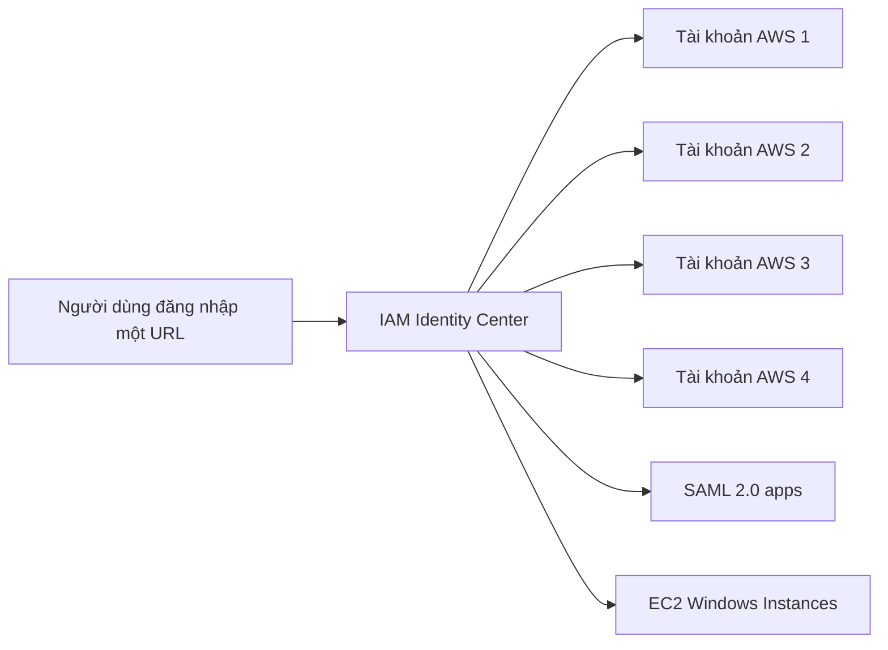

# 🎫 AWS IAM Identity Center: Một lần đăng nhập, mọi tài khoản AWS

> Nguồn: `231-AWS-IAM-Identity-Center.txt` · [Udemy](https://ua.udemy.com/course/aws-certified-cloud-practitioner-new/learn/lecture/20587298)

Tiếp theo, mình giới thiệu **AWS IAM Identity Center** — dịch vụ có tên mới nhưng các bạn có thể đã biết nó dưới tên cũ **AWS Single Sign-On (SSO)**. Đây là một trong những chủ đề "ăn điểm" nhanh nhất trong đề Cloud Practitioner, cùng xem nhé.

---

### 🎯 IAM Identity Center là gì?

* Đây là **successor (dịch vụ kế nhiệm)** của **AWS Single Sign-On (AWS SSO)**.
* Dù đề thi gọi tên nào — IAM Identity Center hay AWS Single Sign-On — hãy hiểu tính năng là **single sign-on (đăng nhập một lần)**.
* Lợi ích chính: **một login duy nhất cho tất cả tài khoản AWS** trong organization của bạn. Đây cũng là điều đề thi tập trung kiểm tra.
* Ngoài ra, một login đó còn dùng để truy cập:
  * **Business cloud applications (ứng dụng cloud doanh nghiệp)**
  * **Ứng dụng bật SAML 2.0**
  * **EC2 Windows Instances**

User đăng nhập một lần và có quyền truy cập vào mọi thứ bạn đã định nghĩa cho user đó.

---

### 🗄️ Identity provider — dữ liệu user lưu ở đâu?

IAM Identity Center có thể lấy danh tính từ:

* **Built-in identity store** — kho danh tính dựng sẵn ngay trong IAM Identity Center.
* **Third-party identity store** — kết nối với hệ thống bên thứ ba như **Microsoft Active Directory**, **OneLogin** hoặc **Okta**.

---

### 🖥️ Trải nghiệm một login cho nhiều tài khoản

Cách hoạt động rất đơn giản:

1. Bạn đăng nhập qua **một URL duy nhất**, nhập **username và password**.
2. Bạn vào **portal của AWS IAM Identity Center** — trong demo, giảng viên có **4 tài khoản** trong organization của mình.
3. Bấm chọn một tài khoản, rồi bấm **management console**.
4. Bạn vào thẳng console của tài khoản đó.

So sánh dễ thấy: **nhớ 1 login thay vì 4 login** cho 4 tài khoản, và quản lý user **tập trung (central manner)** thay vì từng account một.

---

### ⚠️ Mẹo thi

Hễ đề cho tình huống **một lần đăng nhập truy cập nhiều tài khoản AWS**, hãy chọn **IAM Identity Center**. Nếu đề dùng tên **AWS Single Sign-On** thì cũng chính là dịch vụ này — đừng để bị "đánh lừa" bởi tên gọi. *Đây là dạng câu hỏi gần như chắc chắn xuất hiện, nên các bạn nhớ kỹ nhé.*

---

### 🎯 Tự kiểm tra nhanh

**Câu 1:** IAM Identity Center là phiên bản kế nhiệm của dịch vụ nào?

<b>Xem đáp án</b>

**Đáp án:** AWS Single Sign-On (AWS SSO).
Giải thích: Dù gặp tên nào trong đề, tính năng vẫn là single sign-on.
Tham chiếu: Mục IAM Identity Center là gì.

**Câu 2:** IAM Identity Center mang lại lợi ích chính gì?

<b>Xem đáp án</b>

**Đáp án:** Một login duy nhất cho tất cả tài khoản AWS trong organization.
Giải thích: Ngoài ra một login còn dùng cho ứng dụng cloud, app SAML 2.0 và EC2 Windows Instances.
Tham chiếu: Mục IAM Identity Center là gì.

**Câu 3:** IAM Identity Center hỗ trợ những identity provider nào?

<b>Xem đáp án</b>

**Đáp án:** Built-in identity store hoặc third-party như Microsoft Active Directory, OneLogin, Okta.
Giải thích: Đây là nơi dữ liệu user được lưu trữ.
Tham chiếu: Mục Identity provider.

**Câu 4:** Trong demo, giảng viên quản lý bao nhiêu tài khoản và bằng cách nào?

<b>Xem đáp án</b>

**Đáp án:** 4 tài khoản — đăng nhập một URL rồi chọn account để vào thẳng management console.
Giải thích: Thay vì nhớ 4 login, chỉ cần nhớ một; user được quản lý tập trung.
Tham chiếu: Mục Trải nghiệm một login cho nhiều tài khoản.

**Câu 5:** Đề cho "một lần truy cập cho nhiều tài khoản AWS" — chọn dịch vụ nào?

<b>Xem đáp án</b>

**Đáp án:** AWS IAM Identity Center.
Giải thích: Đây là từ khóa nhận diện nhanh trong đề thi.
Tham chiếu: Mục Mẹo thi.

---

Vậy là các bạn đã nắm được **IAM Identity Center**: một login cho nhiều tài khoản và ứng dụng, quản lý user tập trung. *Hãy nhớ cả hai tên — IAM Identity Center và AWS Single Sign-On — vì đề có thể dùng bất kỳ tên nào.*

Ở bài tiếp theo, chúng ta sẽ tổng kết lại toàn bộ chuyên đề **Advanced Identity**. Hẹn gặp các bạn! 🚀
