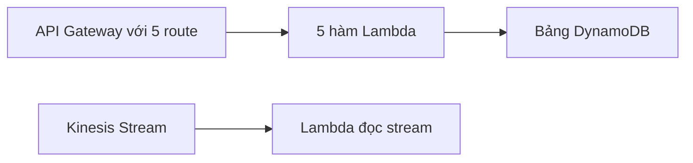

# 🧩 AWS Infrastructure Composer — thiết kế serverless bằng kéo thả

> Nguồn: `239-AWS-Infrastructure-Composer.txt` · [Udemy](https://ua.udemy.com/course/aws-certified-cloud-practitioner-new/learn/lecture/41562804)

Trong bài này, chúng ta cùng làm quen với **AWS Infrastructure Composer** — công cụ cho phép **thiết kế trực quan và xây dựng ứng dụng serverless cực nhanh** trên AWS. Đây là bài có thực hành, mình sẽ cùng các bạn mở console và thao tác luôn.

---

### 🎯 Infrastructure Composer là gì?

AWS Infrastructure Composer là cách để các bạn **thiết kế và xây dựng ứng dụng serverless một cách trực quan, rất nhanh** trên AWS. Nhờ công cụ **drag and drop (kéo thả)**, các bạn có thể tạo **infrastructure as code (IaC — hạ tầng dưới dạng mã)** một cách nhanh chóng **mà không cần là chuyên gia**.

Các bạn cũng cấu hình được **cách các tài nguyên tương tác với nhau**. Kết quả sinh ra là **infrastructure as code tương thích với CloudFormation**. Và điều ngược lại cũng làm được: nếu đã có **CloudFormation hoặc SAM template**, các bạn có thể **import vào Infrastructure Composer để xem trực quan**.

---

### 🖥️ Thực hành: mở demo trong console

Trong Infrastructure Composer console, mình mở **Open Demo** để các bạn thấy cách nó hoạt động. Demo hiển thị:

* Một **API Gateway với 5 route**.
* Mỗi route kết nối tới **compute layer (tầng xử lý)** gồm **5 hàm Lambda**.
* Cuối cùng là một **bảng DynamoDB**.

Điều thú vị là các bạn **nhìn thấy trực quan** mọi thứ đang diễn ra: ví dụ khi ai đó gọi **POST item**, request sẽ nối tới hàm Lambda tên **CreateItem**.

Các bạn có thể khám phá chi tiết từng tài nguyên: bấm **Details** để xem thuộc tính thật của hàm Lambda — **package type, runtime, architecture**... và chỉnh sửa tất cả. Bạn cũng thiết lập được **permissions (quyền)** cho phép Lambda ghi vào DynamoDB. Với bảng DynamoDB, các bạn xem được **logical ID, partition key**...

---

### ✏️ Kéo thả tài nguyên mới

Để thấy sức mạnh của công cụ, mình thử tạo tài nguyên ngay trên canvas:

1. Trong mục **Resources**, chọn **Kinesis Stream** — một stream xuất hiện.
2. Thêm tiếp một **Lambda function**.
3. Nối Lambda với Kinesis Stream để hàm này **đọc từ stream** — chỉ đơn giản vậy thôi.
4. Bạn có thể chỉnh cấu hình cho cả stream lẫn Lambda function.

Không chỉ có các **enhanced components (thành phần nâng cao) chuyên cho serverless**, công cụ còn hỗ trợ **mọi loại tài nguyên IaC tiêu chuẩn**. Ví dụ, cần một **Amplify app**, các bạn chỉ việc kéo thả vào và cấu hình mọi thứ cần thiết.

---

### 📄 Xuất template CloudFormation

Cuối cùng, vào mục **Templates**, các bạn sẽ thấy **output template CloudFormation** đúng với những gì đang hiển thị trên canvas. Có thể chọn **YAML hoặc JSON**, rồi **copy/paste vào CloudFormation** hoặc lưu lại để dùng cho mục đích sau này.

*Đây là công cụ mình rất thích vì quá tiện — hy vọng các bạn cũng thấy vậy.*

---

Vậy là chúng ta đã biết "vẽ" hạ tầng serverless chỉ bằng kéo thả, rồi xuất ra CloudFormation template. Ở bài tiếp theo, mình sẽ giới thiệu **AWS Device Farm** — dịch vụ test ứng dụng trên thiết bị thật. Hẹn gặp lại! 🚀
