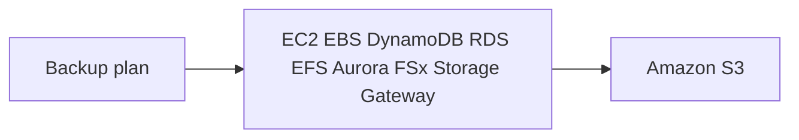

# 💾 AWS Backup — backup tập trung, tự động trên toàn bộ AWS

> Nguồn: `241-AWS-Backup-Overview.txt` · [Udemy](https://ua.udemy.com/course/aws-certified-cloud-practitioner-new/learn/lecture/26623552)

Trong bài này, chúng ta cùng tìm hiểu **AWS Backup**. Đúng như tên gọi, đây là dịch vụ giúp các bạn **quản lý tập trung và tự động hóa việc backup (sao lưu)** trên nhiều dịch vụ AWS khác nhau. Một mẹo thi rất dễ nhớ: **cứ thấy "backups" trong đề, hãy nghĩ tới AWS Backup**.

---

### 🎯 AWS Backup là gì?

AWS Backup là dịch vụ **fully-managed (được quản lý hoàn toàn)** giúp **quản lý tập trung và tự động hóa backup trên các dịch vụ AWS**.

Các khả năng chính:

* **On-demand backup (backup theo yêu cầu)** và **scheduled backup (backup theo lịch)**.
* Hỗ trợ **point-in-time recovery (PITR — khôi phục tại một thời điểm)**.
* Định nghĩa được **retention period (thời gian lưu trữ)**, **lifecycle management (quản lý vòng đời)** và **backup policy (chính sách backup)**.

---

### 🌍 Backup xuyên vùng và xuyên tài khoản

AWS Backup còn cho phép các bạn thực hiện:

* **Cross-region backup (backup xuyên vùng)**.
* **Cross-account backup (backup xuyên tài khoản)**.

Cả hai đều được hỗ trợ (backed) bởi **AWS Organizations** — rất phù hợp với doanh nghiệp có nhiều tài khoản AWS.

---

### ⚙️ Cách AWS Backup hoạt động

Quy trình rất đơn giản:

1. Tạo một **backup plan (kế hoạch backup)** — ví dụ **frequency (tần suất)** và **retention policy (chính sách lưu trữ)** của backups.
2. **Gán tài nguyên** cần backup. AWS Backup hỗ trợ: **Amazon EC2, EBS, DynamoDB, RDS, EFS, Aurora, FSx và Storage Gateway**.
3. Nhờ backup plan, tất cả các tài nguyên này **tự động được backup vào Amazon S3**.

*Đơn giản vậy thôi — và vì quá "đúng tên", đây là một điểm thi rất dễ ăn.*

---

### 🎯 Tự kiểm tra nhanh

**Câu 1:** AWS Backup là loại dịch vụ gì?

<b>Xem đáp án</b>

**Đáp án:** Fully-managed service giúp quản lý tập trung và tự động hóa backups trên các dịch vụ AWS.

Giải thích: Đây là định nghĩa cốt lõi cần nhớ cho kỳ thi.

Tham chiếu: Mục AWS Backup là gì.

**Câu 2:** AWS Backup hỗ trợ kiểu khôi phục nào?

<b>Xem đáp án</b>

**Đáp án:** Point-in-time recovery (PITR).

Giải thích: Ngoài ra còn có on-demand và scheduled backup.

Tham chiếu: Mục AWS Backup là gì.

**Câu 3:** Cross-account backup được hỗ trợ (backed) bởi dịch vụ nào?

<b>Xem đáp án</b>

**Đáp án:** AWS Organizations.

Giải thích: Tương tự với cross-region backup.

Tham chiếu: Mục Backup xuyên vùng và xuyên tài khoản.

**Câu 4:** Backup plan cho phép cấu hình những gì?

<b>Xem đáp án</b>

**Đáp án:** Ví dụ frequency (tần suất) và retention policy (chính sách lưu trữ).

Giải thích: Bạn cũng định nghĩa được lifecycle management và backup policies.

Tham chiếu: Mục Cách AWS Backup hoạt động.

**Câu 5:** Các tài nguyên được AWS Backup hỗ trợ sẽ được backup tự động vào đâu?

<b>Xem đáp án</b>

**Đáp án:** Amazon S3.

Giải thích: Backup plan điều khiển việc backup cho EC2, EBS, DynamoDB, RDS, EFS, Aurora, FSx và Storage Gateway.

Tham chiếu: Mục Cách AWS Backup hoạt động.

---

Vậy là các bạn đã nắm AWS Backup: quản lý backup tập trung, hỗ trợ PITR, cross-region/cross-account qua Organizations, và đưa dữ liệu vào S3. Ở bài cuối của phần này, chúng ta sẽ tìm hiểu **4 chiến lược Disaster Recovery**. Hẹn gặp lại! 🚀
