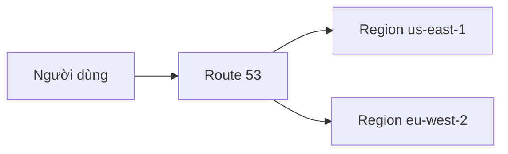

# 🛡️ Bốn chiến lược Disaster Recovery — câu hỏi "rẻ nhất" trong đề thi

> Nguồn: `242-Disaster-Recovery-Strategies.txt` · [Udemy](https://ua.udemy.com/course/aws-certified-cloud-practitioner-new/learn/lecture/29102338)

Chúng ta cùng khép lại phần Other Services với một chủ đề rất hay xuất hiện trong đề: **Disaster Recovery Strategies (các chiến lược khôi phục sau thảm họa)**. Kiểu câu hỏi phổ biến nhất là: *"Chiến lược nào rẻ nhất?"* — và bài này sẽ trang bị cho các bạn cả 4 chiến lược cùng thứ tự chi phí để không bao giờ chọn sai.

---

### 🎯 Bức tranh tổng quan

Disaster recovery là cách đưa hệ thống trở lại hoạt động sau khi xảy ra thảm họa. AWS có **4 chiến lược**, xếp theo **chi phí tăng dần**:

Hãy nhớ thứ tự này: **rẻ nhất là Backup and Restore, đắt nhất là Multi-Site Hot Site**.

---

### 📊 So sánh 4 chiến lược

| Chiến lược | Trên cloud có gì | Chi phí | Khi thảm họa xảy ra |
|---|---|---|---|
| Backup and Restore | Dữ liệu được backup, app không chạy | Thấp nhất | Restore dữ liệu và dựng app ở nơi khác |
| Pilot Light | Chức năng lõi, ví dụ chỉ database, setup tối thiểu | Tăng nhẹ | Nâng cấp database type và khởi động application servers |
| Warm Standby | Bản đầy đủ của app, kích thước tối thiểu | Cao hơn | Tăng kích thước app lên |
| Multi-Site Hot Site | Bản đầy đủ, full size, sẵn sàng mọi lúc | Đắt nhất | Dùng được ngay lập tức |

Chi tiết từng chiến lược:

* **Backup and Restore** — dữ liệu của bạn được backup vào cloud. Khi có thảm họa, bạn **restore ở một nơi khác** để lấy lại ứng dụng. Vì app **không chạy thường trực** (chỉ chạy khi restore), chi phí ở mức **tối thiểu** — đây là lý do nó rẻ nhất.
* **Pilot Light** — chạy **các chức năng lõi của app** trên cloud, ví dụ **chỉ database**, ở **minimal setup (thiết lập tối thiểu)** nhưng sẵn sàng scale. Chưa có application servers. Khi thảm họa xảy ra, bạn **nâng cấp database type** và **khởi động application servers**. Chi phí **nhỉnh hơn backup and restore một chút**.
* **Warm Standby** — phiên bản **đầy đủ của app** đã sẵn sàng trên cloud nhưng ở **kích thước tối thiểu (minimum size)**. Khi cần, chỉ việc **tăng size** là dùng được. Chi phí **cao hơn**.
* **Multi-Site Hot Site** — bản **đầy đủ, kích thước đầy đủ**, sẵn sàng dùng **bất kể lúc nào**. Đây là chiến lược **đắt nhất** vì mọi thứ đã sẵn sàng ngay khi thảm họa xảy ra.

---

### 🗺️ Disaster recovery đa vùng với Route 53

Trong cloud, chúng ta còn có thể làm disaster recovery **multi-region (đa vùng)**. Ví dụ:

* Hệ thống đang chạy ở region **us-east-1**.
* Một thảm họa ập vào us-east-1.
* Bạn **fail over (chuyển hướng) toàn bộ traffic** sang một region khác, ví dụ **eu-west-2**, bằng **Route 53**.

Đây là kiểu thiết lập rất khả thi trong thực tế. *Ở cấp độ CCP (Cloud Practitioner), vậy là các bạn đã có đủ kiến thức cần thiết.*

---

### 🎯 Tự kiểm tra nhanh

**Câu 1:** Chiến lược disaster recovery nào rẻ nhất?

<b>Xem đáp án</b>

**Đáp án:** Backup and Restore.

Giải thích: App không chạy thường trực, chỉ backup dữ liệu nên chi phí tối thiểu.

Tham chiếu: Mục So sánh 4 chiến lược.

**Câu 2:** Chiến lược nào đắt nhất?

<b>Xem đáp án</b>

**Đáp án:** Multi-Site Hot Site.

Giải thích: Bản đầy đủ, full size, sẵn sàng dùng ngay lập tức khi có thảm họa.

Tham chiếu: Mục So sánh 4 chiến lược.

**Câu 3:** Pilot Light chạy gì trên cloud?

<b>Xem đáp án</b>

**Đáp án:** Các chức năng lõi của app, ví dụ chỉ database, ở minimal setup nhưng sẵn sàng scale.

Giải thích: Chưa có application servers; khi thảm họa xảy ra phải nâng cấp database type và khởi động application servers.

Tham chiếu: Mục So sánh 4 chiến lược.

**Câu 4:** Warm Standby khác Pilot Light ở điểm nào?

<b>Xem đáp án</b>

**Đáp án:** Warm Standby có bản đầy đủ của app nhưng ở kích thước tối thiểu; Pilot Light chỉ có các chức năng lõi.

Giải thích: Khi thảm họa, Warm Standby chỉ cần tăng size là dùng được.

Tham chiếu: Mục So sánh 4 chiến lược.

**Câu 5:** Người ta dùng dịch vụ nào để fail over traffic sang region khác trong disaster recovery đa vùng?

<b>Xem đáp án</b>

**Đáp án:** Route 53.

Giải thích: Ví dụ chuyển traffic từ us-east-1 sang eu-west-2 khi xảy ra thảm họa.

Tham chiếu: Mục Disaster recovery đa vùng với Route 53.

---

Vậy là các bạn đã nắm trọn 4 chiến lược disaster recovery: **Backup and Restore → Pilot Light → Warm Standby → Multi-Site Hot Site**, cùng thứ tự chi phí tăng dần và cách fail over đa vùng bằng Route 53. Đây chính là kiến thức "ăn điểm" rất chắc chắn trong đề thi — hãy đọc lại một lần nữa cho nhớ nhé. Ở bài tiếp theo, chúng ta sẽ đến với **AWS Elastic Disaster Recovery (DRS)**. Hẹn gặp lại! 🚀
