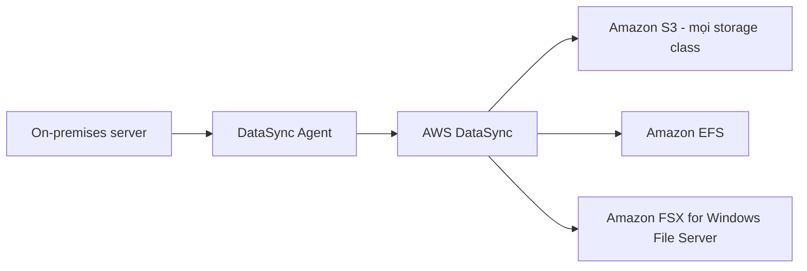

# 🚚 AWS DataSync — chuyển dữ liệu lớn từ on-premises lên AWS

> Nguồn: `244-AWS-DataSync.txt` · [Udemy](https://ua.udemy.com/course/aws-certified-cloud-practitioner-new/learn/lecture/29102382)

Tiếp theo, chúng ta tìm hiểu **AWS DataSync** — dịch vụ giúp di chuyển khối lượng dữ liệu lớn từ on-premises (tại chỗ) lên AWS nhanh chóng. Bài này ngắn thôi nhưng chứa một **từ khóa "ăn điểm"** mà mình tin chắc các bạn sẽ gặp lại trong đề thi.

---

### 🔍 DataSync là gì?

DataSync cho phép bạn **di chuyển lượng dữ liệu lớn từ on-premises lên AWS** và đồng bộ dữ liệu vào:

* **Amazon S3**
* **Amazon EFS**
* **Amazon FSX for Windows File Server**

Dịch vụ này được thiết kế cực kỳ đơn giản — đúng tinh thần "càng đơn giản càng dễ nhớ" cho kỳ thi.

---

### ⏰ Replication task và từ khóa "incremental"

DataSync cho phép tạo các **replication task (tác vụ nhân bản dữ liệu)** và **lên lịch chạy định kỳ** — ví dụ:

* Mỗi giờ
* Mỗi ngày
* Mỗi tuần

Cơ chế quan trọng nhất các bạn cần nhớ: sau **lần full load (tải toàn bộ) đầu tiên** từ on-premises lên AWS, **mọi tác vụ sau đó đều là incremental (tăng dần)** — chỉ truyền phần dữ liệu thay đổi.

*Hãy để ý từ **incremental** trong đề thi — đây chính là gợi ý rằng **DataSync là đáp án đúng**.*

---

### ⚙️ Cách DataSync hoạt động

Luồng dữ liệu diễn ra như sau:

1. **DataSync service** chạy bên trong AWS.
2. Các bạn cài **DataSync Agent** tại on-premises.
3. Agent kết nối tới DataSync servers và gửi dữ liệu trực tiếp vào **Amazon S3 (bất kỳ storage class nào)**, **EFS** hoặc **FSX for Windows File Server**.

Vậy là xong — DataSync đơn giản đúng như tên gọi của nó: cắm agent, trỏ đích đến, và dữ liệu tự chảy lên cloud.

---

### 🎯 Tự kiểm tra nhanh

**Câu 1:** DataSync dùng để làm gì?

<b>Xem đáp án</b>

**Đáp án:** Di chuyển lượng dữ liệu lớn từ on-premises lên AWS.

Giải thích: Đây là mục đích chính của dịch vụ.

Tham chiếu: Mục DataSync là gì.

**Câu 2:** DataSync có thể đồng bộ dữ liệu vào những đích nào?

<b>Xem đáp án</b>

**Đáp án:** Amazon S3, Amazon EFS và Amazon FSX for Windows File Server.

Giải thích: Đây là 3 đích đến được hỗ trợ.

Tham chiếu: Mục DataSync là gì.

**Câu 3:** Sau lần full load đầu tiên, các tác vụ tiếp theo có đặc điểm gì?

<b>Xem đáp án</b>

**Đáp án:** Đều là incremental — chỉ truyền phần dữ liệu thay đổi.

Giải thích: Từ khóa "incremental" trong đề thi là hint trỏ đến DataSync.

Tham chiếu: Mục Replication task và từ khóa incremental.

**Câu 4:** Replication task của DataSync có thể chạy theo lịch nào?

<b>Xem đáp án</b>

**Đáp án:** Định kỳ mỗi giờ, mỗi ngày hoặc mỗi tuần.

Giải thích: Tác vụ có thể được lên lịch chạy thường xuyên.

Tham chiếu: Mục Replication task và từ khóa incremental.

**Câu 5:** Thành phần nào được cài ở phía on-premises?

<b>Xem đáp án</b>

**Đáp án:** DataSync Agent.

Giải thích: Agent kết nối tới DataSync servers trong AWS để gửi dữ liệu đi.

Tham chiếu: Mục Cách DataSync hoạt động.

---

Vậy là các bạn đã nắm **AWS DataSync**: chuyển dữ liệu lớn lên **S3, EFS, FSX for Windows File Server**, chạy theo lịch và nhớ ngay từ khóa **incremental**. Ở bài tiếp theo, chúng ta sẽ bàn về **7 chiến lược di chuyển lên cloud (The 7 Rs)** — kiến thức rất hay được hỏi. Hẹn gặp lại! 🚀
