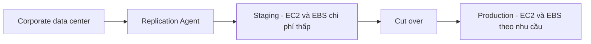

# 🧭 Application Discovery Service & Application Migration Service — khảo sát rồi di chuyển

> Nguồn: `246-Application-Discovery-Service-Application-Migration-Service.txt` · [Udemy](https://ua.udemy.com/course/aws-certified-cloud-practitioner-new/learn/lecture/33532780)

Muốn lên cloud, bạn có hai con đường: làm mới từ đầu hoặc mang theo hệ thống on-premises. Nếu chọn con đường thứ hai, bạn cần **lập kế hoạch migration** — và bộ đôi **Application Discovery Service** + **Application Migration Service** sinh ra chính là để làm việc đó.

---

### 🧭 Hai con đường khi lên cloud

Khi chuyển lên cloud, có hai use case điển hình:

* **Bắt đầu từ con số 0** và tận dụng cloud ngay từ đầu — lúc này bạn **không cần migration**.
* **Đang có server và data center on-premises** và muốn migrate lên cloud — lúc này bạn **cần lập kế hoạch migration**.

Cách lập kế hoạch là dùng **AWS Application Discovery Service**: quét các server của bạn và thu thập thông tin về **server utilization data (dữ liệu mức sử dụng server)** cùng **dependency mapping (bản đồ phụ thuộc)**. Những thông tin này giúp bạn hiểu **nên migrate như thế nào và migrate cái gì trước**.

---

### 🔎 Hai kiểu Discovery: Agentless và Agent

Application Discovery Service hỗ trợ hai cách thu thập dữ liệu:

| Tiêu chí | Agentless Discovery (dùng Connector) | Application Discovery Agent |
|---|---|---|
| Cách triển khai | Dùng Connector, không cần cài agent | Cài agent bên trong virtual machine |
| Thu thập được | Thông tin về virtual machine, cấu hình, lịch sử hiệu năng như CPU, memory, disk usage | Cập nhật và thông tin chi tiết hơn từ trong VM |
| Chi tiết thêm | — | System configuration, performance, các process đang chạy, chi tiết kết nối mạng giữa các hệ thống |
| Phù hợp với | Khảo sát tổng quan | Dependency mapping |

*Điểm mấu chốt: Agent cho bạn **dependency mapping** tốt hơn nhờ nhìn thấy các kết nối mạng bên trong hệ thống.*

---

### 📊 Xem kết quả ở đâu?

Toàn bộ dữ liệu thu thập được có thể xem trong một dịch vụ khác: **AWS Migration Hub**.

Application Discovery Service giúp bạn vẽ ra **cần di chuyển những gì và chúng liên kết với nhau ra sao** — nhưng sau khi có bản đồ, bạn vẫn cần thực sự **di chuyển**.

---

### 🚚 Application Migration Service (MGN) — cách di chuyển đơn giản nhất

Cách đơn giản nhất để đi từ on-premises lên AWS là dùng **AWS Application Migration Service**, còn gọi là **MGN**.

*Trước đây dịch vụ này có tên là **CloudEndure Migration**, nhưng nay đã được thay thế.*

Với MGN, bạn thực hiện **rehosting — còn gọi là lift-and-shift**: chuyển các server **physical, virtual hoặc từ cloud khác** để chạy native trên AWS. Cách hoạt động:

1. Trong **corporate data center**, hệ thống của bạn gồm OS, ứng dụng và database chạy trên các disk.
2. Bạn cài **replication agent** và MGN sẽ thực hiện **continuous replication (nhân bản liên tục)** các disk.
3. Dữ liệu được nhân bản vào **EC2 instance chi phí thấp** và **EBS volume** trong AWS (staging).
4. Khi sẵn sàng **cut over**, bạn chuyển từ staging sang production với **EC2 instance lớn hơn tùy ý** và **EBS volume đúng hiệu năng cần thiết**.

MGN hỗ trợ **nhiều nền tảng, hệ điều hành và database**, cho bạn **downtime tối thiểu** và **chi phí giảm** vì không cần thuê kỹ sư phức tạp — mọi thứ được dịch vụ này tự động hóa.

---

### 🎯 Tự kiểm tra nhanh

**Câu 1:** Application Discovery Service giúp bạn làm gì?

<b>Xem đáp án</b>

**Đáp án:** Quét server, thu thập dữ liệu mức sử dụng và dependency mapping để lập kế hoạch migration.

Giải thích: Nhờ đó bạn biết migrate như thế nào và migrate gì trước.

Tham chiếu: Mục Hai con đường khi lên cloud.

**Câu 2:** Sự khác biệt chính giữa Agentless Discovery và Application Discovery Agent là gì?

<b>Xem đáp án</b>

**Đáp án:** Agentless dùng Connector và cho thông tin tổng quan; Agent cài trong VM và cho thông tin chi tiết hơn, bao gồm dependency mapping.

Giải thích: Agent thấy được process đang chạy và kết nối mạng giữa các hệ thống.

Tham chiếu: Mục Hai kiểu Discovery.

**Câu 3:** Kết quả của Application Discovery Service được xem ở đâu?

<b>Xem đáp án</b>

**Đáp án:** AWS Migration Hub.

Giải thích: Đây là nơi tập trung dữ liệu inventory của server và application.

Tham chiếu: Mục Xem kết quả ở đâu.

**Câu 4:** MGN là viết tắt của dịch vụ nào và trước đây có tên gì?

<b>Xem đáp án</b>

**Đáp án:** AWS Application Migration Service, trước đây là CloudEndure Migration.

Giải thích: Dịch vụ này đã được thay thế bằng MGN.

Tham chiếu: Mục Application Migration Service.

**Câu 5:** MGN thực hiện kiểu migration nào?

<b>Xem đáp án</b>

**Đáp án:** Rehosting — lift-and-shift, chuyển server physical, virtual hoặc từ cloud khác chạy native trên AWS.

Giải thích: Nhân bản liên tục vào staging rồi cut over sang production.

Tham chiếu: Mục Application Migration Service.

---

Vậy là các bạn đã nắm bộ đôi: **Application Discovery Service** để khảo sát và vẽ bản đồ hệ thống, **Application Migration Service (MGN)** để bê hệ thống lên AWS với downtime tối thiểu. Ở bài tiếp theo, chúng ta tìm hiểu **AWS Migration Evaluator** — công cụ xây dựng business case cho migration. Hẹn gặp lại! 🚀
