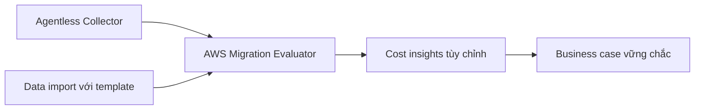

# 💰 AWS Migration Evaluator — xây dựng business case trước khi lên cloud

> Nguồn: `247-AWS-Migration-Evaluator.txt` · [Udemy](https://ua.udemy.com/course/aws-certified-cloud-practitioner-new/learn/lecture/38270572)

Trước khi thuyết phục doanh nghiệp migrate lên AWS, bạn cần trả lời được câu hỏi khó nhất: *"Việc này có đáng tiền không?"* **AWS Migration Evaluator** ra đời để giúp bạn xây dựng **business case (hồ sơ kinh doanh) dựa trên dữ liệu** cho cuộc migration.

---

### 💡 Migration Evaluator là gì?

Migration Evaluator là dịch vụ giúp bạn **xây dựng business case dựa trên dữ liệu cho việc migrate lên AWS**.

Quy trình bắt đầu bằng việc thiết lập một **clear baseline (đường cơ sở rõ ràng)** về những gì tổ chức của bạn đang vận hành hôm nay — để bạn hiểu rõ **các workload của mình**. Từ đó:

1. **Phân tích trạng thái hiện tại** (current state).
2. **Định nghĩa trạng thái đích** (target state) trên AWS.
3. **Phát triển kế hoạch migration** (migration plan).

---

### 🧰 Thu thập dữ liệu: Collector hoặc data import

Có hai cách đưa dữ liệu vào Migration Evaluator:

* **Agentless Collector** — cài đặt để thực hiện **broad-based discovery (khảo sát toàn diện)** toàn bộ hạ tầng của bạn. Collector sẽ chụp lại **on-premises footprint (dấu chân hạ tầng tại chỗ)**, **server dependencies (phụ thuộc giữa các server)**...
* **Data import feature** — có sẵn **tool (công cụ)** và **template (mẫu dữ liệu)**; bạn đưa dữ liệu của mình vào đúng khuôn mẫu này.

---

### 📈 Từ dữ liệu đến business case

Các nguồn dữ liệu trên sẽ cho phép bạn chạy **Migration Evaluator Service**, từ đó nhận được:

* **Quick insights (thông tin nhanh)** để hiểu tình hình.
* **Customized cost insights (thông tin chi phí tùy chỉnh)** cho tổ chức của bạn.
* Sự đảm bảo rằng migration của bạn **hiệu quả về chi phí** và **tốt cho doanh nghiệp**.

Kết quả cuối cùng: bạn có một **business case vững chắc**. Và nếu cần, bạn thậm chí có thể **nhận hướng dẫn từ chuyên gia AWS** cho business case của mình.

---

### 🎯 Tự kiểm tra nhanh

**Câu 1:** Migration Evaluator giúp bạn tạo ra thứ gì?

<b>Xem đáp án</b>

**Đáp án:** Business case dựa trên dữ liệu cho việc migrate lên AWS.

Giải thích: Mục tiêu là chứng minh migration hiệu quả về chi phí và tốt cho doanh nghiệp.

Tham chiếu: Mục Migration Evaluator là gì.

**Câu 2:** Vì sao cần thiết lập baseline trước khi migrate?

<b>Xem đáp án</b>

**Đáp án:** Để hiểu rõ tổ chức đang vận hành những workload nào.

Giải thích: Từ baseline, bạn phân tích current state, định nghĩa target state và lập kế hoạch.

Tham chiếu: Mục Migration Evaluator là gì.

**Câu 3:** Agentless Collector làm gì?

<b>Xem đáp án</b>

**Đáp án:** Thực hiện broad-based discovery toàn bộ hạ tầng, chụp lại on-premises footprint và server dependencies.

Giải thích: Đây là một trong hai cách thu thập dữ liệu.

Tham chiếu: Mục Thu thập dữ liệu.

**Câu 4:** Ngoài Collector, còn cách nào đưa dữ liệu vào Migration Evaluator?

<b>Xem đáp án</b>

**Đáp án:** Dùng data import feature với tool và template có sẵn.

Giải thích: Bạn đưa dữ liệu của mình vào đúng khuôn mẫu.

Tham chiếu: Mục Thu thập dữ liệu.

**Câu 5:** Nếu cần, bạn có thể nhận hỗ trợ gì thêm từ AWS?

<b>Xem đáp án</b>

**Đáp án:** Hướng dẫn từ chuyên gia cho business case của bạn.

Giải thích: Đây là lựa chọn bổ sung khi bạn cần.

Tham chiếu: Mục Từ dữ liệu đến business case.

---

Vậy là các bạn đã biết **AWS Migration Evaluator**: khảo sát hạ tầng bằng Collector hoặc template, phân tích current state, định hình target state và tạo ra **business case thuyết phục** với chi phí tùy chỉnh. Ở bài tiếp theo, chúng ta đến với **AWS Migration Hub** — trung tâm theo dõi mọi cuộc migration. Hẹn gặp lại! 🚀
